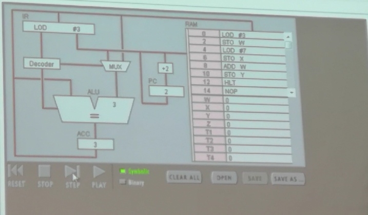
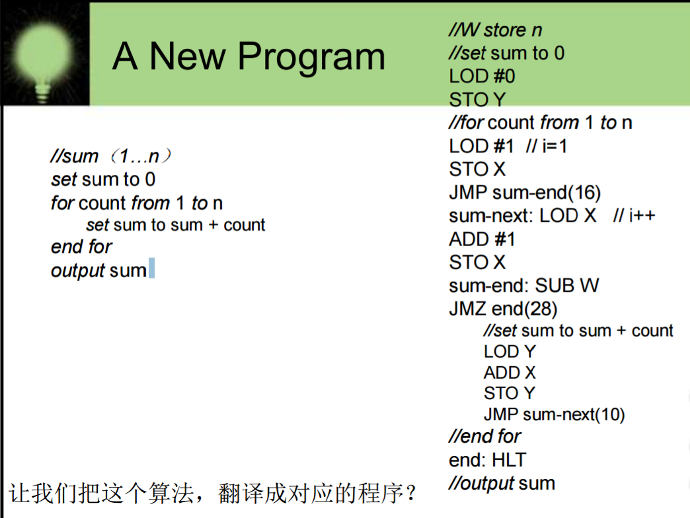
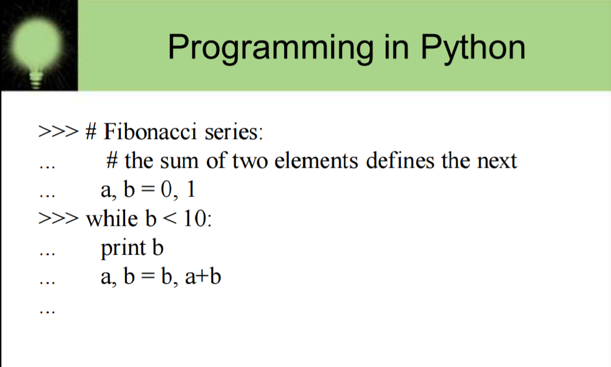

# Chapter 7 Programming Bately(Loower level programming language)

1. Connecting CPU and Memory(储存器；内存)

**IR**  
Instruction Register 指令寄存器，是临时放置从内存里面取得的程序指令的寄存器，用于存放当前从主储存器读出的正在执行的一条指令。
当执行一条指令时，先把它从内存取到数据寄存器（DR, Data Register）中，然后再传送到IR。指令划分为**操作码**和**地址码**字段，由二进制数字组成。为了执行任何给定的指令，必须对操作码进行测试，以便识别所要求的操作。**指令译码器**就是做这项工作的。指令寄存器中操作码字段的输出就是指令译码器的输入。操作码一经译码后，即可向操作控制器发出具体操作的特定信号。

**PC**
Program Counter 程序计数器是用于存放下一条指令所在单元的地址的地方。
当执行一条指令时，首先需要根据PC中存放的指令地址，将指令由内存取到**指令寄存器**中，此过程称为“取指令”。与此同时，PC中的地址或自动加1或由转移指针给出下一条指令的地址。此后经过分析指令，执行指令。完成第一条指令的执行，而后根据PC取出第二条指令的地址，如此循环，执行每一条指令。

**ACC/AC**
Accumulator register 累加寄存器，通常称为**累加器**，它是一个**通用寄存器**，其功能是：当**运算器**的算数逻辑单元（ALU）执行算术或逻辑运算时，为ALU提供一个工作区。==累加寄存器暂时存放ALU运算的结果信息==。显然，==运算器中至少要有一个累加寄存器==。在运算器中，累加器是专门存放算术或逻辑运算结果的寄存器。能进行加、减、读出、移位、循环移位和求补等操作。是运算器的主要部分。
Ps：**移位**是遣词造句的一种方法。指为了突出和强调某个意思，移位打破常规移动句子成分的位置，使表达的效果更好。

**MUX**
Multiplexer 多路复用器，是一种设备，能接收多个信号，按每个输入信号可恢复的方式合成单个输出信号。复用器是一种综合系统，通常包含一定数目的数据输入，有一个单独的输出。

**ALU**
Arithmetic&logical Unit 算术逻辑单元，是中央处理器（CPU）的执行单元，是所有中央处理器的核心组成部分，由由"And Gate"（与门） 和"Or Gate"（或门）构成的算术逻辑单元，主要功能是进行二位元的算术运算，如加减乘(不包括整数除法)。基本上，在所有现代CPU体系结构中，二进制都以补码的形式来表示。

2. The Fetch-Execute Cycle
1、 Fetch the next instruction
2、 Decode the instruction
3、 Get data if needed
4、 Execute the instruction

3. Commputer Operations
1、A computer is a programmable electronic device that can store, retrieve(检索),and process data.
2、Data and instructions to manipulate（操纵） the data are logically the same and can be stored in the same place.
3、Store, retrieve, and process are actions that the computer can perform on data.
 
4. Machine Language(机器语言)
1、The instructions build into the hardware of a particular computer(计算机硬件可识别的语言)
2、Initially, humans had no choice but to write programs in machine langulage because other programming langulages had not yet been invented.----(用0，1编写程序)
3、Every processor type has its own set of specific machine instructions
4、The relationship between the processor and the instructions it can carry out is completely integrated (处理器和它可以执行的指令之间的关系是完全集成的).
5、Each machine-language instruction does only one very low-level task.

5. A Virtual Computer
1、A hypothetical machine designed to contain the important features of real computers that we want to illustrate.
2、Features in PIPPIN(优秀的东西或人)
-The memory is made up of 256 bytes.A half store data and other store instruction
-Has 18 machine-language instructions
-Has IR,PC,ACC registers in CPU
-A 8bit ALU(8位的CPU)

6. Instruction Format
The instruction specifier(说明符，指示语) is made up of several sectios
-The operation code操作码
-The register specifier寄存器说明符
-The addressing-mode specifier寻址模式说明符

optionally 可选择地
7. A Program Example 

accum （accumulator）累加器
8. Assembly Language(汇编语言)
1、Assemly language is a language that uses mnemonic codes(助记忆符号) to represent machine-language instructions
-The programmer uses these alphanumeric( 文字数字的，包括文字与数字的) codes in place of binary digists
-A program called an assembler(汇编程序) reads each of the instructionns in mnemonic form（助记符形式） and translates it into the machine-language equivalent(翻译成对应的机器语言)
9. 
10. 
11. High level programming language
**高级语言**是以人类的日常语言为基础的一种编程语言，使用一般人易于接受的文字来表示（例如汉字、不规则英文或其他外语），从而使程序编写员编写更容易，亦有较高的可读性，以方便对电脑认知较浅的人亦可以大概明白其内容。。它并不是特指的某一种语言，而是包括很多编程语言.
Exemple:
-C, C++, Javas,and Visual Basic
-Ada, Lisp, C#
-PHP, Python... 
12. Compilers(编译)
-A program that translates a high-level language program int machine code
-High-level languages provide a richer set of instructions that makes the progarmmer's life even easier.

13. Interpreters(解释，翻译器)
A translating program that translates and executes the statements in sequence
-Unlike an assembler or complier which produce machine code as output, which is then executed in a separate step
-An intertreter translates a statement and then immediately executes the statement
-Interpreters can be viewed as simulators(模拟器)
14. Java
• Introduced in 1996 and swept the
computing community by storm
• Portability（便携性） was of primary importance（至关重要）
• Java is compiled（编译） into a standard machine language called Bytecode
• A software interpreter called the JVM
(Java Virtual Machine) takes the Bytecode program and executes it
15. Programming Language Paradigms（范式）
**Paradigm** is a set of assumptions, concepts, values, and practices(实践) that constitute(构成) a way of viewing reality.

**Programming Language Paradigms**
• Imperative or procedural model(命令式或程序式)
– FORTRAN, COBOL, BASIC, C, Pascal, Ada, and C++
• Functional model(功能模型)
– LISP, Scheme (a derivative of LISP), and ML
• Logic programming
– PROLOG
• Object-oriented paradigm（面向对象范例）
– SIMULA and Smalltalk
– C++ is as an imperative（命令式的） language with some object-oriented features
– Java is an object-oriented language with some imperative features
16. 
17. 解释以下词汇
1）汇编语言（Assembly Language）

==A language that uses mnemonic codes（助记忆符号） to represent machinelanguage 
instructions==
**汇编语言（assembly language）是一种用于电子计算机、微处理器、微控制器或其他可编程器件的低级语言，亦称为符号语言。**
在汇编语言中，用**助记符（Mnemonics）**代替机器指令的操作码，用**地址符号（Symbol）或标号（Label）**代替指令或操作数的地址。在不同的设备中，汇编语言对应着不同的机器语言指令集，通过汇编过程转换成机器指令。普遍地说，特定的汇编语言和特定的机器语言指令集是一一对应的,不同平台之间不可直接移植。
许多汇编程序为程序开发、汇编控制、辅助调试提供了额外的支持机制。有的汇编语言编程工具经常会提供宏，它们也被称为宏汇编器。
汇编语言不像其他大多数的程序设计语言一样被广泛用于程序设计。在今天的实际应用中，它通常被应用在底层，硬件操作和高要求的程序优化的场合。驱动程序、嵌入式操作系统和实时运行程序都需要汇编语言。

2）编译（Compiler）

==A program that translates a high-level language program into machine code==
编译
1、利用编译程序从源语言编写的源程序产生目标程序的过程。 
2、用编译程序产生目标程序的动作。 编译就是把高级语言变成计算机可以识别的2进制语言，计算机只认识1和0，编译程序把人们熟悉的语言换成2进制的。 编译程序把一个源程序翻译成目标程序的工作过程分为五个阶段：词法分析；语法分析；语义检查和中间代码生成；代码优化；目标代码生成。主要是进行词法分析和语法分析，又称为源程序分析，分析过程中发现有语法错误，给出提示信息。

编译语言
是一种以编译器来实现的编程语言。它不像直译语言一样，由解释器将代码一句一句运行，而是以编译器，先将代码编译为机器码，再加以运行。理论上，任何编程语言都可以是编译式，或直译式的。它们之间的区别，仅与程序的应用有关。 [1] 

3）命令式语言（Imperative programming）

==Imperative programming is a programming paradigm（范例） that uses statements that change a program’s state（状态）==
命令式编程（语言）是一种描述计算机所需作出的行为的编程典范。几乎所有计算机的**硬件**工作都是命令式的；几乎所有计算机的硬件都是设计来运行**机器码**，使用命令式的风格来写的。较高阶的命令式编程语言使用**变量**和更复杂的语句，但仍依从相同的典范。虽非计算机程序，但与命令式编程有相似的风格：每步都是指令，有形的世界控制情况。**因为命令式编程的基础观念，不但概念上比较熟悉，而且较容易具体表现于硬件，所以大部分的编程语言都是命令式的。**

4）函数编程语言（Functional programming）

==Functional programming is a programming paradigm(程序设计范式)--a style of building the structure and elements of computer programs--that treats computation as the evaluation（评估） of mathematical functions and avoid changing-state and mutable（可变的；易变的） data.==
函数式编程或称函数程序设计，又称泛函编程，是一种编程典范，它将计算机运算视为数学上的函数计算，并且避免使用程序状态以及易变对象。函数编程语言最重要的基础是λ演算（lambda calculus）。而且λ演算的函数可以接受函数当作输入（引数）和输出（传出值）。
比起指令式编程，**函数式编程**更加**强调**程序执行的**结果**而非执行的过程，倡导利用若干简单的执行单元让计算结果不断渐进，逐层推导复杂的运算，而不是设计一个复杂的执行过程。

5）过程式编程（Procedural programming）

==A programming paradigm, derived（起源于，基于） from structured programming（结构化程序设计技术）, based upon the concept of the procedure call（过程调用）==
又称**过程式程序设计**、过程化编程，一种编程典范，有时会被视为是**指令式编程**的同义语。派生自结构化编程（Structured programming），主要采取程序调用（procedure call）或函数调用（function call）的方式来进行流程控制。流程则由包涵一系列运算步骤的程序（Procedures），例程（routines），子程序（subroutines）, 方法（methods），或函数（functions）来控制。在程序运行的任何一个时间点，都可以调用某个特定的程序。任何一个特定的程序，也能被任意一个程序或是它自己本身调用。
