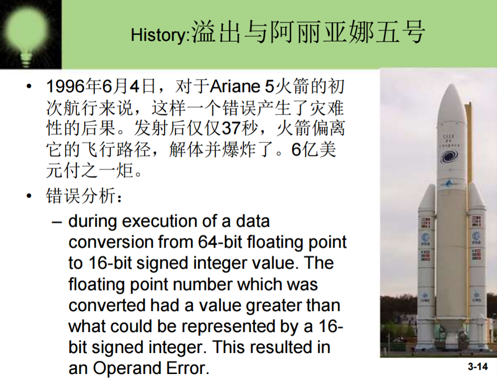
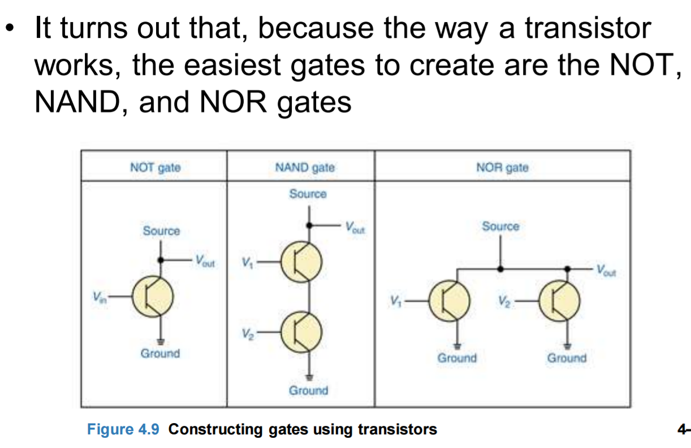
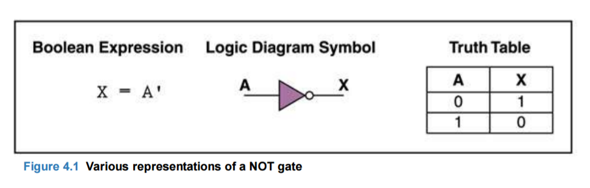
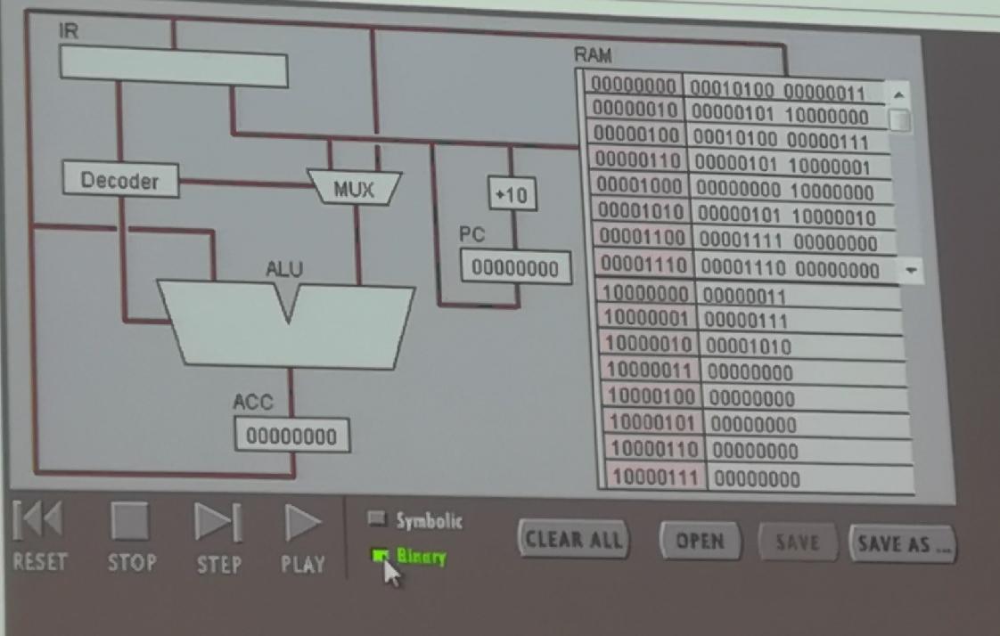
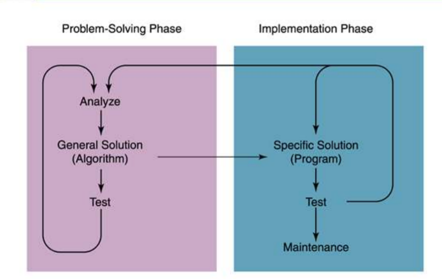
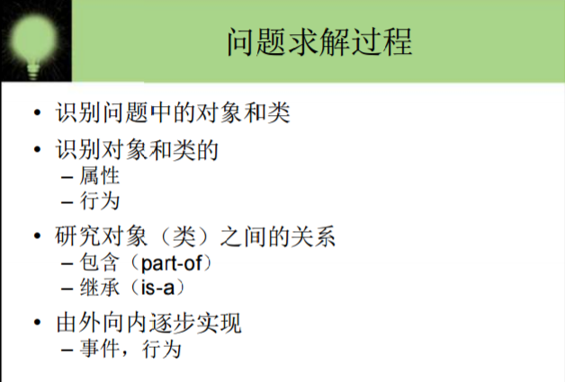
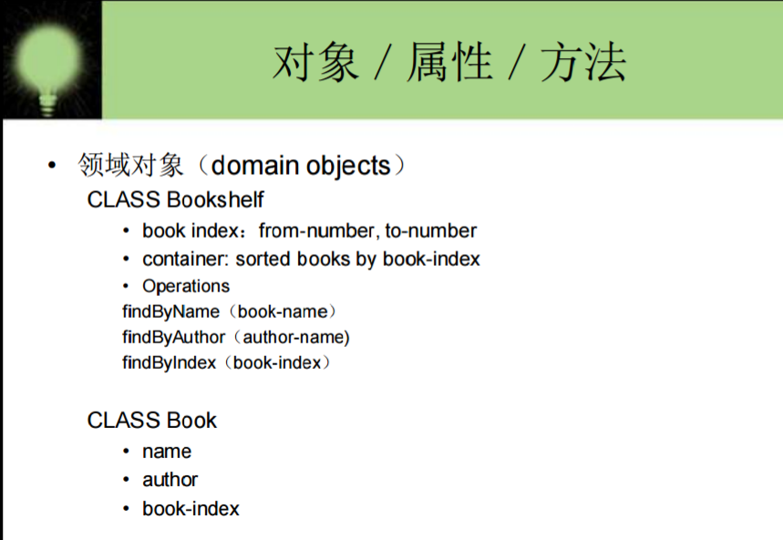
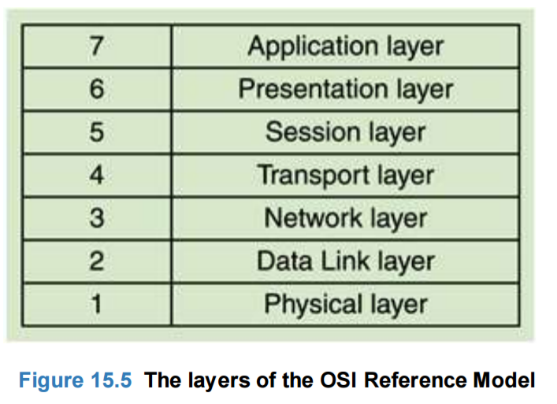

# Chapter 01    Introduction

1.	The difference between hardware and software?

**Hardware**

The physical elements of a computing system (printer, circuit boards, wires, keyboard…) 

**Software** 

The programs that provide the instructions for a computer to execute.

2. Layer of Computing System

3. **Abstraction(抽象)**

A mental model that removes complex details.

This is a key concept. Abstraction will reappear throughout the text.

4. Early History of Computing

**Abacus(算盘)**

An early device to record numeric values.

**Blaise Pascal**

Mechanical device to add, subtract, divide & multiply.

**Joseph Jacquard**

Jacquard’s Loom, the punched card(穿孔卡片).

**Charles Babbage**

Analytical Engine.

**Ada Lovelace**

First Programmer,the loop.

**Alan Turing**

Turing Machine, Artificial Intelligence Testing.

**Harvard Mark I,ENIAC,UIVAC I**

Early computers launch new era in mathematics, physics, engineering and economics

5. First Generation Hardwave(1951-1959)

**Vacuum Tubes(真空管)**

Large, not very reliable, generated a lot of heat.

**Magnetic Drum(磁鼓)**

Memory device that rotated under a read/write head.(在读写头下旋转的存储设备)

**Card Readers(读卡器) -> Magnetic Tape Drives（磁带驱动器）**

Sequential auxiliary storage devices.(序贯辅助存储设备)

6. Second Generation Hardwave(1959-1965)

**Transistor(晶体管)**

Replaced vacuum tube, fast, small, durable（耐用）, cheap.

**Magnetic Cores(磁芯)**

Replaced magnetic drums, information available ==instantly==.

**Magnetic Disks(磁盘)**

Replaced magnetic tape, data can be accessed directly（直接访问）.

7. Third Generation Hardwave(1965-1971)

**Integrate Circuits(集成电路)**

Replaced circuit boards, smaller, cheaper, faster, more reliable. 

**Transistors**

Now used for memory construction(存储器结构).

**Terminal（终点站）**

An input/output device with a keyboard and screen.

8. Fourth Generation Hardwave(1971-?)

**Large-scale Integration**

Great advances in chip(芯片) technology.

**PCs, the Commercial Market(商业市场), Workstations**

Personal Computers were developed as new companies like Apple and Atari came into being. Workstations emerged（出现）.

9. **Moore's Law**

The number of transistors incorporated in a chip will approximately double every 24 months.
(芯片中的晶体管数量每24个月大约增加一倍。)

10. Parallel Computing and Networking(并行计算与网络化)

**Parallel Computing**

Computers rely on interconnected central processing units that increasse processing speed.

(计算机依赖于互连的中央处理单元，从而提高处理速度。)

**Network**

With the Ethernet small computers could be connected and share resources. A file serve connected PCs in the late 1980s.

**ARRANET and LANs -> Internet(阿帕网 与 局域网 -> 互联网)**

11. First Generation Sofewave(1951-1959)

Machine Language 

Computer programs were written in binary(1s and 0s)

Assembly Languages and translators 

Programs were written in artificial programming languages and were then translated into machine language

Programmer Changes 

Programers divide into applicatio programmers and systems programmers.

12. Second Generation Software (1959-1965)

**High Level Languages**

Use English-like statements and make programming easier.

Fortran, COBOL, Lisp are exampie.

13. Third Generation Softwave(1965-1971)

Systems Software 

-untility programs(实用程序)

-language translators

-and the operating system, which decides which programs to run and when.

Separation between Users and Hardware  (用户与硬件分离)

Computer programmers began to write programs to be used by people who did not know how to program.

14. Fourth Generation Software(1971-1989)

Structured Programming  (结构化程序设计)

Pascal, C, C++

New Application Software for Users 

Spreadsheets, word processors, database management systems.(电子表格、文字处理机、数据库管理系统)

15. Fifth Generation Software (1990- present)

Microsoft 

The Windows operating system, and other Microsoft application programs dominate the market

**O**bject-**O**riented **D**esign 

Based on a hierarchy(层级，层次结构) of data objects(i.e.Java)

World Wide Web 

Allows easy global communication thought the Internet.

New Users  

Today's user needs no computer knowledge

15. Computer Science is a mathematical, scientific, or engineering discipline.

16. Systems Areas of Computer Science

• Algorithms and Data Structures(算法和数据结构)

• Programming Languages(程序设计语言)

• Architecture(建筑)

• Operating Systems(操作系统)

• Software Methodology and Engineering(软件方法学和工程)

• Human-Computer Communication(人机通信)

17. Application Areas of Computer Science

• Numerical and Symbolic Computation(数字和符号计算)

• Databases and Information Retrieval (数据库和信息检索)

• Artificial Intelligence and Robotics(人工智能和机器人学)

• Graphics(图形)

• Organizational Informatics(组织信息学)

• Bioinformatics(生物信息学)

18. Some Challenges for CS

19. Software Industry

• The economies(经济) of all developed nations(国家) are dependent on software.

• More and more systems are software controlled

• Software engineering is concerned with theories, methods and tools for professional software development.

• Expenditure(生产总值) on software represents a significant fraction of GNP in all developed countries.

20. Challenges in software engineering

• Heterogeneity, delivery and trust.

• Heterogeneity（异质性）

– Developing techniques for building software that can cope with heterogeneous platforms and execution environments;

• Delivery

– Developing techniques that lead to faster delivery（交付） of software;

• Trust

– Developing techniques that demonstrate（证明） that software can be trusted by its users.

# Chapter 02  Number System

1. "Information" is that which informs, as well as that from which knowledge and data can be derived(vi. 起源;   由来;   衍生;   导出;  v. 得到( derive的过去式和过去分词 );   （从…中）得到获得;   源于;   （从…中）提取;). As it regards data, the information's existence is not necessarily coupled to(耦合) an observer, while in the case of knowledge, the information requires a cognitive（认知的，认识的） observer.

property:特性，属性;财产,地产;道具;所有权

 sensory:adj. 感觉的，感受的，感官的;   传递感觉的; 

 representation:n. 表现;   陈述;   表现…的事物; 有代理人

 complexity:n. 复杂性，错综复杂的状态;   复杂的事物;   复合物;  

2. Binary(二进制)

3. Numbers

1、Natural Numbers

**Zero** and any number obtained by repeatedly adding one to it.

Examples: 100, 0, 45645, 32

2、Negative Numbers

A value less than 0, with a - sign

Examples: -24, -1, -45645, -32

3、Integers(整数)

A natural number, a negative number, zero

4、Rational Numbers(有理数)

A integer or the quotient(商) of two integers

Examples:-249, -1, 0, 3/7, -2/5

4. Countinf(计数)

5. The base(基) of a number determines the number of digits and the value of digit positions.

**Positional Notation**(进位制/位值计数法)

**Binary Number**(二进制)

**Bases Higher than 10**

Base 16 has 16 digits:

0,1,2,3,4,5,6,7,8,9,A,B,C,D,E, and F

6. Converting **Octal**(八进制) to **Decimal**(十进制)

Converting **Hexadecimal**(十六进制) to Decimal

Converting Binary to Decimal

7. Arthmetic in Binary(二进制算数)

1、

2、Subtracting Binary Numbers(减去二进制数)

3、Converting Binary to Octal

4、Converting Binary to Hexadecimal

8. Power of 2 Number System

9. Converting for Natural Numbers 

10. Converting Decimal to Other Bases

1、Converting Decimal to Hexadecimal

2、Converting Decimal to Binary

11. **Converting for Natural Numbers**

12.  Bi-quinary coded decimal(双五进制编码小数)

-Bi-quinary coded decimal is a numeral encoding scheme(数字编码方案) ussed in many abacuses(算盘) and in some early computers(计算器).

-The term(术语) bi-quinary(双五元) indicates that the code comprises(包括) both a two-state(bi)(两态) and a five-state(quinary) component(分量).

12. Bi-quinary in some early computers 

valid digit:有效数字

 parity check bit:奇偶校验位

13. Bi-quinary & Binary

• The Bi-quinary example illustrates:

– The bi-quinary difference between abacus and IBM360 and UNIVAC?

– Why had bi-quinary used in some early computer? Give your explanation

– Simulation(模仿) is a good innovation strategy?

# Charpter 3   Data Representation 1

1. Representing Negativve Values

 1、signed-magnitude representation(符号幅值表示)

The sign represents the ordering, and the digits represent the magnitude of the number.(符号表示排序，数字表示数字的大小)

For example, if the maximum number of decimal digits we can represent is two, we can let 1 through 49 be the positive numbers 1 through 49 and let 50 through 99 reprensent the negative numbers -50 through -1. 

2、To perform addition within this scheme, you just add the numbers together and discard any carry(丢弃任何进位).

**A-B = A+(-B)**.We can subtract(减去) one number from another by adding the negative of the second to the first.

3、A formula for computing the negative representation

**Negative(I) = 10k - I, where k is the number of digits**

This reprentation of negative numbers is called the **ten's complement**

2. Binary and Computers

1、bit

-A bit is the basic of information in computing and digital communciations.A bit can have only one of two values, and may therefore be physically implemented(实施) with a two-state device. The most common representation of threse value are 0 and 1.

2、byte

-8 bits. (c types maybe int8_t, uint8_t, char )

3、integer

-A natural number, a negative number

3. A approach of two's complement

1、Definition: ones' complement(补码)

-Binary digit x,y satisfy x + y = 1. That x is ones' complement of y. 

-1 is ones' complement of 0

-0 is ones' complement of 

2、two's complement

4. Representing Negative Values

 • Addition and subtraction are accomplished the same way as in 10’s acomplement arithmetic

• Notice that with this representation, the leftmost bit in a negative number is always a 1.

5. Numer Overflow(溢出)

1、Overflow occurs when the value that we compute cannot fit if into the number of bits we have allocated(分配) for the result. For example, if each value is stored using eight bits, adding 127 to 3 overflows.

2、Overflow is a classic example of the type of problem we encounter by mapping an infinite(无限的) world onto a finite machine.

6. 

7. 

fraction:小数

8. Represnting Real Numbers

1、Real numbers have a whole part and a fractional part. For example 104.32, 0.999999, 357.0 and 3.14159623.

-the digits represent values according to their position, and 

-those position values are relative to the base.

2、The positions to the right of the decimal point are the tenths position(10-1 or one tenth), the hundredths position(10-2 or one hundredth), etc.

3、In binary, the same rules apply but the base value is 2. Since we are not working in base 10, the decimal point is referred to as a fadix point(小数点) .

4、The positions to the right of the radix point in binary are the halves position(2-1 or one half), the quarters position(2-2 or one quarter), etc.

5、A real value in base 10 can be defined by the following formula.

**sign  * mantissa * 10exp**

The representation is  called foating point  because the number of digits is fixed but the radix point floats.
**•Mantissa**(小数部分)

6、Scientific notation  A form of floating-point representation in which the decimal point(小数点) is kept to the right of the leftmost digit.

fOr example, 12001.32708 would be written as 1.200132708E+4 in scientific notation.

7、Likewise, a binary floating-point vale is defined by the fllowing formula:

**sign * mantissa * 2exp**

9. 

IEEE:电气电子工程师协会

The institute of electrical and electronics engineers has defined three standards for storing floating-point number; two are used to store numbers in memory: single precision and double （电子电气工程师学会定义了三种存储浮点数的标准，其中两种用于存储内存中的数字：单精度和双精度。）

10. 

excess:过剩的
exponent：指数

11. 

int8_t x = 0xd3;  其中0x表示十六进制，8_t表示八位。

# Chapter 03 Data Representation 2

1. Data and Computers

Computers are multimedia devices, dealing with a vast array of information categories.Computers store,present, and help us modify(修改)

• Numbers

• Text

• Audio

• Images and graphics

• Video

2. Binary Reprensentations

1、One bit can be either 0 or 1.

Therefore, one bit can represent only two things.

2、To represent more than two things, we need multiple bits. Two bits can represent four things because there are four combinations of 0 and 1 that can be made from two bits:00,01,10,11.

3、In general, bits can represent 2n  things because there are 2n  combinations of 0 and 1 that can be made from n bits.Note that every time we increase the number of bits by 1, we double the number of things we can represent.

3. 

4. Alalog and Digital Information(模拟和数字信息)

1、Computers are finite.Computer memory and other hardware devices have only so much room to store and manipulate(操作) a certain amount of data.The goal, is to represent enough of the world to satisfy our computational needs and our senses of sight and sound.

2、Information can be represehted in one of two ways: analog or digital.

**Analog data**

A continuous representation, analogous to the actual information it represents.

**Digital data**

A discrete(离散的) represehtation, breaking the information up into separate elements.

A mercury thermometer(水银温度计) is an analog device. The mercury rises in a countinous flow in the tube in direct proportion(正比) to the temperature.

3、Computers, cannot work well with analog information.So we digitze (数字化) information by breaking it into pieces and representing those peces separatlely .

4、Why do we use binary?Modern computers are designed to use and manage binary values because the devices that store and manage the data are far **less expensive** and far more **reliable** if they only have to represent on of two possible values.

5. Representing Text

1、To represent a text document(文本文档) in digital form, we need to be able to represent every possible charater that may appear.

2、There are finite number of characters to represent, so the general approach is to list them all and assign(分配) each a binary string.

3、A character set is a list of characters and the codes used to represent each one.

4、By agreeing to use a particular character set, computer manufacturers have made the processing of text data easier.

6. The ASCII Character Set

1、ASCII stands for  American Standard Code for Information Interchange.The ASCII character set originally used seven bits to represent each character, allowing for 128 unique characters.

2、Later ASCII evolved so that all eight bits were used which allows for 156 characters.

3、Note that the first 32 characters in the ASCII character chart do not have a simple character representation that you could print to the screen.(NULL)

7. The Unicode Character Set 

1、 The extender version(扩展版本) of the ASCII character set is not enough for international use.

2、The Unicode(统一码) character set uses **16 bits per character**.Therefore, the Unicode character set can represent 256,or over 65 thousand, characters.

3、Unicode was designed to be a superset of ASCII.That is, the first 256 characters in the Unicode character set correspond exactly to the extended ASCCII character set.

8. Representing Color

1、Color is our perception of the various frequencies of light that reach the retinas(视网膜) of our eyes.

2、Our retinas have three types of color photoreceptor cine cells that respond to different sets of frequencies(频率).These photoreceptor categories(光感受器类) correspond to the color of **red, green, and blue**.

3、The amount of data that is used to represent a color is called the color depth .

4、HiColor  is a term that indicates a 16-bit color depth . Five bits are used for each number in an RGB value and the extra bit is sometimes used to represent transparency(透明性).TureColor  indicates a 24-bit color depth . Therefore, each number in an RGB value gets eight bits.

9. 

10. Digitized Images

1、Digitizing a picture is the act of representing it as a collection of individual dots called pixels(像素).

2、The number of pixels used to represent a picture is called the **resolution**(分辨率).

3、The storage of image infomation on a pixel-by-pixel basis is called a raster-graphics format(光栅图形格式）.Several popular raster file formats(栅格文件格式) including bitmap(BMP)(位图).

11. text Compression(压缩)

It is important that we find ways to store and transmit text efficiently, which means we must find ways to ccompress text.

–**keyword encoding**

– **run-length encoding**(游程长度编码)

– **Huffman encoding**(赫夫曼编码)
1、Keyword Encoding

compression ratio:压缩率

2、Run-Length Ecoding

• A single character may be repeated over and over again in a long sequence. This type of repetition doesn’t generally take place in English text, but often occurs in large data streams.

• In run-length encoding, a sequence of repeated characters is replaced by a **flag character**(标志字符), followed by the repeated
character, followed by a single digit that indicates how many times the character is repeated.

3、Huffman Encoding

• Why should the character “X”, which is seldom used in text, take up the same number of bits as the blank, which is used very frequently? Huffman codes using variable-length bit strings to represent each character.
• A few characters may be represented by five bits, and another few by six bits, and yet another few by seven bits, and so forth.

12. Representing Audio Information

• We perceive sound when a series of air compressions vibrate (空气压缩振动) a membrane（膜） in our ear, which sends signals to our brain.

• A stereo(立体音响) sends an electrical signal to a speaker to produce sound. This signal is an analog representation of the sound wave. The voltage in the signal varies in direct proportion to the sound wave.

• To **digitize**(数字化) the signal we periodically measure the voltage of the signal and record the appropriate numeric value. The process is called **sampling**. 

• In general, a sampling rate of around **40,000 times per second** is enough to create a reasonable sound reproduction.

13. Audio Formats

1、Audio Formats(音频格式)

-WAV, AU, AIFF, VQF, and MP3.

2、• MP3 is dominant

– MP3 is short for MPEG-2, audio layer 3 file  . 

– MP3 employs both lossy(有损的) and lossless(无损的) compression .

First it analyzes the frequency spread and compares it to mathematical models of human psychoacoustics（心理声学）

(the study of the interrelation（相互关系） between the ear and the brain), then it discards（丢弃） information that can’t be heard by humans. 
Then the bit stream is compressed using a form of **Huffman encoding** to achieve additional compression.

14. Data and Computers

• **Data compression**  Reduction in the amount of space needed to store a piece of data. 

• **Compression ratio** The size of the compressed data divided by the size of the original data.

• A data compression techniques can be

– **lossless**, which means the data can be retrieved(检索) without any loss of the original information, 

– **lossy**, which means some information may be lost in the process of compaction(n. 压紧，紧束状态;压实;).

# Chapter 4  Gates and Circuits

1. Computers and Electricity

1、**Gate(门) **   A devive that performs a basic operation on electrical signals

2、**Circuits(电路)  **  Gates combined to perform more complicated tasks 

3、There are three different, but equally powerful, notational methods for describing the behavior of gates and circuits

Boolean expressions  (布尔表达式)

Logic diagrams  (逻辑图)

Truth talbes  (真值表)

2. Constructing Gates

**Transistor  **   A device that acts, dpending on the voltage level of an input signal, either as a wrie that conducts electricity or as a resistor that blocks the flow of electricity

-A transistor has no moving parts, yet acts like a switch

-It is made of a **semiconductor**(半导体) material, which is neither a particularly good conductor of electricity, such as copper, nor a particularly good insulator, such as rubber

3. Constructing Gates

terminal:终端

emitter:发射极

4. **NOT(非) Gate**

•A NOT gate accepts one input value and produces one ouput value

•By definition, if the input value for a NOT gate is 0, the oupter value is 1, and if the input value is 1,the output is 0.

•A NOT gate is sometimes referred to as an inverter(反相器) because it inverts the input value.
5. **AND(与) Gate**

•An AND gate accepts two input signals

•If the two input values for an AND gate are both 1, the output is 1;otherwise, the output is 0.

6. **OR(或) Gate**

•If the two input values are both 0, the output value is 0; otherwise, the output is 1

7. **XOR(异或) Gate**

•XOR, or exclusive(adj.专用的;高级的;排外的;单独的 n.独家新闻;专有物;独家经营的产品（或项目、设计等）;排外者) OR, gate
-An XOR gate produces 0 if its two inputs are the same, and a 1 otherwise

-Note the difference between the XOR gate and the OR gate; they differ only in one  input situation

-When both input signals are 1, the OR gate produces a 1 and the XOR produces a 0.

8. Computers and Electricity

•**Boolean expressions(布尔表达式)**

Expressions in Boolean algebra, a mathematical notation for expressing two-valued logic

This algebraic notation are an elegant and powerful way to demeonstrate the activity of electrical circuits

•**Logic diagram(逻辑图)**

A representation of a circuit 

Each type of gate is represented by a specific graphical symbol

•**Truth table(真值表)** 

A table showing all possible input value and the associated output values

9. Basic Gates

NOT, AND, OR, XOR, NAND, NOR

Typically, logic diagrams are black and while, and the gates are distinguished only by their shape  

10. **NAND and NOR Gates**

•The NAND and NOR gates are essentially the opposite of AND and OR gates, reprectively

11. Review of Gate Proessing 

•A NOT gate inverts its single input value 

•An AND gate produces 1 if both input values are 1

•An OR gate produces 1 if one or other or both input values are 1

•An XOR gate produces 1 if one or the other (but not both) input values are 1

•• A NAND gate produces the opposite results of an AND gate

•• A NOR gate produces the opposite results of an OR gate

(1)I' is I's inverse(逆) 

(2)O is the result of C and I' pass through XOR

(3)Cnext is the result of C and I' pass an AND gate

12. Circults

•Two general categories 

-In a **combinational circuit(组合电路)**, the input value explicitly(明确的) determine the output 

-In a **sequential circuit(时序电路)**, the output is a function of the input value as well as the exsting state(存在状态) of the circuit 

•As  with gates, we can describe the operatios of entire circuits using three notations 

– Boolean expressions

– logic diagrams

– truth tables

1、Combiantional Circuits

• Gates are combined into circuits by using the output of one gate as the input for another

2、Combinational Circuits

• Because there are three inputs to this circuit, eight rows are required to describe all possible input combinations

• This same circuit using Boolean algebra is (AB + AC)

3、the other way

• We have therefore just demonstrated **circuit equivalence**

– That is, both circuits produce the exact same output for each input value combination  

• Boolean algebra allows us to apply provable mathematical principles to help us design logical circuits

**Properties of Boolean Algebra**

13. Adders

• At the digital logic level, addition is performed **in binary**

• Addition operations are carried out by special circuits called, appropriately, **adders**

•The result of adding two binary digits could produce a carry value  

•Recall that 1 + 1 = 10 in base two

•A circuit that computes the sum of two bits and produces the correct carry bits is called a **half adder  **

•Circuit diagram representing a half adder

•Two Boolean expressions:

• A circuit called a **full adder** takes the carry-in value into account

14. Circuits as Memory

•Digital circuits can be used to store information  

•These circuits form a sequential(相继的) circuit, because the output of the circuit is also used  as input to the circuit

•More about latch  

15. Integrated Circuits(集成电路)

Integrated circuit(also called a **chip(芯片)** A piece of silicon(硅) on which multiple gates have been embedded(adj.植入的，深入的，内含的
v. 把…嵌入，埋入( embed的过去式和过去分词 ))

These silicon pieces are mounted(安装) on a plastic or ceramic(陶瓷) package(封装) with pins(头针) along the edges that can be soldered onto(焊上) circuit boards or insetred into(嵌入) appropriate sockets(插座)

16. CPU Chips

•The most important integrated circuit in any computer is the Central Processing Unit, or CPU

•Each CPU chip has a large number of pins through which essentially all communication in a computer system occurs

17.  There are eight 1bit full adder integrated circuits. Combine them to 8bit adder circuit using the following box diagram.

18.SR-latch(SR锁存器)

<https://wenku.baidu com/view/55a228e7d4bbfd0a79563c1ec5da50e2524dd1d8.html>

# Chapter 5  Computing Components(组件)

auxiliary storage device:辅助存储装置
arithmetic/logic unit:运算单元
1. 冯·诺伊曼结构
冯·诺伊曼结构，也称普林斯顿结构，是一种将程序指令存储器和数据存储器合并在一起的存储器结构。程序指令存储地址和数据存储地址指向同一个存储器的不同物理位置，因此程序指令和数据的宽度相同，如英特尔公司的8086中央处理器的程序指令和数据都是16位宽。
目前使用冯·诺伊曼结构的**中央处理器**和**微控制器**有很多。除了上面提到的英特尔公司的8086，英特尔公司的其他中央处理器、ARM公司的ARM7、MIPS公司的MIPS处理器也采用了冯·诺伊曼结构。
冯·诺伊曼结构由五个部分组成，包括：运算器、逻辑控制装置、存储器、输入和输出设备.(An arithmetic unit, a logic control device, a memory, an input and output device.)
原理:设计思想之一是二进制，他根据电子元件双稳工作的特点，建议在电子计算机中采用二进制。报告提到了二进制的优点，并预言，二进制的采用将大简化机器的逻辑线路。
2. Memory(存储器)
•Memory is a collection of cells, each with a unique physical address(地址)

3. Address Space
•To access abyte in memory requires an identifier(标识符). The total number of uniquely identifiable locations in memory is called the address space(寻址空间)。

|• A computer has 32 MB (megabytes) of memory. How many bits are needed to address any single byte in memory?|
|---|
|• The memory address space is 32 MB, or 225 (25 x 220). This means you need log2 225 or 25 bits, to address each byte.|
|• 一个PC主板，支持最多16G物理内存，它有多少地址线（bit）？|
|16 = 24, G = 230, so it needs 4 + 30 address line|
4. 小知识：int 在内存中的存储

5. RAM and ROM
•RAM stands for **Random Access Memory**(随机存取存储器) 
-Inherent in the idea of being able to access each location is the ability to change the contents of each location
•ROM stands for **Read Only Memory**(只读存储器)
-The contents in locations in ROM cannot be changed
•RAM is **volatile**(不稳定的), ROM is not
-This means that RAM does not retain(保持) its bit configuration(位配置) when the power is turned off, but ROM does.
6. Fundamental about CPUs(关于CPU的基本原理)

中央处理器主要包括运算器（算术逻辑运算单元，ALU，Arithmetic Logic Unit）和高速缓冲存储器（Cache）及实现它们之间联系的数据（Data）、控制及状态的总线（Bus）。它与内部存储器（Memory）和输入/输出（I/O）设备合称为电子计算机三大核心部件。
<https://baike.baidu.com/item/%E4%B8%AD%E5%A4%AE%E5%A4%84%E7%90%86%E5%99%A8/284033?fr=aladdin>
<https://wenku.baidu.com/view/ebe974ab760bf78a6529647d27284b73f342364c.html>
7. Arithmetic/Logic Unit
• Performing basic arithmetic operations such as adding
• Performing logical operations such as AND, OR, and NOT
• Most modern ALUs(算术逻辑单元) have a small amount of special storage units called registers(寄存器)

32位计算机指ALU能执行32位加法，或寄存器有32位
8. Control Unit
• **Control unit** The organizing force in the computer
• There are **two registers** in the control unit
– The **instruction register (IR)** contains the instruction that is being executed
– The **program counter (PC)** contains the address of the next instruction to be executed
• ALU and the control unit called the **Central Processing Unit**, or CPU
9. Connecting CPU and Memory

10. Bus and Memory
• Data BUS(总线)
– Transfer a word data to CPU parallel
– **Word length** 32bit mean transfer 32bit between CPU and Memory
• Address BUS
– Select a word data to CPU parallel
– **Address BUS 32bit** mean address space 4G 
11. Cache Memory(缓存)
•A CPU cashe 
-is a cache used by the central processing unit of a computer to rduce the average time to access(获取) memory
-The cashe is a smaller, faster memory which stores copies of the data from the most frequently used main memory locations.
•Most modern CPUs have at least three indepenndent cashes:
– an **instruction cache** to speed up executable instruction fetch
– a **data cache** to speed up data fetch and store
– a **translation lookaside buffer**(翻译后援缓冲器) used to speed up virtual-tophysical address(虚拟地形地址) translation for both executable instructions and data.
12.  64bit CPU指什么的宽度是64位的？
CPU64位是指处理器的**位宽(Bit width**，也就是指微处理器一次执行指令的数据带宽，64位处理器属于目前主流的处理器产品，64位处理器的优势在于：
1、64位CPU一次就能处理64位即8个字节的数据。
2、理论上在一个时钟周期内64位系统处理的数据量是32位系统的两倍。
3、64位CPU的优势还体现在系统对内存的控制上。由于地址使用的是特殊的整数，而64位CPU的一个ALU（算术逻辑运算器）和寄存器可以处理更大的整数，也就是更大的地址。
13. Flowof Infformation
The parts are connected to one another by a collection of wires called a bus 

14. Input/Output Units 
• **Input Unit**  A device through which data and programs from the outside world are
entered into the computer
– Keyboard, the mouse, and scanning devices 
• **Output unit**  A device through which results stored in the computer memory are made available to the outside world
– Printers and video display terminals (打印机和视频显示终端)
15. 
16. Secondary Dtorage Devices
1、Because most of main memory is volatile(易失的) and limited, it is essential that there be other types of storage devices where programs and data can be stored when they are no lonnger being processed
2、Secondary storage devices can be installed within the computer box at the factory or added later as needed
17. **Magentic Disks**
A read/write head travels across a spinnig maggnetic(磁的) disk, retrieving or recording data

**Compact Disks**
• A **CD** drive uses a laser to read information stored optically on a plastic disk
• **CD-ROM** is Read-Only Memory
• **DVD** stands for Digital Versatile Disk(数字通用光盘)
**Magnetic Tape**
The first truly mass auxiliary storage device was the magnetic tape drive(磁带驱动器)

18. 

Pipelining:流水线技术
 tandem:串列
 在一个整体的计算部分, 把处理器的每个处理器有助于在串联.

• Instruction level parallelism:指令级并行性
Thread level parallelism:线程级并行性
Data parallelism:数据并行性

# Chapter 7 Programming Bately(Loower level programming language)

1. Connecting CPU and Memory(储存器；内存)

**IR**  
Instruction Register 指令寄存器，是临时放置从内存里面取得的程序指令的寄存器，用于存放当前从主储存器读出的正在执行的一条指令。
当执行一条指令时，先把它从内存取到数据寄存器（DR, Data Register）中，然后再传送到IR。指令划分为**操作码**和**地址码**字段，由二进制数字组成。为了执行任何给定的指令，必须对操作码进行测试，以便识别所要求的操作。**指令译码器**就是做这项工作的。指令寄存器中操作码字段的输出就是指令译码器的输入。操作码一经译码后，即可向操作控制器发出具体操作的特定信号。

**PC**
Program Counter 程序计数器是用于存放下一条指令所在单元的地址的地方。
当执行一条指令时，首先需要根据PC中存放的指令地址，将指令由内存取到**指令寄存器**中，此过程称为“取指令”。与此同时，PC中的地址或自动加1或由转移指针给出下一条指令的地址。此后经过分析指令，执行指令。完成第一条指令的执行，而后根据PC取出第二条指令的地址，如此循环，执行每一条指令。

**ACC/AC**
Accumulator register 累加寄存器，通常称为**累加器**，它是一个**通用寄存器**，其功能是：当**运算器**的算数逻辑单元（ALU）执行算术或逻辑运算时，为ALU提供一个工作区。==累加寄存器暂时存放ALU运算的结果信息==。显然，==运算器中至少要有一个累加寄存器==。在运算器中，累加器是专门存放算术或逻辑运算结果的寄存器。能进行加、减、读出、移位、循环移位和求补等操作。是运算器的主要部分。
Ps：**移位**是遣词造句的一种方法。指为了突出和强调某个意思，移位打破常规移动句子成分的位置，使表达的效果更好。

**MUX**
Multiplexer 多路复用器，是一种设备，能接收多个信号，按每个输入信号可恢复的方式合成单个输出信号。复用器是一种综合系统，通常包含一定数目的数据输入，有一个单独的输出。

**ALU**
Arithmetic&logical Unit 算术逻辑单元，是中央处理器（CPU）的执行单元，是所有中央处理器的核心组成部分，由由"And Gate"（与门） 和"Or Gate"（或门）构成的算术逻辑单元，主要功能是进行二位元的算术运算，如加减乘(不包括整数除法)。基本上，在所有现代CPU体系结构中，二进制都以补码的形式来表示。

2. The Fetch-Execute Cycle
1、 Fetch the next instruction
2、 Decode the instruction
3、 Get data if needed
4、 Execute the instruction

3. Commputer Operations
1、A computer is a programmable electronic device that can store, retrieve(检索),and process data.
2、Data and instructions to manipulate（操纵） the data are logically the same and can be stored in the same place.
3、Store, retrieve, and process are actions that the computer can perform on data.
 
4. Machine Language(机器语言)
1、The instructions build into the hardware of a particular computer(计算机硬件可识别的语言)
2、Initially, humans had no choice but to write programs in machine langulage because other programming langulages had not yet been invented.----(用0，1编写程序)
3、Every processor type has its own set of specific machine instructions
4、The relationship between the processor and the instructions it can carry out is completely integrated (处理器和它可以执行的指令之间的关系是完全集成的).
5、Each machine-language instruction does only one very low-level task.

5. A Virtual Computer
1、A hypothetical machine designed to contain the important features of real computers that we want to illustrate.
2、Features in PIPPIN(优秀的东西或人)
-The memory is made up of 256 bytes.A half store data and other store instruction
-Has 18 machine-language instructions
-Has IR,PC,ACC registers in CPU
-A 8bit ALU(8位的CPU)

6. Instruction Format
The instruction specifier(说明符，指示语) is made up of several sectios
-The operation code操作码
-The register specifier寄存器说明符
-The addressing-mode specifier寻址模式说明符

optionally 可选择地
7. A Program Example 

accum （accumulator）累加器
8. Assembly Language(汇编语言)
1、Assemly language is a language that uses mnemonic codes(助记忆符号) to represent machine-language instructions
-The programmer uses these alphanumeric( 文字数字的，包括文字与数字的) codes in place of binary digists
-A program called an assembler(汇编程序) reads each of the instructionns in mnemonic form（助记符形式） and translates it into the machine-language equivalent(翻译成对应的机器语言)
9. 
10. 
11. High level programming language
**高级语言**是以人类的日常语言为基础的一种编程语言，使用一般人易于接受的文字来表示（例如汉字、不规则英文或其他外语），从而使程序编写员编写更容易，亦有较高的可读性，以方便对电脑认知较浅的人亦可以大概明白其内容。。它并不是特指的某一种语言，而是包括很多编程语言.
Exemple:
-C, C++, Javas,and Visual Basic
-Ada, Lisp, C#
-PHP, Python... 
12. Compilers(编译)
-A program that translates a high-level language program int machine code
-High-level languages provide a richer set of instructions that makes the progarmmer's life even easier.

13. Interpreters(解释，翻译器)
A translating program that translates and executes the statements in sequence
-Unlike an assembler or complier which produce machine code as output, which is then executed in a separate step
-An intertreter translates a statement and then immediately executes the statement
-Interpreters can be viewed as simulators(模拟器)
14. Java
• Introduced in 1996 and swept the
computing community by storm
• Portability（便携性） was of primary importance（至关重要）
• Java is compiled（编译） into a standard machine language called Bytecode
• A software interpreter called the JVM
(Java Virtual Machine) takes the Bytecode program and executes it
15. Programming Language Paradigms（范式）
**Paradigm** is a set of assumptions, concepts, values, and practices(实践) that constitute(构成) a way of viewing reality.

**Programming Language Paradigms**
• Imperative or procedural model(命令式或程序式)
– FORTRAN, COBOL, BASIC, C, Pascal, Ada, and C++
• Functional model(功能模型)
– LISP, Scheme (a derivative of LISP), and ML
• Logic programming
– PROLOG
• Object-oriented paradigm（面向对象范例）
– SIMULA and Smalltalk
– C++ is as an imperative（命令式的） language with some object-oriented features
– Java is an object-oriented language with some imperative features
16. 
17. 解释以下词汇
1）汇编语言（Assembly Language）

==A language that uses mnemonic codes（助记忆符号） to represent machinelanguage 
instructions==
**汇编语言（assembly language）是一种用于电子计算机、微处理器、微控制器或其他可编程器件的低级语言，亦称为符号语言。**
在汇编语言中，用**助记符（Mnemonics）**代替机器指令的操作码，用**地址符号（Symbol）或标号（Label）**代替指令或操作数的地址。在不同的设备中，汇编语言对应着不同的机器语言指令集，通过汇编过程转换成机器指令。普遍地说，特定的汇编语言和特定的机器语言指令集是一一对应的,不同平台之间不可直接移植。
许多汇编程序为程序开发、汇编控制、辅助调试提供了额外的支持机制。有的汇编语言编程工具经常会提供宏，它们也被称为宏汇编器。
汇编语言不像其他大多数的程序设计语言一样被广泛用于程序设计。在今天的实际应用中，它通常被应用在底层，硬件操作和高要求的程序优化的场合。驱动程序、嵌入式操作系统和实时运行程序都需要汇编语言。

2）编译（Compiler）

==A program that translates a high-level language program into machine code==
编译
1、利用编译程序从源语言编写的源程序产生目标程序的过程。 
2、用编译程序产生目标程序的动作。 编译就是把高级语言变成计算机可以识别的2进制语言，计算机只认识1和0，编译程序把人们熟悉的语言换成2进制的。 编译程序把一个源程序翻译成目标程序的工作过程分为五个阶段：词法分析；语法分析；语义检查和中间代码生成；代码优化；目标代码生成。主要是进行词法分析和语法分析，又称为源程序分析，分析过程中发现有语法错误，给出提示信息。

编译语言
是一种以编译器来实现的编程语言。它不像直译语言一样，由解释器将代码一句一句运行，而是以编译器，先将代码编译为机器码，再加以运行。理论上，任何编程语言都可以是编译式，或直译式的。它们之间的区别，仅与程序的应用有关。 [1] 

3）命令式语言（Imperative programming）

==Imperative programming is a programming paradigm（范例） that uses statements that change a program’s state（状态）==
命令式编程（语言）是一种描述计算机所需作出的行为的编程典范。几乎所有计算机的**硬件**工作都是命令式的；几乎所有计算机的硬件都是设计来运行**机器码**，使用命令式的风格来写的。较高阶的命令式编程语言使用**变量**和更复杂的语句，但仍依从相同的典范。虽非计算机程序，但与命令式编程有相似的风格：每步都是指令，有形的世界控制情况。**因为命令式编程的基础观念，不但概念上比较熟悉，而且较容易具体表现于硬件，所以大部分的编程语言都是命令式的。**

4）函数编程语言（Functional programming）

==Functional programming is a programming paradigm(程序设计范式)--a style of building the structure and elements of computer programs--that treats computation as the evaluation（评估） of mathematical functions and avoid changing-state and mutable（可变的；易变的） data.==
函数式编程或称函数程序设计，又称泛函编程，是一种编程典范，它将计算机运算视为数学上的函数计算，并且避免使用程序状态以及易变对象。函数编程语言最重要的基础是λ演算（lambda calculus）。而且λ演算的函数可以接受函数当作输入（引数）和输出（传出值）。
比起指令式编程，**函数式编程**更加**强调**程序执行的**结果**而非执行的过程，倡导利用若干简单的执行单元让计算结果不断渐进，逐层推导复杂的运算，而不是设计一个复杂的执行过程。

5）过程式编程（Procedural programming）

==A programming paradigm, derived（起源于，基于） from structured programming（结构化程序设计技术）, based upon the concept of the procedure call（过程调用）==
又称**过程式程序设计**、过程化编程，一种编程典范，有时会被视为是**指令式编程**的同义语。派生自结构化编程（Structured programming），主要采取程序调用（procedure call）或函数调用（function call）的方式来进行流程控制。流程则由包涵一系列运算步骤的程序（Procedures），例程（routines），子程序（subroutines）, 方法（methods），或函数（functions）来控制。在程序运行的任何一个时间点，都可以调用某个特定的程序。任何一个特定的程序，也能被任意一个程序或是它自己本身调用。

#Charpter 6  Problem Solving and Algorithm Design(top-down method) 问题求解与算法设计（自顶向下方法）

1. Problem solving (问题解决)
The act of finding a solution to perplexing(复杂的，令人困惑的)，distressing(使痛苦), vexing(使烦恼), or unsettled question.
• G. Polya wrote How to Solve It: A New Aspect of Mathematical Method
• His How to Solve It list is quite general
– Written in the context of solving mathematical problems
– The list becomes applicable(适用的) to all types of problems

2. Ask Questions...
...to understand the problem
– What do I know about the problem?
– What is the information that I have to process
in order the find the solution?
– What does the solution look like?
– What sort of special cases exist?
– How will I recognize that I have found
the solution?

**Look for Familiar Things**
• You should never reinvent the wheel
• In computing, you see certain problems again and again in different guises
• A good programmer sees a task, or perhaps part of a task (a subtask), that has been solved before and plugs in the solution

3. Divide and Conquer(分而治之)
•Break up a large problem into amaller units that we can handle
-Appliles the concept of abstraction
-The divide-and-conquer approach can be applied over and over again unit each subtask is manageable

4. 另一个案例

这里是对**规模**的分解，还有一种是上面一个案例的从**时间维度**的角度分解的。

5. Algorithms(算法)
•A set of instructions  for solving a problem or subproblem in a finite amount of time  using a finite amount of data 
•The instruction must be unambiguous (明确的)

6. Computer Problem-Sloving

7. The Interactions Between Problem-Solving Phases

8. Pseudocode(伪代码)
• Uses a mixture of English and formatting to make the steps in the solution explicit

**IF-THEN-ELSE**
Binary choice on a given Boolean condition is indicated by the use of four keywords: IF, THEN, ELSE, and ENDIF. The general form is:

IF condition THEN
sequence 1
ELSE
sequence 2
ENDIF

**WHLIE**
WHILE condition
sequence
ENDWHILE

**CASE**
CASE expression OF
condition 1 : sequence 1 
condition 2 : sequence 2 
... 
condition n : sequence n 
OTHERS: 
default sequence
ENDCASE

**REPEAT-UNTIL**
REPEAT
sequence
UNTIL condition

**FOR**
FOR iteration bounds
sequence
ENDFOR

**NESTED CONSTRUCTS**(嵌套结构)
Example

SET total to zero 
REPEAT
READ Temperature 
IF Temperature > Freezing THEN 
    INCREMENT total 
END IF
UNTIL Temperature < zero 
Print total

**INVOKING SUBPROCEDURES**(调用子过程)
Use the CALL keyword. For example:

CALL AvgAge with StudentAges 
CALL Swap with CurrentItem and TargetItem 
CALL Account.debit with CheckAmount 
CALL getBalance RETURNING aBalance 
CALL SquareRoot with orbitHeight RETURNING nominalOrbit

**EXCEPTION HANDLING**(异常处理)
BEGIN 
        statements 
    EXCEPTION 
        WHEN exception type 
            statements to handle exception
        WHEN another exception type 
            statements to handle exception
    END 

9. Developing an Algotithm

• The plan must be suitable in a suitable form
• Two methodologies that currently used
– Top-down design（自上而下）
– Object-oriented design(面向对象)
**Top-Down Design**
• Breaking the problem into a set of subproblems called modules
• Creating a hierarchical structure(层次结构) of problems and subproblems (modules模块)

10. Testing the Algorithm

• The process itself must be tested
• Testing at the algorithm development phase involves looking at each level of the top-down design

• **Desk checking** Working through a design at a desk with a pencil and paper 
• **Walk-through** Manual simulation(人工模拟) of the design by the team members, taking sample data values and simulating the design using the sample data
• **Inspection** One person (not the designer) reads the design (handed out in advance) line by line while the others point out errors

#Charpter 6   Problem Solving(Object Oriennted Design)

1. Problem Solving
**Problem solving** The act of finding a solution to a perplexinng, distressing, vexing, or unsettled question.

2. Alan Curtis Key & Smalltalk

3. **Object-Oriented Design(面向对象设计)**
•A problem-solving methodology that produces a solution to a problem in terms  of self-contained entities called objects (一种解决问题的方法，它从一个称为对象的自包含实体中产生一个问题的解决方案。)
•Object  A thing or entity that makes sence within the context of the problem (在问题的背景下实现的事物或实体)
For example, a student
• A group of similar objects is described by an **object class**, or class  
• A class contains fields that represent the **properties and behaviors** of the class
**具有相同特性（数据元素）和行为（功能）的对象的抽象就是类。因此，对象的抽象是类，类的具体化就是对象，也可以说类的实例是对象，类实际上就是一种数据类型。**
**类具有 属性 ，它是对象的状态的抽象，用数据结构来描述类的属性。**
**类具有 操作 ，它是对象的行为的抽象，用操作名和实现该操作的方法来描述。**
– A field   can contain data value(s) and/or methods (subprograms)
**对象具有状态，一个对象用数据值来描述它的状态。**
– A method  is a named algorithm that manipulates（操作） the data values in the object
**对象还有操作，用于改变对象的状态，对象及其操作就是对象的行为。**

4. 

5. Relationships Between Classes
• Containment (包含)
– “part-of” 
– An address class may be part of the definition of a student class
• Inheritance (遗传；继承)
– Classes can inherit data and behavior from other classes – “is-a" 

6. 

7. 

8. 

9. Information Hiding / Abstraction
•Information Hiding  and Abstraction  are two sides of the same coin.     
—— **Information** Hiding The practice of hiding the details of a module(模块) with the goal of controlling access(访问) to the details of the module. 
—— **Abstraction** A model of a complex system that includes only the details essential to the viewer.

• Abstraction is the result with the details hidden
– **Data abstraction** Separation of the logical view of data from their implementation（实施）. 
– **Procedural abstraction** Separation of the logical view of actions from their implementation. 
– **Control abstraction** Separation of the logical view of a control structure from its implementation.

10. 

#Chapter 9  Abstract Data Types and Algorithms

1. Abstract Data Types

• **Abstract data type** A data type whose properties (data and operations) are specified independently of any particular implementation(独立于任何特定实现指定的数据类型。)

**The goal in design is to reduce complexity through abstraction**

• In computing, we view data from three perspectives
– **Application level**
  • View of the data within a particular problem
– **Logical level**
  • An abstract view of the data values (the domain领域) and the set of operations to manipulate them
– **Implementation实施 level**
  • A specific representation of the structure to hold the data items and the coding of the operations in a programming language

• **Data structures** The implementation of a composite data(复合数据) fields in an abstract data type
• **Containers** Objects whole role is to hold and manipulate(操纵) other objects

2. 

3. 

4. 图书馆找书

实现过程描述：伪代码

5. 算法与优化

6. Arrays

• An array is a **named collection of homogeneous items** in which individual items are accessed by their place within the collection
– The place within the collection is called an **index**

7. Array-Based Implementations

• If there is **no ordering** on the items in the container, we call the container **unsorted**
• If there is an ordering, we call the container **sorted**

8. Linked Implementation(链表)

• **Linked implementation** An implementation based on the concept of a **node**
• A node is made up of **two pieces of information**
– the item that the user wants in the list, and
– a pointer to the next node in the list

9. 容器：链表实现与数组实现对比

• 空间花费：数组少 
• 按index访问数据：数组快 
• 查找
– 有序列表：数组有更好的查找算法
– 无序列表：两者都只能顺序查找 
• 插入数据和删除数据：链表方便

空间花费（已知多大）用数组。链表不适用于二分算法。
数组取任何值的时间代价是等同的，而链表访问不同数据的时间不同，因此**遍历**用数组更快。

10. List

• List operations
– **Create** itself
– **Insert** an item
– **Delete** an item
– **Print** itself
– Know the **number of items** it contains

• **Generic data type(通用数据类型)** (or **class**)
 A data type or class in which the operations are specified but the type or class of the objects being manipulated is not

11. Sorting

• Because sorting a large number of elements can be extremely timeconsuming, a good sorting algorithm is very desirable
• We present several quite different sorting algorithms

**Selection Sort **

• List of names
– Put them in **alphabetical order(z字母顺序)**
• Find the name that comes first in the alphabet, and write it on a second sheet of paper
• Cross out the name on the original list
• Continue this cycle until all the names on the original list have been crossed out and written onto the second list, at which point the second list is sorted
• A slight adjustment to this manual approach does away with the need to **duplicate space（复制空间）**
– As you cross a name off the original list, a free space opens up
– Instead of writing the minimum value on a second list, exchange it with the value currently in the position where the crossed-off item should go

**Bubble Sort **

• A selection sort that uses a different scheme for finding the minimum value
– Starting with the last list element, we **compare successive pairs of elements（连续元素对）**, swapping whenever the bottom element of the pair is smaller than the one above it

**Quicksort **

• Based on the idea that it is faster and easier to sort two small lists than one larger one
– Given a large stack of final exams to sort by name
– Pick a splitting(分裂) value, say L, and divide the stack（栈） of tests into two piles, A–L and M–Z
– note that the two piles do not necessarily contain the same number of tests
– Then take the first pile and subdivide（细分） it into two piles, A–F and G–L
– This division process goes on until the piles are small enough to be easily sorted by hand

**Binary Search **

• A **sequential search** of a list begins at the beginning of the list and continues until the item is found or the entire list has been searched
• A **binary search** looks for an item in a list using a **divide-and-conquer** strategy

• Binary Search Algorithm
– Binary search algorithm assumes that the items in the list being searched are **sorted**
– The algorithm begins at the **middle** of the list in a binary search
– If the item for which we are searching is less than the item in the middle, we know that the item won’t be in the second half of the list
– Once again we examine the “middle” element (which is really the item 25% of the way into the list)
– The process continues with each comparison cutting in half the portion（部分） of the list where the item might be

12. 

13. Stacks(栈)

• A **stack** is an abstract data type in which accesses(访问) are made at only one end
– **LIFO**, which stands for **Last In First Out**
– The insert is called **Push** and the delete is called **Pop**
– Empty() 检测栈中是否存在数据项

14. Queues(队列)

• A **Queue** is an abstract data type in which items are entered at one end and removed from the other end
– **FIFO**, for **First In First Out**
– Like a **waiting line** in a bank or supermarket
– No standard queue terminology(术语)
•**Enqueue, Enque, Enq, Enter, and Insert** are used for the insertion operation
• **Dequeue, Deque, Deq, Delete, and Remove**
are used for the deletion operation.

15. 

# Chapter 15, 16  Networks & WWW

1. Networking

**Computer network**  A collectionn of computing devices that are connected in various ways in order to communicate  and share resources 

Usually, the connections between computers in a network are made using physical wires or cables

However, some connections are wireless , using radio waves of infrared(红外线的) signals

The generic term node  or host (节点或主机) refers to any device on a network

Date transfer rate   The speed with data is moved from one place on a network to another 

-802.11g/n    54Mbps/?Mbps  (bps--bit per second)

-下载速度  102KBytes

Date transfer rate  and distance  is a key issue  in computer networks

Computer networks have opened up an entire frontier in the world of computing callled the client/server model (客户端/服务器模型)

File server (文件服务器)  A computer that stores and manages files for multiple users on a network

FTP(File Transfer Protocol 文件传输协议)：

-FTP 服务器  用来存储文件，用户可以使用FTP客户端通过FTP协议访问位于FTP服务器上的资源。

-FTP 客户端

在开发网站的时候，通常利用FTP协议把网页或程序传到Web服务器上。此外，由于FTP传输效率非常高，在网络上传输大的文件时，一般也采用该协议。

默认情况下FTP协议使用TCP端口中的 20和21这两个端口，其中20用于传输数据，21用于传输控制信息。但是，是否使用20作为传输数据的端口与FTP使用的传输模式有关，如果采用主动模式，那么数据传输端口就是20；如果采用被动模式，则具体最终使用哪个端口要服务器端和客户端协商决定。

Web server (网络服务器)  A computer dedicated to(专用于) responding requests(from the brower client 浏览器客户端) for web pages

-服务器

-浏览器 IE， Safari

-HTTP协议（HyperText Transfer Protocol超文本传输协议）

超文本传输协议（HTTP，HyperText Transfer Protocol)是互联网上应用最为广泛的一种网络协议。所有的WWW文件都必须遵守这个标准。设计HTTP最初的目的是为了提供一种发布和接收HTML页面的方法。HTTP是一个客户端和服务器端请求和应答的标准（TCP）。客户端是终端用户，服务器端是网站。

-HTML

超文本标记语言，标准通用标记语言下的一个应用。
“超文本”就是指页面内可以包含图片、链接，甚至音乐、程序等非文字元素。
超文本标记语言的结构包括“头”部分（英语：Head）、和“主体”部分（英语：Body），其中“头”部提供关于网页的信息，“主体”部分提供网页的具体内容。

2. Types of Networks

**Local_area network(LAN 局域网) ** A network that connects a relatively small number of machines in a relatively close geographical area

局域网连接往往不会超过256个设备

•Various configurations(配置), called topologies(拓扑结构), have been used to administer(管理) LANs

-Ring topology(环拓扑)  A configuration that connects all nodes in a closed loop on which messages travel in one direction

-Star topology(星形拓扑)  A configuration that centers around one node to which all others are connected and through which all messages are sent 

-Bus topology(总线拓扑)  All nodes are connected to a single communication line that carries messages in both directions

A bus technology called Ethernet (以太网) has become the industry standard for local-area networks

以太网（Ethernet）是一种计算机局域网技术。IEEE组织的IEEE 802.3标准制定了以太网的技术标准，它规定了包括物理层的连线、电子信号和介质访问层协议的内容。以太网是目前应用最普遍的局域网技术，取代了其他局域网标准如令牌环、FDDI和ARCNET。

以太网的标准拓扑结构为总线型拓扑，但目前的快速以太网（100BASE-T、1000BASE-T标准）为了减少冲突，将能提高的网络速度和使用效率最大化，使用交换机（Switch hub）来进行网络连接和组织。如此一来，以太网的拓扑结构就成了星型；但在逻辑上，以太网仍然使用总线型拓扑和CSMA/CD（Carrier Sense Multiple Access/Collision Detection，即载波多重访问/碰撞侦测）的总线技术。

以太网实现了网络上无线电系统多个节点发送信息的想法，每个节点必须获取电缆或者信道的才能传送信息，有时也叫作以太（Ether）。（这个名字来源于19世纪的物理学家假设的电磁辐射媒体-光以太。后来的研究证明光以太不存在。） 每一个节点有全球唯一的48位地址也就是制造商分配给网卡的MAC地址，以保证以太网上所有节点能互相鉴别。由于以太网十分普遍，许多制造商把以太网卡直接集成进计算机主板。

以太网通讯具有**自相关性**的特点，这对于电信通讯工程十分重要。(自相关性是指随机误差项的各期望值之间存在着相关关系，称随机误差项之间存在自相关性（autocorrelation）或序列相关，公式为：Yt＝β0+β1X1t+…+βmXmt+et)

**交换机（Switch hub）**  意为“开关”是一种用于电（光）信号转发的网络设备。它可以为接入交换机的任意两个网络节点提供独享的电信号通路。最常见的交换机是以太网交换机。其他常见的还有电话语音交换机、光纤交换机等。

原理：交换机工作于OSI参考模型的第二层，即数据链路层。交换机内部的CPU会在每个端口成功连接时，通过将MAC地址和端口对应，形成一张MAC表。在今后的通讯中，发往该MAC地址的数据包将仅送往其对应的端口，而不是所有的端口。因此，交换机可用于划分数据链路层广播，即冲突域；但它不能划分网络层广播，即广播域。 

交换机拥有一条很高带宽的背部总线和内部交换矩阵。交换机的所有的端口都挂接在这条背部总线上，控制电路收到数据包以后，处理端口会查找内存中的地址对照表以确定目的MAC（网卡的硬件地址）的NIC（网卡）挂接在哪个端口上，通过内部交换矩阵迅速将数据包传送到目的端口，目的MAC若不存在，广播到所有的端口，接收端口回应后交换机会“学习”新的MAC地址，并把它添加入内部MAC地址表中。使用交换机也可以把网络“分段”，通过对照IP地址表，交换机只允许必要的网络流量通过交换机。通过交换机的过滤和转发，可以有效的减少冲突域，但它不能划分网络层广播，即广播域。

**Wide-area network(WAN 广域网) **  A network connects two or more loca-area networks over a potentially large geographic distance 

Often one particular node on a LAN is set up to serve as g gateway(网关)  to handle all communication going between that LAN and other networks

Communication between networks is called internetworking

The Internet(因特网) , as we know it today, is essentially the untimate wide-area network, spannig the entire globe 

WAN = LAN + LAN + LAN + ···(there are n LAN)
if n is equal to the number of all LAN in the world, then this WAN is equal to the Internet.

**路由器（Router）**，是连接因特网中各局域网、广域网的设备，它会根据信道的情况自动选择和设定路由，以最佳路径，按前后顺序发送信号。 路由器是互联网络的枢纽，"交通警察"。目前路由器已经广泛应用于各行各业，各种不同档次的产品已成为实现各种骨干网内部连接、骨干网间互联和骨干网与互联网互联互通业务的主力军。路由和交换机之间的主要区别就是交换机发生在OSI参考模型第二层（数据链路层），而路由发生在第三层，即网络层。这一区别决定了路由和交换机在移动信息的过程中需使用不同的控制信息，所以说两者实现各自功能的方式是不同的。

路由器（Router）又称网关设备（Gateway）是用于连接多个逻辑上分开的网络，所谓逻辑网络是代表一个单独的网络或者一个子网。当数据从一个子网传输到另一个子网时，可通过路由器的路由功能来完成。因此，路由器具有判断网络地址和选择IP路径的功能，它能在多网络互联环境中，建立灵活的连接，可用完全不同的数据分组和介质访问方法连接各种子网，路由器只接受源站或其他路由器的信息，属网络层的一种互联设备。

局域网之间建立连接的网关得名字是唯一的，但某一局域网内其他网关的名字可与其他局域网相同。

**Metropolitan-area network(MAN 城域网) **  The communication infrastructures(通信基础设施) that have been developed in and around large cities

3. Internet Connetions

**Internet backbon(互联网骨干) **  A set of high-speed networks that carry Internet traffc

骨干网（Backbone Network）是用来连接多个区域或地区的高速网络。每个骨干网中至少有一个和其他骨干网进行互联互通的连接点。不同的网络供应商都拥有自己的骨干网，用以连接其位于不同区域的网络。

These networks are provided by companies  such as CISCO,华为，AT&T, GTE, and IBM

**Internet service provider(ISP 互联网服务提供商) **  a company that provides other companies or individuals with access to the Internet

There are various technologies available that you can use to connect a home computer to the Internet 

-A phone modem(电话调制解调器)  converts data into an analog(模拟) audio signal for transfer over a telephone line, and then a modem at the destination(目的地) converts is back again into data 

-A digital subscriber line(DSL 数字用户线路)   uses regular copper(铜) phone lines to transfer digital data to and from the phone company's central office

-A cable modem(电缆调制解调器)   uses the same line that your cable TV signal come in on to transfer the data back and forth
(使用与有线电视信号进入的线路相同的线路来回传输数据)

**Broadband(宽带) **  A connection in which transfer speeds are faster than 128K bits per second 

-DSL connections and cable（电缆） modems are broadband connections 

-The speed for downloads (getting data from the Internet to your home computer) may not be the same as uploads (sending data frm your home computer to the Internet)

4. Packet Switching

To improve the efficiency of transferring informationn over a shared communication line, messages are divided into fixed-sized, numbered  packets 

Network devices called routers(路由器) are used to direct packets between networks

为什么用“包交换”技术？

假设有10M的数据，传输出错概率为10%（实际没有那么高）。如果以10M整体发送，那么它有10%的概率出错，即无法传输，若将其分成10分，那么我们可以保证有9分成功输送。

路由器的分配问题：包的发送顺序 != 接收顺序。

5. Open Systems

Proprietary system（专有系统）   A system that uses technologies kept private by a particular commercial vendor

One system couldn’t communicate with another, leading to the need for

Interoperability（互操作性）   The ability of softwave and hardware on multiple machines and from multilpe commercial vendors to ommunciate （在多台机器上和多个商业供应商的软件和硬件通信能力）

Leading to 

Open systems   Systems based on a common model of network architecture(网络结构) and a suite of(一系列) protocols(协议) used in its  implementation(安装启用)

The International Organization for Standardization(ISO) established the **Open System Interconnection(OSI) Reference Model**

Each layer deals with a particular aspect of network communication

6. Network Protocols(协议)

·Network protocols are layered such that each one relies on the protocols the underlie it 

·Sometimes referred to as a **protocol stack**

IP:
<https://baike.baidu.com/item/IP/224599>

TCP:
<https://baike.baidu.com/item/TCP/33012>

UDP:
<https://baike.baidu.com/item/UDP>

SMTP:
<https://baike.baidu.com/item/SMTP>

Telent:
<https://baike.baidu.com/item/telnet#1>

FTP:
<https://baike.baidu.com/item/ftp/13839>

7. TCP/IP

• **TCP** stands for Transmission Control Protocol
TCP software **breaks messages into packets**, hands them off to the IP software for delivery, and then orders and reassembles(重新组装) the packets at their destination
• **IP** stands for Internet Protocol
IP software deals with the **routing of packets** through the maze of interconnected networks to their final destination

TCP/IP(.cont)

• **UDP** stands for User Datagram Protocol
– It is an alternative to TCP
– The main difference is that TCP is **highly reliable**, at the cost of decreased performance, while UDP is less reliable, but generally faster

比较：
根据数据可靠性与要求来确定使用哪种协定
UDP——用于视屏聊天、电话等
TCP——发送word文档等

8. Hight_Level Protocols

• Other protocols build on the foundation established by the TCP/IP protocol suite
– Simple Mail Transfer Protocol (SMTP)
– File Transfer Protocol (FTP)
– Telnet
– Hyper Text Transfer Protocol (http)

9. MIME Types

• Related to the idea of network protocols and standardization is the concept of a file’s MIME type
– MIME stands for **Multipurpose Internet Mail Extension**(多用途互联网邮件扩充)
– Based on a document’s MIME type, an application program can decide how to deal with the data it is given

<https://baike.baidu.com/item/MIME/2900607>

10. Firewalls

• Firewall A machine and its software that serve as a special gateway to a network, protecting it from inappropriate access
– **Filters(透过)** the network traffic that comes in, checking the **validity(有效性)** of the messages as much as possible and erhaps denying some messages altogether
– Enforces(强制执行) an organization’s **access control policy(访问控制策略)**

防火墙、路由器一般设置在操作系统的第三层，而防火墙一般放在路由器里。
杀毒软件——文件层

现在的IP地址有32位（4 x 8),连2的32次方个局域网

11. Network Addresses

• Network software translates a hostname into its corresponding IP address
For example      205.39.145.18   (IP V4)

• An IP address can be split into(分成)
– **network address**, which specifies a specific network 
– **host number(主机号)**, which specifies a particular machine in that network

now an IP address can be stored in four or six bytes(IP V4 or IP V6)

12. Domain Name System(域名系统)

• A hostname consists of the computer name followed by **the domain name**
• **csc.villanova.edu** is the **domain name**
– A domain name is separated into two or more sections that specify the organization, and possibly a subset of an organization, of which the computer is a part
– Two organizations can have a computer named the same thing because the domain name makes it clear which one is being
referred to
• The very last section of the domain is called its **top-level domain (TLD) name**(顶级域名)

• Organizations based in countries other than the United States use a top-level domain that corresponds to their two-letter(两个字母) country codes

China - .ch

• The **domain name system (DNS)** is chiefly(主要地) used to translate hostnames into numeric IP addresses
– DNS is an example of a **distributed database**（分布式数据库）
– If that server can resolve the hostname, it does so
– If not, that server asks **another domain name server**

# Software Engineering Review

1. 理解软件工程————概念

· 软件工程：(1)将**系统化、规范化、可度量**的方法应用与软件的开发、运行和维护的过程， 即将工程化应用于软件中。(2)对(1)中所述方法 的研究。——IEEE[IEE93]
工程化{
    系统化：目标明确、步骤清晰
    规范化：每一步都有标准
    可度量：能量化评估
}

· 软件工程：是指导计算机软件开发和维护的工程学科。采用工程的概念、原理、技术和方法来开发与维护软件，把经过实践考验而证明正确的**管理技术**和当前能够得到的最好的**技术方法**结合起来，这就是软件工程。

2. 理解软件工程————要素

· 工程化、管理、技术。融合多个学科的知识。

· 人：软件工程项目中最重要、也是最活跃的的资源因素。组织的原则和模式、角色定义和分工、人员的配备、绩效的评定等等。       1992-1995.9 SEI P-CMM V1.0

**人体工程学**

子程序的代码<=30行，便与人较快理解
人对程序的忍耐极限是3秒（用户感受）  所以超过3秒，进度条来缓解
还有颜色、内容等

**人机交互**

<https://baike.baidu.com/item/%E4%BA%BA%E6%9C%BA%E4%BA%A4%E4%BA%92/61313?fr=aladdin>

**人既是生产工具，又是生产资料**

3. 理解软件工程————软件开发过程的实质

人能理解的自然语言 ——> (去二义性、模糊性)需求分析(用户能懂的方法 ) ——> 结构分析 ——> (基本组件详细设计)流程图、伪代码(不关心用户是否理解 ) ——> 高级语言(伪/代码) ——> 机器语言

分析、设计等都需要用不同的符号、语言，这个过程实际上是一个编程的过程

这个过程中需要 需求分析师、架构师、高级程序员、程序员等 ——> 测试（类似于多人比划一人猜的游戏，中间一个环节出错都会产生不同的结果，且该结果往往与答案大相庭径）

技术过程 

管理部分 {
    质量管理（控制错误）——> 一级一级地控制
    配置管理（控制变化）——> 用户对产品的最终结果、需求的不断变化，技术团队的人员变动等
    计划与进度管理（控制时间）
    风险管理（控制意外）——> 用户、技术（是否满足用户）、人员意外变动（IT行业高离职率）
    /参与评审: 该组成员、用户、其他组成员 ——> 防止有人意外离职 /
    /成员待遇与市场待遇相差20%以上，离职风险加大。/
    费用管理（控制预算）——> 经费有限
    人员管理（控制人力）——> 人员比例搭配
}

最终目标：在规定的时间、费用内做出符合质量要求的软件。（不是以技术挑战为第一目标）

4. 软件工程的重要性

1、[历史角度]发展的必然——软件危机 

时间、费用不可控——成功率

· 六十年代以来，随着计算机应用需求的驱动，系统软件和应用软件有很大的发展，如操作系统，编译系统和大型应用软件等。由于软件生产的复杂性和高成本，使大型软件的生产出现了很大的困难，即出现软件危机。 

· 软件工程正是为克服软件危机而提出的一种概念，并在实践中不断地探索它的原理，技术和方法。在此过程中，人们研究和借鉴了工程学的某些原理和方法，并形成了一门新的学科─软件工程学。

对传统行业模仿不彻底——只靠会编程的人是搞不定的（你不可能让建筑设计师去搬砖，这是一种人才的浪费，但对于IT行业，一个程序员能做需求分析、结构设计、写代码、测试等）

· 传统工程行业对软件业的影响：软件行业是一个年轻的行业，建筑业从我们老祖宗挖山洞到盖摩天大楼积累了丰富的工程管理和技术经验。不同时代，**人思考解决的问题大不相同，但人的思维模式和方法却是相对稳定的，经验也是渐进积累的。**新兴行业完全应该继承传统行业的所积累的智慧和财富。

建筑：规划设计、工程施工、工程监理

软件：顾问咨询、方案提供、软件设计、软件工厂、软件工程监理 

· 虽然时至今日人们并没有完全克服软件危机，但软件工程却很大的改善了软件业的情况，让人们看到了希望，也说明我们还要继续努力，更深入地认识软件开发管理的规律、深化软件工程的研究和实践。

什么事都由一个人做、相对不聪明的人不能参与工作，说明这个行业还不成熟。————对应：分工相信

2、[社会角度]团队协作的时代——个人英雄主义时代的终结

· 中国的软件英雄：吴晓军（2.13）、史玉柱(巨人汉卡 )、鲍岳桥（ UCDOS）、周志农 (自然码 )、朱崇君(CCED)、求伯君(WPS)、刘旭(瑞星)、王江民(KV)、王文京(用友)、张小龙(Foxmail)、丁磊（163邮局）、洪以容（netants）…… 越来越少，影响也越来越小。这些英雄如今不是销声匿迹，就是组成了自己的团队。我们需要英雄，但是，**如果只有英雄，那么就只有软件、而没有软件业了。**能够支撑起民族软件业的只能是靠工程化思想武装起来的团队、要有几只超级规模的团队！ 

· 在个人英雄主义时代，对一般软件从业者来讲，会两句DBASE，能写个工资程序、打打报表就能生存，那个时代已经一去不复返了。

· 我国的软件开发水平，单从编码来看，我们拥有众多的高水平程序员，绝不逊色于任何国家，但软件开发管理水平与发达国家有很大差距，这也就是我们不能开发出像Office、操作系统之类软件的原因。我们从单个程序员来说，能够编写出一流的代码，漂亮的界面。但是却去不能协调众多程序员去开发一个项目（工程）软件。在这一方面说我们中国程序员一个人是一条龙，十个人是一条虫并不为过。 

例：国内某机场。印度人写的一个模块200多行，我们程序员只用不到50行，但人家的模块同样正确、而且坚固、文档清晰易懂。技术技巧固然重要，但**软件开发中最大的问题已不是技术问题，而是管理问题！**

3、[个人角度]专业人员必备的个人素质

1) 基础理论：训练分析解决问题的能力，深层研究的工具。数学分析训练严密的逻辑思维。普通物理和西方哲学史等教会你很多思维方式，比如：假说——大胆假设、认真求证。
2) 专业理论：数据库理论、网络基础、编译原理等。
3) 专业技术：程序设计语言等。
4) 工程技术：软件工程，本、研教育中唯一涉及工程规范与管理的课程，它象粘合剂，技术经过它的粘合才能形成软件产品！
5) 外语。多门语言多条路。
6) 表达与交流能力：团队内部、与客户通讯的基本素质
7) 法律常识与职业道德：知识产权保护、行业特点的职业道德

· 程序员是一个吃青春饭的行当，也是英雄出少年的行当，就象运动员一样。一个程序员，10年以后很少再只写代码。软件工程是你从程序员到高级程序员、系统分析员，或项目经理、部门经理、CTO一步步迈进必备的知识，积累起来的经验也是你超越年轻人坐在更高职位的资本。

· 软件行业分工越来越细、一个团队内也有各种角色。软件工程的知识可以使你结合自己的特点准确定位自己的发展方向。

5. 软工的知识体系——三个层次

围绕质量目标的三个层次： 
· **过程**：做什么 模型、流程、标准——对应管理要素。 关键过程域KPA。定义了方法使用的顺序、要求交付的文档资料、为保证质量和协调变更所需要的管理、里程碑、项目管理、人员组织等。 

ps：KPA（Key Process Area )意为关键过程领域，这些关键过程域指出了企业需要集中力量改进和解决问题的过程。同时，这些关键过程域指明了为了要达到该能力成熟度等级所需要解决的具体问题。

· **方法**：如何做 往往采用某种特殊的语言或图形表达方法及一套质量保证标准——对应技术要素。项目计划与估算、需求分析、总体设计、详细设计、编码、测试及维护的具体做法和基本原则。 
· **工具**：对方法的支撑，自动或半自动的软件开发支撑环境。 CASE。

6. 软工的知识体系————内容索引

7.  主要概念——软件生存周期

· 从时间角度，把整个周期划分为若干个阶段
· 划分的原则：各阶段的任务彼此间尽可能相对独立，同一个阶段各项任务的性质尽可能相同，从而降低每个阶段任务的复杂性，简化不同阶段之间的联系，有利于软件开发过程的组织管理。受软件规模、性质、种类、开发方法等因素的影响。

· 典型划分GB8567（4个时期7个阶段）：
1）软件分析时期：问题定义、可行性研究、需求分析
2）软件设计时期：总体设计、详细设计
3）编码与测试时期：编码、测试
4）运行与维护时期

8. 主要概念——软件开发模型

· 软件开发模型描述了软件开发过程中各阶段或活动之间的关系。它确立了软件开发和演绎中各**阶段的次序**限制及**活动的准则**。

瀑布模型是将软件生存周期的各项活动规定为按固定顺序而连接的若干阶段工作，形如瀑布流水，最终得到软件产品。

瀑布模型有以下优点
1）为项目提供了按阶段划分的检查点。
2）当前一阶段完成后，您只需要去关注后续阶段。
3）可在迭代模型中应用瀑布模型。
增量迭代应用于瀑布模型。迭代1解决最大的问题。每次迭代产生一个可运行的版本,同时增加更多的功能。每次迭代必须经过质量和集成测试。
4）它提供了一个模板，这个模板使得分析、设计、编码、测试和支持的方法可以在该模板下有一个共同的指导。

瀑布模型有以下缺点
1）各个阶段的划分完全固定，阶段之间产生大量的文档，极大地增加了工作量。
2）由于开发模型是线性的，用户只有等到整个过程的末期才能见到开发成果，从而增加了开发风险。
3）通过过多的强制完成日期和里程碑来跟踪各个项目阶段。
4）瀑布模型的突出缺点是不适应用户需求的变化。

原型模型又叫快速原型模型，它指的是在执行实际软件的开发之前，应当建立系统的一个工作原型。一个原型是系统的一个模拟执行，和实际的软件相比，通常功能有限、可靠性较低及性能不充分。通常使用几个捷径来建设原型，这些捷径可能包括使用低效率的、不精确的和虚拟的函数，一个原型通常是实际系统的一个比较粗糙的版本。

特点：

(1）开发人员和用户在“原型”上达成一致。这样一来，可以减少设计中的错误和开发中的风险，也减少了对用户培训的时间，而提高了系统的实用、正确性以及用户的满意程度。
（2）缩短了开发周期，加快了工程进度。
（3）降低成本。
原型模型的缺点：
当告诉用户，还必须重新生产该产品时，用户是很难接受的。这往往给工程继续开展带来不利因素。
开发者为了使一个原型快速运行起来，往往在实现过程中采用这种手段。
不宜利用原型系统作为最终产品。采用原型模型开发系统，用户和开发者必须达成一致：原型被建造仅仅是用户用来定义需求，之后便部分或全部抛弃，最终的软件是要充分考虑了质量和可维护性等方面之后才被开发。

增量模型是把待开发的软件系统**模块化**，将每个模块作为一个增量组件，从而分批次地分析、设计、编码和测试这些增量组件。运用增量模型的软件开发过程是递增式的过程。相对于瀑布模型而言，采用增量模型进行开发，开发人员不需要一次性地把整个软件产品提交给用户，而是可以分批次进行提交。

<https://baike.baidu.com/item/%E5%A2%9E%E9%87%8F%E6%A8%A1%E5%9E%8B#2>

螺旋模型是一种演化软件开发过程模型，它兼顾了快速原型的迭代的特征以及瀑布模型的系统化与严格监控。螺旋模型最大的特点在于引入了其他模型不具备的风险分析，使软件在无法排除重大风险时有机会停止，以减小损失。同时，在每个迭代阶段构建原型是螺旋模型用以减小风险的途径。螺旋模型更适合大型的昂贵的系统级的软件应用。

喷泉模型（fountain model）是一种以用户需求为动力，以对象为驱动的模型，主要用于描述面向对象的软件开发过程。该模型认为软件开发过程自下而上周期的各阶段是相互迭代和无间隙的特性。

喷泉模型主要用于采用对象技术的软件开发项目。该模型认为软件开发过程自下而上周期的各阶段是相互迭代和无间隙的特性。软件的某个部分常常被重复工作多次，相关对象在每次迭代中随之加入渐进的软件成分。无间隙指在各项活动之间无明显边界，如分析和设计活动之间没有明显的界限，由于对象概念的引入，表达分析、设计、实现等活动只用对象类和关系，从而可以较为容易地实现活动的迭代和无间隙，使其开发自然地包括复用。

1、喷泉模型的优点
喷泉模型不像瀑布模型那样，需要分析活动结束后才开始设计活动，设计活动结束后才开始编码活动。该模型的各个阶段没有明显的界限，开发人员可以同步进行开发。其优点是可以提高软件项目开发效率，节省开发时间，适应于面向对象的软件开发过程。  
2、喷泉模型的缺点
由于喷泉模型在各个开发阶段是重叠的，因此在开发过程中需要大量的开发人员，因此不利于项目的管理。此外这种模型要求严格管理文档，使得审核的难度加大，尤其是面对可能随时加入各种信息、需求与资料的情况。 

· RUP四个阶段：
 初启：确定目标、范围
 细化：初步需求分析、初步高层设计、部分详细设计、部分原型构造
 用到的UML语言机制：用例及用例图、类图、活动图、包图、交互图等
 细化结束的条件：主要需求通过用例及用例图描述；重要风险已标示；能够精确估算实现每一用例的时间
 构造：通过迭代完成对所有用例的软件实现。
 迭代计划及其原则：业务价值大、风险高的用例优先
 迭代过程：针对用例的分析、设计、编码、测试、集成
 用到的UML语言机制：……
 移交

9. 演变与趋势————道法自然

60年代：软件就是程序
70年代：砖 ——> 子程序
80年代：框架 ——> 子程序

砖和框架都是各自年代的单位

90年代：  组件：若干个类（几房几厅）  业务：用户可理解的模块

盖房的单位不断变化，模块不断变大。

10. 演变与趋势————新方法的萌芽

11. 迭代开发

迭代式开发也被称作迭代增量式开发或迭代进化式开发，是一种与传统的瀑布式开发相反的软件开发过程，它弥补了传统开发方式中的一些弱点，具有更高的成功率和生产率。

教学中，对迭代和版本的区别，可理解如下： 迭代一般指某版本的生产过程，包括从需求分析到测试完成； 版本一般指某阶段软件开发的结果，一个可交付使用的产品。

原理：在迭代式开发方法中，整个开发工作被组织为一系列的短小的、固定长度（如3周）的小项目，被称为一系列的迭代。每一次迭代都包括了定义、需求分析、设计、实现与测试。采用这种方法，开发工作可以在需求被完整地确定之前启动，并在一次迭代中完成系统的一部分功能或业务逻辑的开发工作。再通过客户的反馈来细化需求，并开始新一轮的迭代。

 
 