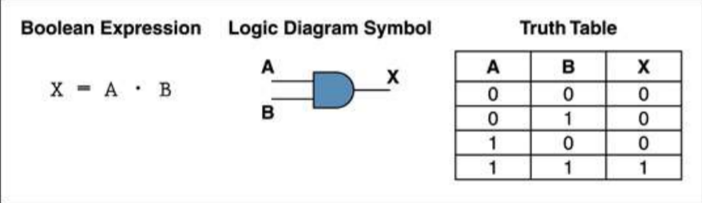
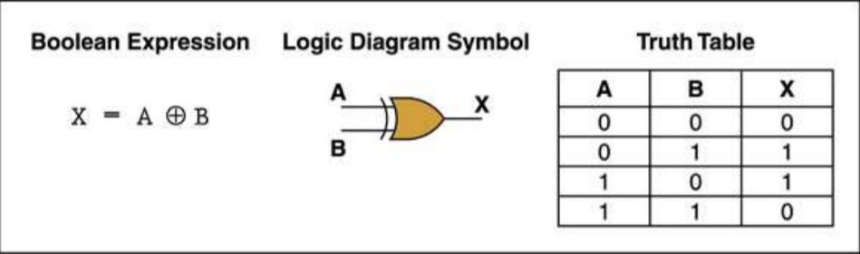
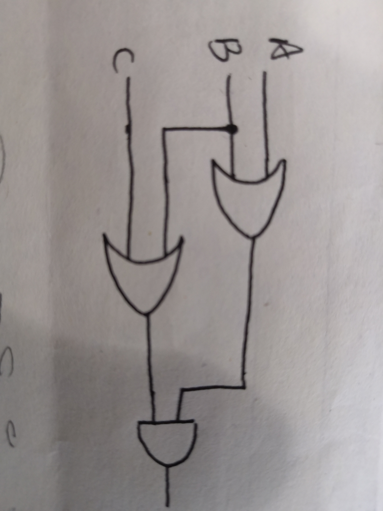
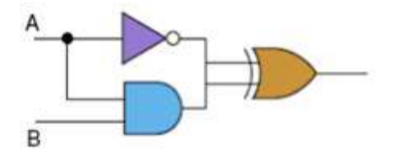
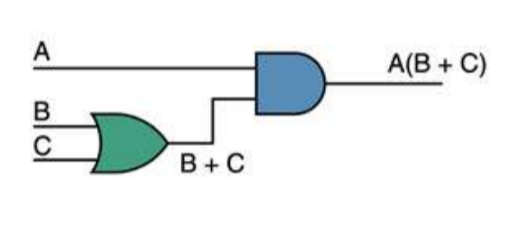
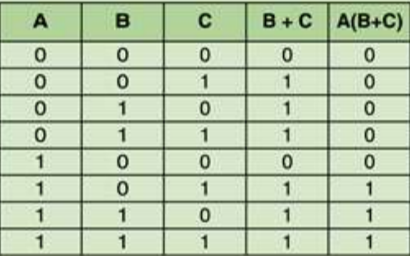
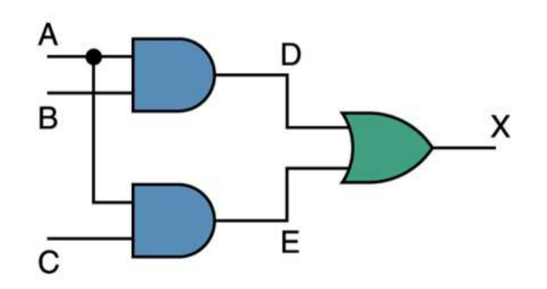
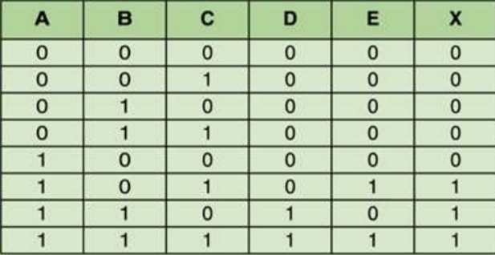
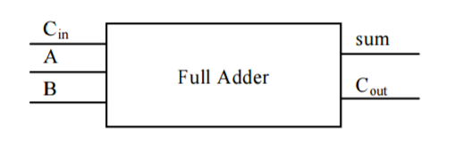
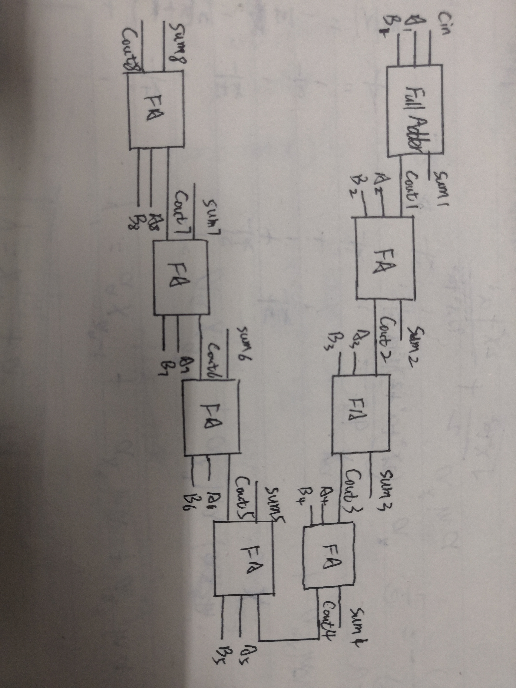

#作业（part 1  of  2）

1. Give the three representations of an AND gate and say in your words what AND means.

Answer:  

I think an AND gate is something like a gate that accepts two input singles.The value of both singles determine what the output single will be.If the two values corresponding to the singles are both 1,then the relsult is 1,otherwise,the consequence is 0.

2. Give the three representations of an XOR gate and say in your words what XOR means.

Answer:   

I think a XOR gate is something like a gate that also accept 2 input singles.The values of two singles determine what the output single will be.It will produce 1 when the values are diffient and 0 when the values are same.

3. Draw a circuit diagram corresponding to the following Boolean expression: (A + B)(B + C).

4. Show the behavior of the following circuit with a truth table:

|A|B|A'|AB|Result|
|---|---|---|---|---|
|0|0|1|0|1|
|1|0|0|0|0|
|0|1|1|0|1|
|1|1|0|1|1|

5. What is circuit equivalence? Use truth table to prove the following formula.

(AB)’ = A’ + B’

Circuit equivalence is that if you have two circuits,which have diffient construction.But when they work,you will find that they have the same function,whose one meaning is that they have the same ture table.For exemple,the next two circuits have the same function,so they are equivalent.

Proof:
|A|B|(AB)'|A'+B'|
|---|---|---|---|
|0|0|1|1|
|1|0|1|1|
|0|1|1|1|
|1|1|0|0|

##作业(part 2  of  2)

6. There are eight 1-bit full adder integrated circuits. Combine them to 8bit  adder circuit using the following box diagram.

7. Logical binary operations can be used to modify bit pattern. Such as
(X8X7X6X5X4X3X2X1)2 and (00001111)2 = (0000X4X3X2X1)2

We called that (00001111)2 is a mask which only makes low 4 bits to work.

Fill the follow expression：

(1) (X8X7X6X5X4X3X2X1)2 or (00001111)2 = (==(X8X7X6X5X4X3X2X1== )2

(2) (X8X7X6X5X4X3X2X1)2 xor (00001111)2 = (==X8X7X6X51111== )2

(3)((X8X7X6X5X4X3X2X1)2 and (11110000)2 )) or (not (X8X7X6X5X4X3X2X1)2 and (00001111)2) = (==X8X7X6X50000==)2

###作业(part 3  of  3)

8.使用维基百科，解释以下概念。

**1)Logic gate**

In electronics, a logic gate is an idealized or physical device implementing a Boolean function; that is, it performs a logical operation on one or more binary inputs and produces a single binary output. Depending on the context, the term may refer to an ideal logic gate, one that has for instance zero rise time and unlimited fan-out, or it may refer to a non-ideal physical device[1] (see Ideal and real op-amps for comparison).
Logic gates are primarily implemented using diodes or transistors acting as electronic switches, but can also be constructed using vacuum tubes, electromagnetic relays (relay logic), fluidic logic, pneumatic logic, optics, molecules, or even mechanical elements. With amplification, logic gates can be cascaded in the same way that Boolean functions can be composed, allowing the construction of a physical model of all of Boolean logic, and therefore, all of the algorithms and mathematics that can be described with Boolean logic.
Logic circuits include such devices as multiplexers, registers, arithmetic logic units (ALUs), and computer memory, all the way up through complete microprocessors, which may contain more than 100 million gates. In modern practice, most gates are made from field-effect transistors (FETs), particularly metal–oxide–semiconductor field-effect transistors (MOSFETs).
Compound logic gates AND-OR-Invert (AOI) and OR-AND-Invert (OAI) are often employed in circuit design because their construction using MOSFETs is simpler and more efficient than the sum of the individual gates.[2]
In reversible logic, Toffoli gates are used.

在电子学中，逻辑门是实现布尔函数的理想化或物理设备；即，它对一个或多个二进制输入执行逻辑操作并产生单个二进制输出。根据上下文，术语可以指理想逻辑门，例如具有零上升时间和无限扇出的逻辑门，或者它可以指非理想物理器件[1](参见理想运算放大器和真实运算放大器进行比较)。

逻辑门主要使用二极管或晶体管作为电子开关来实现，但也可以使用真空管、电磁继电器(继电器逻辑)、流体逻辑、气动逻辑、光学、分子甚至机械元件来构造。通过放大，逻辑门可以以与组成布尔函数相同的方式级联，从而允许构建所有布尔逻辑的物理模型，从而，能够用布尔逻辑描述的所有算法和数学。

逻辑电路包括诸如多路复用器、寄存器、算术逻辑单元(ALU)和计算机存储器之类的设备，一直到完整的微处理器，其中可能包含超过1亿个门。在现代实践中，大多数栅由场效应晶体管（FET）制成，特别是金属氧化物半导体场效应晶体管（MOSFET）。

复合逻辑门与-或-逆(AOI)和-或-与-逆(OAI)常用于电路设计，因为它们使用MOSFET的构造比单个门之和简单且有效。[2]在可逆逻辑中，使用Toffoli门。

**2)Boolean algebra**

In mathematics and mathematical logic, Boolean algebra is the branch of algebra in which the values of the variables are the truth values true and false, usually denoted 1 and 0 respectively. Instead of elementary algebra where the values of the variables are numbers, and the prime operations are addition and multiplication, the main operations of Boolean algebra are the conjunction and denoted as ∧, the disjunction or denoted as ∨, and the negation not denoted as ¬. It is thus a formalism for describing logical relations in the same way that elementary algebra describes numeric relations.
Boolean algebra was introduced by George Boole in his first book The Mathematical Analysis of Logic (1847), and set forth more fully in his An Investigation of the Laws of Thought (1854).[1] According to Huntington, the term "Boolean algebra" was first suggested by Sheffer in 1913,[2] although Charles Sanders Peirce in 1880 gave the title "A Boolian Algebra with One Constant" to the first chapter of his "The Simplest Mathematics".[3] Boolean algebra has been fundamental in the development of digital electronics, and is provided for in all modern programming languages. It is also used in set theory and statistics.[4]

在数学和数学逻辑中，布尔代数是代数的分支，其中变量的值是真值true和false，通常分别表示1和0。布尔代数的主要运算不是初等代数，其中变量的值是数，素运算是加法和乘法，而是连接和记为^，析出或记为∨，和否定不记为¬。因此，它是以基本代数描述数值关系的方式描述逻辑关系的形式主义。

布尔代数是由乔治·布莱在他的第一本书《逻辑的数学分析》（1847）中引入的，并在他的《思想法则的研究》（1854）中作了更全面的阐述。[1]根据亨廷顿的说法，“布尔代数”一词最早是由谢弗在1913年提出的，[2]尽管查尔斯·查尔斯1880年，莱斯·桑德斯·皮尔斯在他的《最简单的数学》的第一章中授予了“一个常数的布尔代数”的称号。[3]布尔代数是数字电子学发展的基础，并用所有现代编程语言提供。它也被用在集合论和统计学中。〔4〕

9.自学存储电路。维基百科：“Flip-flop”，选择中文：
1)Flip-flop 中文翻译是？

**触发器**

2)How many bits information does a SR latch store?

**1**

