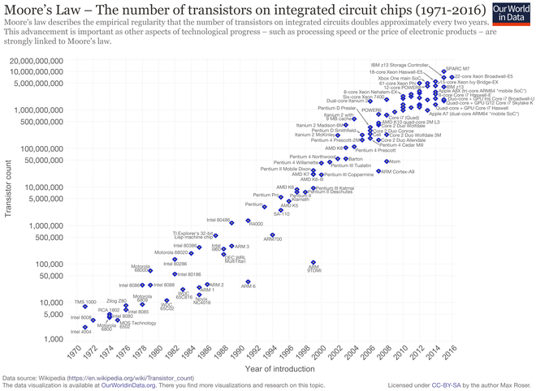

# homework

**Computer**

A computer is a device that can be instructed to carry out sequences of arithmetic or logical operations automatically via computer programming. Modern computers have the ability to follow generalized sets of operations, called programs. These programs enable computers to perform an extremely wide range of tasks.
Computers are used as control systems for a wide variety of industrial and consumer devices. This includes simple special purpose devices like microwave ovens and remote controls, factory devices such as industrial robots and computer-aided design, and also general purpose devices like personal computers and mobile devices such as smartphones.
Early computers were only conceived as calculating devices. Since ancient times, simple manual devices like the abacus aided people in doing calculations. Early in the Industrial Revolution, some mechanical devices were built to automate long tedious tasks, such as guiding patterns for looms. More sophisticated electrical machines did specialized analog calculations in the early 20th century. The first digital electronic calculating machines were developed during World War II. The speed, power, and versatility of computers have been increasing dramatically ever since then.
Conventionally, a modern computer consists of at least one processing element, typically a central processing unit (CPU), and some form of memory. The processing element carries out arithmetic and logical operations, and a sequencing and control unit can change the order of operations in response to stored information. Peripheral devices include input devices (keyboards, mice, joystick, etc.), output devices (monitor screens, printers, etc.), and input/output devices that perform both functions (e.g., the 2000s-era touchscreen). Peripheral devices allow information to be retrieved from an external source and they enable the result of operations to be saved and retrieved.
计算机是一种装置，它可以被指令通过计算机编程自动执行一系列算术或逻辑运算。现代计算机有能力遵循广义的操作集，称为程序。这些程序使计算机能够执行非常广泛的任务。计算机被用作各种工业和消费设备的控制系统。这包括简单的专用设备，如微波炉和遥控器，工厂设备，如工业机器人和计算机辅助设计，以及通用设备，如个人计算机和移动设备，如智能电话。早期的计算机仅仅是计算设备。自古以来，简单的手工装置如算盘帮助人们进行计算。在工业革命的早期，一些机械设备被建造来使冗长乏味的任务自动化，例如织机的引导图案。更先进的电机在二十世纪初进行了专门的模拟计算。第一台数字电子计算器是在第二次世界大战期间发明的。从那时起，计算机的速度、功率和多功能性急剧增加。传统上，现代计算机包括至少一个处理元件，通常是中央处理器（CPU）和某种形式的存储器。处理单元执行算术和逻辑操作，并且测序和控制单元可以响应于存储的信息改变操作的顺序。外围设备包括输入设备(键盘、鼠标、操纵杆等)、输出设备(监视屏幕、打印机等)和执行两种功能的输入/输出设备(例如，2000年代的触摸屏)。外围设备允许从外部源检索信息，并且它们允许保存和检索操作的结果。

**Computer science**

Computer science is the study of the theory, experimentation, and engineering that form the basis for the design and use of computers. It is the scientific and practical approach to computation and its applications and the systematic study of the feasibility, structure, expression, and mechanization of the methodical procedures (or algorithms) that underlie the acquisition, representation, processing, storage, communication of, and access to, information. An alternate, more succinct definition of computer science is the study of automating algorithmic processes that scale. A computer scientist specializes in the theory of computation and the design of computational systems.[1] See glossary of computer science.
Its fields can be divided into a variety of theoretical and practical disciplines. Some fields, such as computational complexity theory (which explores the fundamental properties of computational and intractable problems), are highly abstract, while fields such as computer graphics emphasize real-world visual applications. Other fields still focus on challenges in implementing computation. For example, programming language theory considers various approaches to the description of computation, while the study of computer programming itself investigates various aspects of the use of programming language and complex systems. Human–computer interaction considers the challenges in making computers and computations useful, usable, and universally accessible to humans.
计算机科学是对构成计算机设计和使用的基础的理论、实验和工程的研究。它是一种科学实用的计算方法及其应用的方法，是对D获取信息。计算机科学的另一种更简洁的定义是研究规模化算法过程的自动化。计算机科学家擅长计算理论和计算系统的设计。[1]参见计算机科学词汇表。其学科领域可分为多种理论和实践学科。一些领域，如计算复杂性理论（探索计算和棘手问题的基本特性），是高度抽象的，而像计算机图形学的领域则强调现实世界的视觉应用。其他领域仍然专注于实现计算的挑战。例如，编程语言理论考虑了描述计算的各种方法，而计算机编程本身的研究则调查了编程语言和复杂系统使用的各个方面。人机交互考虑了使计算机和计算变得有用、可用和普遍为人类所访问的挑战。

**Software**

Computer software, or simply software, is a generic term that refers to a collection of data or computer instructions that tell the computer how to work, in contrast to the physical hardware from which the system is built, that actually performs the work. In computer science and software engineering, computer software is all information processed by computer systems, programs and data. Computer software includes computer programs, libraries and related non-executable data, such as online documentation or digital media. Computer hardware and software require each other and neither can be realistically used on its own.
At the lowest level,[clarification needed] executable code consists of machine language instructions specific to an individual processor—typically a central processing unit (CPU) or a graphics processing unit (GPU). A machine language consists of groups of binary values signifying processor instructions that change the state of the computer from its preceding state. For example, an instruction may change the value stored in a particular storage location in the computer—an effect that is not directly observable to the user. An instruction may also invoke one of many input or output operations, for example displaying something text on a computer system; state changes which should be visible to the user. The processor carries out the instructions in the order they are provided, unless it is instructed to "jump" to a different instruction, or is interrupted by the operating system. As of 2015, most personal computers, smartphone devices and servers have processors with multiple execution units or multiple processors performing computation together, and computing has become a much more concurrent activity than in the past.
The majority of software is written in high-level programming languages that are easier and more efficient for programmers to use because they are closer than machine languages to natural languages.[1] High-level languages are translated into machine language using a compiler or an interpreter or a combination of the two. Software may also be written in a low-level assembly language, which has strong correspondence to the computer's machine language instructions and is translated into machine language using an assembler.
计算机软件，或简称软件，是一个通用术语，指的是一组数据或计算机指令，这些数据或计算机指令告诉计算机如何工作，这与实际执行工作的物理硬件形成对比。在计算机科学和软件工程中，计算机软件是由计算机系统、程序和数据处理的所有信息。计算机软件包括计算机程序、库和相关的不可执行数据，如联机文档或数字媒体。计算机硬件和软件需要彼此，而且它们本身都不能实际使用。在最低级别上，[所需的澄清]可执行代码由特定于单个处理器的机器语言指令组成——通常是中央处理单元(CPU)或图形处理单元(GPU)。机器语言由一组二进制值组成，二进制值表示处理器指令，处理器指令将计算机的状态从前一状态更改。例如，指令可以改变存储在计算机中的特定存储位置中的值，这是用户无法直接观察到的效果。指令还可以调用许多输入或输出操作中的一个，例如，在计算机系统上显示一些文本；状态改变，这些改变对于用户应该是可见的。处理器按照提供的顺序执行指令，除非它被指令跳转到不同的指令，或者被操作系统中断。到2015年，大多数个人计算机、智能手机设备和服务器都具有具有多个执行单元的处理器或者多个处理器一起执行计算，并且计算已经变得比过去更加并发。大多数软件是用高级编程语言编写的，这些高级编程语言对于程序员来说使用起来更容易、更有效，因为它们比机器语言更接近自然语言。两者结合。软件也可以用低级汇编语言编写，该低级汇编语言与计算机的机器语言指令具有很强的对应性，并且使用汇编程序被翻译成机器语言。

**Software engineering**

Notable definitions of software engineering include:
"the systematic application of scientific and technological knowledge, methods, and experience to the design, implementation, testing, and documentation of software"—The Bureau of Labor Statistics—IEEE Systems and software engineering - Vocabulary[4]
"The application of a systematic, disciplined, quantifiable approach to the development, operation, and maintenance of software"—IEEE Standard Glossary of Software Engineering Terminology[5]
"an engineering discipline that is concerned with all aspects of software production"—Ian Sommerville[6]
"the establishment and use of sound engineering principles in order to economically obtain software that is reliable and works efficiently on real machines"—Fritz Bauer[7]
The term has also been used less formally:
as the informal contemporary term for the broad range of activities that were formerly called computer programming and systems analysis;[8]
as the broad term for all aspects of the practice of computer programming, as opposed to the theory of computer programming, which is called computer science;[9]
as the term embodying the advocacy of a specific approach to computer programming, one that urges that it be treated as an engineering discipline rather than an art or a craft, and advocates the codification of recommended practices.[10]
软件工程的显著定义包括：“将科学技术知识、方法和经验系统地应用于软件的设计、实现、测试和文档”-劳工统计局-IEEE系统和软件工程-词汇[4]“对软件开发、操作和维护应用系统的、有纪律的、可量化的方法”-IEEE软件工程术语标准词汇表[5]“涉及软件生产的所有方面的工程学科”-萨默维尔[6]“建立和使用健全的工程原理，以便经济地获得可靠的、在实际机器上高效工作的软件”-弗里茨鲍尔[7]
这个术语也用得不那么正式：作为以前称为计算机编程和系统分析的广泛活动的非正式的当代术语；[8]作为计算机编程实践的所有方面的广义术语，与计算机编程理论相反。夯实，又称计算机科学；[9]作为体现对计算机编程特定方法的倡导的术语，它敦促把夯实作为一门工程学科而不是一门艺术或一门工艺，并提倡对推荐的实践进行编纂。

**Alan Turing**

Alan Mathison Turing OBE FRS (/ˈtjʊərɪŋ/; 23 June 1912 – 7 June 1954) was an English computer scientist, mathematician, logician, cryptanalyst, philosopher, and theoretical biologist.[2] Turing was highly influential in the development of theoretical computer science, providing a formalisation of the concepts of algorithm and computation with the Turing machine, which can be considered a model of a general purpose computer.[7][8][9] Turing is widely considered to be the father of theoretical computer science and artificial intelligence.[10] However, he was also a tragic figure: a hero who was never fully recognized in his home country during his lifetime due to his homosexuality (which was then a crime in the UK).
During the Second World War, Turing worked for the Government Code and Cypher School (GC&CS) at Bletchley Park, Britain's codebreaking centre that produced Ultra intelligence. For a time he led Hut 8, the section which was responsible for German naval cryptanalysis. Here he devised a number of techniques for speeding the breaking of German ciphers, including improvements to the pre-war Polish bombe method, an electromechanical machine that could find settings for the Enigma machine. Turing played a pivotal role in cracking intercepted coded messages that enabled the Allies to defeat the Nazis in many crucial engagements, including the Battle of the Atlantic, and in so doing helped win the war.[11][12] Counterfactual history is difficult with respect to the effect Ultra intelligence had on the length of the war,[13] but at the upper end it has been estimated that this work shortened the war in Europe by more than two years and saved over fourteen million lives.[11]
After the war, Turing worked at the National Physical Laboratory, where he designed the ACE, among the first designs for a stored-program computer. In 1948 Turing joined Max Newman's Computing Machine Laboratory at the Victoria University of Manchester, where he helped develop the Manchester computers[14] and became interested in mathematical biology. He wrote a paper on the chemical basis of morphogenesis,[3] and predicted oscillating chemical reactions such as the Belousov–Zhabotinsky reaction, first observed in the 1960s.
Turing was prosecuted in 1952 for homosexual acts, when by the Labouchere Amendment, "gross indecency" was a criminal offence in the UK. He accepted chemical castration treatment, with DES, as an alternative to prison. Turing died in 1954, 16 days before his 42nd birthday, from cyanide poisoning. An inquest determined his death as suicide, but it has been noted that the known evidence is also consistent with accidental poisoning.[15] In 2009, following an Internet campaign, British Prime Minister Gordon Brown made an official public apology on behalf of the British government for "the appalling way he was treated." Queen Elizabeth II granted him a posthumous pardon in 2013.[16][17][18] The Alan Turing law is now an informal term for a 2017 law in the United Kingdom that retroactively pardoned men cautioned or convicted under historical legislation that outlawed homosexual acts.[19]
Alan Mathison Turing OBE FRS(1912年6月23日至1954年6月7日)是英国计算机科学家、数学家、逻辑学家、密码分析家、哲学家和理论生物学家。图灵机是一种通用计算机的模型。图灵被广泛认为是理论计算机科学和人工智能之父。由于同性恋（当时在英国是犯罪），在他有生之年在他的祖国从未被完全承认。在第二次世界大战期间，图灵在Bletchley公园的政府代码和密码学校（GC&CS）工作，Bletchley公园是英国产生超智能的破译中心。有一段时间，他领导的HUT 8，负责德国海军密码分析的部分。在此，他设计了许多加速破译德语密码的技术，包括改进战前波兰轰炸法，一种机电机器，可以找到谜机的设置。图灵在破解被截获的编码信息方面发挥了关键作用，这些信息使得盟军能够在许多关键战役中打败纳粹，包括大西洋战役，并且这样做有助于赢得战争。
反事实的历史很难看出超情报对战争时间的影响，[13]，但据估计，在最上端，这项工作缩短了欧洲战争两年多，挽救了1400多万人的生命。战后，图灵在国家物理实验室工作，在那里他设计了ACE，这是存储程序计算机的最初设计之一。1948年，图灵加入了曼彻斯特维多利亚大学的马克斯·纽曼计算机实验室，在那里他帮助开发了曼彻斯特计算机，并对数学生物学产生了兴趣。他写了一篇关于形态发生的化学基础的论文，[3]并预测了振荡化学反应，如贝鲁索夫-扎博丁斯基反应，第一次观测是在20世纪60年代。图灵因同性恋行为于1952年被起诉，当时根据工党修正案，“严重猥亵”在英国是刑事犯罪。他接受了化学阉割疗法，用DES代替监狱。图灵在他第四十二岁生日前的1954, 16天死于氰化物中毒。调查确定他的死亡是自杀，但已知证据也与意外中毒一致。[15]2009年，英国首相戈登·布朗在互联网宣传活动之后，代表英国政府就“这个幽灵”向公众正式道歉。英国女王伊丽莎白二世在2013年对他进行了死后赦免。[16][17][18]阿兰·图灵法现在是英国2017年一项法律的非正式用语，该法律追溯性地赦免了根据禁止同性恋行为的历史立法而被警告或定罪的男子。

**Moore’s law**

Moore's law is the observation that the number of transistors in a dense integrated circuit doubles about every two years. The observation is named after Gordon Moore, the co-founder of Fairchild Semiconductor and Intel, whose 1965 paper described a doubling every year in the number of components per integrated circuit,[2] and projected this rate of growth would continue for at least another decade.[3] In 1975,[4] looking forward to the next decade,[5] he revised the forecast to doubling every two years.[6][7][8] The period is often quoted as 18 months because of a prediction by Intel executive David House (being a combination of the effect of more transistors and the transistors being faster).[9]
Moore's prediction proved accurate for several decades, and has been used in the semiconductor industry to guide long-term planning and to set targets for research and development.[10] Advancements in digital electronics are strongly linked to Moore's law: quality-adjusted microprocessor prices,[11] memory capacity, sensors and even the number and size of pixels in digital cameras.[12] Digital electronics has contributed to world economic growth in the late twentieth and early twenty-first centuries.[13] Moore's law describes a driving force of technological and social change, productivity, and economic growth.[14][15][16][17]
Moore's law is an observation and projection of a historical trend and not a physical or natural law. Although the rate held steady from 1975 until around 2012, the rate was faster during the first decade. In general, it is not logically sound to extrapolate from the historical growth rate into the indefinite future. For example, the 2010 update to the International Technology Roadmap for Semiconductors predicted that growth would slow around 2013,[18] and in 2015 Gordon Moore foresaw that the rate of progress would reach saturation: "I see Moore's law dying here in the next decade or so."[19]
Intel stated in 2015 that the pace of advancement has slowed, starting at the 22 nm feature width around 2012, and continuing at 14 nm.[20] Brian Krzanich, the former CEO of Intel, announced, "Our cadence today is closer to two and a half years than two." Intel is expected to reach the 10 nm node in 2018, a three-year cadence.[21][22] Intel also stated in 2017 that hyperscaling would be able to continue the trend of Moore's law and offset the increased cadence by aggressively scaling beyond the typical doubling of transistors.[23] He cited Moore's 1975 revision as a precedent for the current deceleration, which results from technical challenges and is "a natural part of the history of Moore's law"

Moore's law is the observation that the number of transistors in a dense integrated circuit doubles about every two years. The observation is named after Gordon Moore, the co-founder of Fairchild Semiconductor and Intel, whose 1965 paper described a doubling every year in the number of components per integrated circuit,[2] and projected this rate of growth would continue for at least another decade.[3] In 1975,[4] looking forward to the next decade,[5] he revised the forecast to doubling every two years.[6][7][8] The period is often quoted as 18 months because of a prediction by Intel executive David House (being a combination of the effect of more transistors and the transistors being faster).[9]
穆尔定律是在一个密集的集成电路中晶体管的数量大约每两年增长一倍的观察。这个观察是以费尔柴尔德半导体和英特尔的联合创始人戈登·摩尔的名字命名的，他在1965年的论文中描述了每个集成电路的元件数量每年翻一番，[2]并预测这种增长速度将持续至少十年。展望未来十年，[5]他把预测修正为每两年翻一番。[6][7][8]由于英特尔执行官大卫·豪斯的预测（晶体管效应越大，晶体管效应越快），这一时期常常被引用为18个月。几十年来，摩尔的预测被证明是准确的，而且在半导体工业中被用来指导长期计划和设定研发目标。[10]数字电子的进步与摩尔定律紧密相连：经过质量调整的微处理器价格，[11][12]数字电子学在二十世纪末二十一世纪初对世界经济增长作出了贡献。[13]摩尔定律描述了技术和社会变革、生产力的推动力。和经济增长。穆尔定律是对历史趋势的观察和投影，而不是物理或自然规律。尽管利率从1975一直保持到2012左右，但在第一个十年里利率上升得更快。一般来说，从历史增长率推断为不确定未来是不合理的。例如，2010年国际半导体技术路线图的更新预测到2013年左右增长将放缓，[18]，2015年戈登·摩尔预测进展速度将达到饱和：“我看到摩尔定律将在未来十年左右死在这里。”英特尔在2015年表示，其发展步伐已经放缓，从2012年左右22nm的特征宽度开始，持续到14nm。[20]英特尔前CEO布莱恩·克扎尼奇宣布：“我们今天的节奏比两年快两年半。”英特尔预计在2018年达到10nm的节奏，三年的节奏。。[21][22]英特尔还在2017年指出，超标度将能够延续摩尔定律的趋势，并通过积极地超出晶体管的典型倍增来抵消增加的节奏。[23]他引用摩尔1975年的修订作为电流的先例。减速，这是技术挑战的结果，是“穆尔定律历史的自然部分”。
