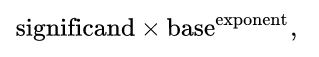
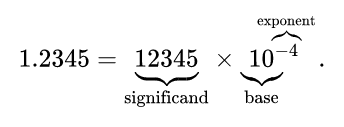

#作业 （part 1 of 2）  

Write out variables x, y and z in binary code
1) int8_t x = 67;    ==01000011==
 int8_t y = -7;      ==11111001==
 int8_t z = y - x;   ==10110101==
2) int8_t x = 0xd3;  ==11010011==
3) uint8_t = 0xd3;   ==00101101==
4) int8_t x = 127;   ==01111111==
 int8_t y = -7;      ==11111001==
 int8_t z = y – x;   ==溢出==
5) float x = 1.125;  == 1.001==
6) float x = 23.0;   ==10111.0==
7) float x = 0.45;   ==溢出==  

#作业 （part 2 of 2）  

**Method of complements**  

In mathematics and computing, the method of complements is a technique used to subtract one number from another using only addition of positive numbers. This method was commonly used in mechanical calculators and is still used in modern computers.
The nines' complement of a number is formed by replacing each digit with nine minus that digit. To subtract a decimal number y (the subtrahend) from another number x (the minuend) two methods may be used:
In the first method the nines' complement of x is added to y. Then the nines' complement of the result obtained is formed to produce the desired result.
In the second method the nines' complement of y is added to x and one is added to the sum. The leading digit '1' of the result is then discarded. Discarding the initial '1' is especially convenient on calculators or computers that use a fixed number of digits: there is nowhere for it to go so it is simply lost during the calculation. The nines' complement plus one is known as the ten's complement.
The method of complements can be extended to other number bases (radices); in particular, it is used on most digital computers to perform subtraction, represent negative numbers in base 2 or binary arithmetic and test underflow and overflow in calculation.   

在数学和计算中，补方法是一种只用正数的加法来从一个数减去另一个数的技术。这种方法在机械计算器中是常用的，至今仍在现代计算机中使用。一个数的补码是用九减去那个数字来代替每一个数字。从另一个数字X（被减数）中减去十进制数y（减数）可以使用两种方法：  
在第一种方法中，将x的九个补加到y中，然后形成所得结果的九个补，以产生期望的结果。
在第二种方法中，将n的补体Y加到X，并将一个加到总和中。然后丢弃结果的前导数字“1”。丢弃最初的“1”在使用固定位数的计算器或计算机上是特别方便的：它没有地方可去，因此在计算过程中丢失了。n补一加称为十补语。补码方法可推广到其它数字基数（基数），特别是在大多数数字计算机上进行减法运算，表示基数2或二进制算术中的负数，在计算中测试下溢和溢出。  

**Byte**  

The byte is a unit of digital information that most commonly consists of eight bits, representing a binary number. Historically, the byte was the number of bits used to encode a single character of text in a computer[1][2] and for this reason it is the smallest addressable unit of memory in many computer architectures.
The size of the byte has historically been hardware dependent and no definitive standards existed that mandated the size – byte-sizes from 1[3] to 48 bits[4] are known to have been used in the past.[5][6] Early character encoding systems often used six bits, and machines using six-bit and nine-bit bytes were common into the 1960s. These machines most commonly had memory words of 12, 24, 36, 48 or 60 bits, corresponding to two, four, six, eight or 10 six-bit bytes. In this era, bytes in the instruction stream were often referred to as syllables, before the term byte became common.
The modern de-facto standard of eight bits, as documented in ISO/IEC 2382-1:1993, is a convenient power of two permitting the values 0 through 255 for one byte.[7] The international standard IEC 80000-13 codified this common meaning. Many types of applications use information representable in eight or fewer bits and processor designers optimize for this common usage. The popularity of major commercial computing architectures has aided in the ubiquitous acceptance of the eight-bit size.[8] Modern architectures typically use 32- or 64-bit words, built of four or eight bytes.
The unit symbol for the byte was designated as the upper-case letter B by the International Electrotechnical Commission (IEC) and Institute of Electrical and Electronics Engineers (IEEE)[9] in contrast to the bit, whose IEEE symbol is a lower-case b. Internationally, the unit octet, symbol o, explicitly denotes a sequence of eight bits, eliminating the ambiguity of the byte. 

字节是数字信息的一个单元，通常由八位组成，表示二进制数。在历史上，字节是用来编码计算机中单个文本字符的比特数，因此它是许多计算机体系结构中最小的可寻址存储单元。字节的大小历来是依赖于硬件的，并且不存在强制从1到48位的大小——字节大小的确定标准，这在过去是已知的。早期的字符编码系统通常使用6位，机器使用6位和9位的字节在20世纪60年代很常见。这些机器通常具有12、24、36、48或60位的存储字，分别对应于2、4、6、8或10  6位字节。在这个时代，指令流中的字节通常被称为音节。ISO/IEC 2382-1:1993中记载的现代8位事实标准是允许值0到255为一个字节的两个方便的幂。国际标准IEC 80000-13将这一共同含义编成代码。许多类型的应用程序使用以8位或更少位表示的信息，处理器设计人员为此常见用途进行了优化。主要的商业计算体系结构的普及有助于普遍接受8位大小。现代体系结构通常使用32位或64位的单词，由4或8字节构建。国际电工委员会（IEC）和电子工程师协会（IEEE）将字节的单位符号指定为大写字母B，而位的IEEE符号是小写字母b。在国际上，单位八位字节，符号O，明确地表示一个八位的序列，消除了字节的模糊性。  

**Integer (computer science)**  

In computer science, an integer is a datum of integral data type, a data type that represents some range of mathematical integers. Integral data types may be of different sizes and may or may not be allowed to contain negative values. Integers are commonly represented in a computer as a group of binary digits (bits). The size of the grouping varies so the set of integer sizes available varies between different types of computers. Computer hardware, including virtual machines, nearly always provide a way to represent a processor register or memory address as an integer.

在计算机科学中，整数是整数数据类型的基准，一种表示数学整数范围的数据类型。积分数据类型可以是不同的大小，并且可以允许或不允许包含负值。整数在计算机中通常表示为一组二进制数字（位）。分组的大小不同，因此可用的整数大小集合在不同类型的计算机之间有所不同。计算机硬件，包括虚拟机，几乎总是提供将处理器寄存器或存储器地址表示为整数的方法。  

**Floating point**  

In computing, floating-point arithmetic (FP) is arithmetic using formulaic representation of real numbers as an approximation so as to support a trade-off between range and precision. For this reason, floating-point computation is often found in systems which include very small and very large real numbers, which require fast processing times. A number is, in general, represented approximately to a fixed number of significant digits (the significand) and scaled using an exponent in some fixed base; the base for the scaling is normally two, ten, or sixteen. A number that can be represented exactly is of the following form:  

where significand is an integer (i.e., in Z), base is an integer greater than or equal to two, and exponent is also an integer. For example:  

The term floating point refers to the fact that a number's radix point (decimal point, or, more commonly in computers, binary point) can "float"; that is, it can be placed anywhere relative to the significant digits of the number. This position is indicated as the ==exponent component==, and thus the floating-point representation can be thought of as a kind of scientific notation.
A floating-point system can be used to represent, with a fixed number of digits, numbers of different orders of magnitude: e.g. the distance between galaxies or the diameter of an atomic nucleus can be expressed with the same unit of length. The result of this dynamic range is that the numbers that can be represented are not uniformly spaced; the difference between two consecutive representable numbers grows with the chosen scale.[1]
Over the years, a variety of floating-point representations have been used in computers. However, since the 1990s, the most commonly encountered representation is that defined by the IEEE 754 Standard.
The speed of floating-point operations, commonly measured in terms of FLOPS, is an important characteristic of a computer system, especially for applications that involve intensive mathematical calculations.
A floating-point unit (FPU, colloquially a math coprocessor) is a part of a computer system specially designed to carry out operations on floating-point numbers. 

在计算中，浮点算法（FP）是使用实数的公式表示作为近似，以支持范围和精度之间的权衡的算法。由于这个原因，浮点计算经常出现在包含非常小和非常大的实数的系统中，这需要快速的处理时间。一般来说，数字被近似表示为固定数量的有效数字（有效数），并在某些固定基中使用指数进行缩放；用于缩放的基数通常为2、10或16。可以精确表示的数字有以下形式：  

 
 
其中significand（有效数）是整数（即在Z中），base（基）是一个大于或等于2的整数，指数也是整数。例如：  

 
 
浮点这个术语指的是一个数字的基点（十进制点，或者更常见的是计算机中的二进制点）可以“浮动”的事实；也就是说，它可以放置在任何相对于数字有效数字的位置。这个位置被表示为==指数分量==，因此浮点表示可以被认为是一种科学的表示法。浮点系统可以用固定数量的数字来表示不同数量级的数字：例如，星系之间的距离或原子核的直径可以用相同的长度单位来表示。这个动态范围的结果是，可以表示的数字不是均匀间隔的；两个连续的可表示数字之间的差异随着所选的比例而增大。多年来，各种浮点表示已经在计算机中使用。然而，自20世纪90年代以来，最常遇到的表示是由IEEE 754标准定义的。浮点运算的速度，通常用FLOPS( floating-point operation 浮点运算)来衡量，是计算机系统的一个重要特性，特别是对于涉及密集数学计算的应用。浮点单元（FPU，俗称数学协处理器）是专门设计用于对浮点数进行操作的计算机系统的一部分。  

##证明：二进制的负数（two‘s complement of X）等于 X 的 ones’complement ＋ 1（即，X每位求反加1）  

证明： 

在十进制中n位二进制可以表示为：

N = d1+d2×2+d3×22 +⋯+dn−1×2n−2+dn×2n−1

Negative(N) = 2n - N

由等比数列求和有：

1 + 2 + 22 + ... + 2n-2 + 2n-1 = $$\frac{1 * (1 - 2^n)}{1 - 2}$$ = 2n - 1
 
所以Negative(N) = 1 + 2 + ... +2n-2 + 2n-1 + ==1== - (d1 + d2 * 2 + d3 * 22 + ... + dn-1 * 2n-2 + dn-1 * 2n-2 + dn * 2n-1) = (1 - d1) + (1 - d2) * 2 + (1 - d3) * 22 + ... + (1 - dn-1) * 2n-2 + (1 - dn) * 2n-1 

二进制中，d1,d2,...,dn,非0即1，故得证。
 

##Int8_t x = - 017; 请用8进制描述变量 x。

(-017)10 = （11101111）2 = （357）8

##1)C程序：int8_t x = -0x1f; int y = x; 请用16进制描述变量 x 和 y，并说明 int y = x 的计算过程。  
y = x = 0xFFFFFFE1
因为：
x = -0xlf = -31(10) 

而31的二进制为0000 0000 0000 0000 0000 0000 001 1111，取反加一得其补码-31为1111 1111 1111 1111 1111 1111 1110 0001(2)，然后把该二进制转换为十六进制得：
y = x = 0xFFFFFFE1

##2)请用数学证明，为什么可以这么计算。

证明：

在十进制中n位二进制可以表示为：

N = d1+d2×2+d3×22 +⋯+dn−1×2n−2+dn×2n−1

Negative(N) = 2n - N

由等比数列求和有：

1 + 2 + 22 + ... + 2n-2 + 2n-1 = $$\frac{1 * (1 - 2^n)}{1 - 2}$$ = 2n - 1
 
所以Negative(N) = 1 + 2 + ... +2n-2 + 2n-1 + ==1== - (d1 + d2 * 2 + d3 * 22 + ... + dn-1 * 2n-2 + dn-1 * 2n-2 + dn * 2n-1) = (1 - d1) + (1 - d2) * 2 + (1 - d3) * 22 + ... + (1 - dn-1) * 2n-2 + (1 - dn) * 2n-1 

二进制中，d1,d2,...,dn,非0即1，故得证。
此证法（取反码）和上面的等同，只不过把位数扩大了（）。然后将二进制转化为十六进制，之所以每隔四位取一位，是因为二进制的每四位的最大值正好等于十六进制的最大值，说明这二者每隔四位（二进制）对应一位（十六进制）。

 

