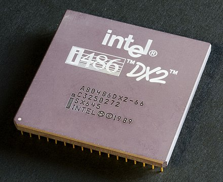
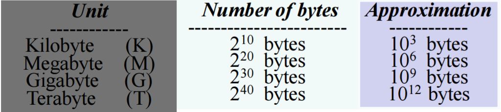

# homework1/1

1. According to the von Neumann architecture, List basic parts of a computer.

batter 电源           fan 风扇    monitor 显示屏
circuit board 电路板        graphics card 显卡        
1、storage 存储器       hard disk 硬盘      CD-ROM / CD driver 光驱（光盘驱动器）
2、Contorl Unit(CU) 控制器   GPU(Graphic Processing Unit) 图形处理器     
                             CPU(Center Processing Unit) 中央处理器   
3、intput and output device 输入输出设备    keyboard 键盘   mouse 鼠标
4、Arithmetic Logical Unit(ALU) 运算器

2、A computer has 64 MB (megabytes) of memory. How many bits are needed to address any single byte in memory?

**26**

3、List basic parts of a CPU, include cache or not?

A CPU has three basic parts, which are contorl unit, arithmetic unit and storage unit.It does include cache.

4、What mean secondary storage. List some on your PC.

Secondary storage, also known as auxiliary storage(memory), external memory that is not directly accessible by CPU, because it is not accessed via the input / output channels(it is an external device).In RAM devices(as flash memory) data can be directly deleted or changed.

My PC : Magnetic Disk  Flash memory  USB fash disk 

5、使用维基百科，解释以下概念：

**CPU**

A central processing unit (CPU) is the electronic circuitry within a computer that carries out the instructions of a computer program by performing the basic arithmetic, logical, control and input/output (I/O) operations specified by the instructions. The computer industry has used the term "central processing unit" at least since the early 1960s. Traditionally, the term "CPU" refers to a processor, more specifically to its processing unit and control unit (CU), distinguishing these core elements of a computer from external components such as main memory and I/O circuitry.
The form, design, and implementation of CPUs have changed over the course of their history, but their fundamental operation remains almost unchanged. Principal components of a CPU include the arithmetic logic unit (ALU) that performs arithmetic and logic operations, processor registers that supply operands to the ALU and store the results of ALU operations and a control unit that orchestrates the fetching (from memory) and execution of instructions by directing the coordinated operations of the ALU, registers and other components.
Most modern CPUs are microprocessors, meaning they are contained on a single integrated circuit (IC) chip. An IC that contains a CPU may also contain memory, peripheral interfaces, and other components of a computer; such integrated devices are variously called microcontrollers or systems on a chip (SoC). Some computers employ a multi-core processor, which is a single chip containing two or more CPUs called "cores"; in that context, one can speak of such single chips as "sockets".
Array processors or vector processors have multiple processors that operate in parallel, with no unit considered central. There also exists the concept of virtual CPUs which are an abstraction of dynamical aggregated computational resources.

中央处理单元(CPU)是计算机内的电子电路，通过执行由指令指定的基本算术、逻辑、控制和输入/输出(I/O)操作来执行计算机程序的指令。计算机工业至少从20世纪60年代初就使用了术语“中央处理单元”。传统上，术语“CPU”指的是处理器，更具体地说是它的处理单元和控制单元（CU），将计算机的这些核心元件与外部组件（如主存储器和I/O电路）区分开来。
CPU的形式、设计和实现在它们的历史进程中已经发生了变化，但是它们的基本操作几乎没有改变。CPU的主要部件包括算术逻辑单元（ALU），算术逻辑单元（ALU）执行算术和逻辑运算，处理器寄存器，其向ALU提供操作数并存储ALU操作的结果，以及控制单元，所述控制单元通过指导ALU、寄存器和其他组件的协调操作来编排(从存储器)指令的取出和执行。
大多数现代CPU是微处理器，意味着它们包含在单个集成电路（IC）芯片上。包含CPU的IC还可以包含存储器、外围接口和计算机的其他组件；这种集成设备被各种各样的称为芯片上的微控制器或系统(SoC)。有些计算机使用多核处理器，它是包含两个或更多个CPU的单芯片，称为“核”；在这种情况下，我们可以把这种单芯片称为“套接字”。阵列处理器或向量处理器具有并行操作的多个处理器，没有单元被认为是中心的。也存在虚拟CPU的概念，它是动态聚合计算资源的抽象。

**RAM**

Random-access memory (RAM /ræm/) is a form of computer data storage that stores data and machine code currently being used. A random-access memory device allows data items to be read or written in almost the same amount of time irrespective of the physical location of data inside the memory. In contrast, with other direct-access data storage media such as hard disks, CD-RWs, DVD-RWs and the older magnetic tapes and drum memory, the time required to read and write data items varies significantly depending on their physical locations on the recording medium, due to mechanical limitations such as media rotation speeds and arm movement.
RAM contains multiplexing and demultiplexing circuitry, to connect the data lines to the addressed storage for reading or writing the entry. Usually more than one bit of storage is accessed by the same address, and RAM devices often have multiple data lines and are said to be "8-bit" or "16-bit", etc. devices.
In today's technology, random-access memory takes the form of integrated circuits. RAM is normally associated with volatile types of memory (such as DRAM modules), where stored information is lost if power is removed, although non-volatile RAM has also been developed. Other types of non-volatile memories exist that allow random access for read operations, but either do not allow write operations or have other kinds of limitations on them. These include most types of ROM and a type of flash memory called NOR-Flash.
Integrated-circuit RAM chips came into the market in the early 1970s, with the first commercially available DRAM chip, the Intel 1103, introduced in October 1970.

随机存取存储器（RAM/R.M/）是存储当前使用的数据和机器代码的计算机数据存储器的一种形式。随机存取存储器装置允许数据项在几乎相同的时间内被读取或写入，而不管数据在存储器内的物理位置如何。相比之下，与其他直接存取数据存储介质，例如硬盘、CD-RW、DVD-RW以及较旧的磁带和鼓式存储器，由于机械限制，如介质旋转速度和手臂运动，数据项的读取和写入所需的时间根据它们在记录介质上的物理位置而显著不同。
RAM包含多路复用和解复用电路，用于将数据线连接到地址存储器以读取或写入条目。通常多于一位的存储器由相同的地址访问，并且RAM设备通常具有多个数据线，并且被称为“8位”或“16位”等设备。
在当今的技术中，随机存取存储器采用集成电路的形式。RAM通常与易失性类型的存储器(例如DRAM模块)相关联，尽管也开发了非易失性RAM。但其中存储的信息在断电时丢失。存在其他类型的非易失性存储器，它们允许对读取操作进行随机访问，但是不允许写入操作，或者对它们具有其他类型的限制。这些类型包括大多数类型的ROM和一种称为NOR Flash的闪存。
集成电路RAM芯片在20世纪70年代初进入市场，第一块商用DRAM芯片英特尔1103于1970年10月推出。

**ROM**

Rom (Read Only Memory) read-only memory, the contents of this memory will not change under any circumstances, computers and users can only read the instructions stored here, and use the data stored in ROM, but can not change or save data. ROM is stored on a non-volatile chip, that is, even after the shutdown of the memory can still be saved, so this memory is often used to store a specific function of the program or system program. ROM stores instructions to start the computer, and at boot time the ROM provides a series of instructions to the central processing unit for testing. In the initial test, the RAM location is checked to confirm its ability to store data. Other electronic components, including the keyboard, timer circuit, and the CPU itself, are also included in the CPU test.

Rom（Read Only Memory）只读存储器，这种存储器（Memory）的内容任何情况下都不会改变，计算机与用户只能读取保存在这里的指令，和使用存储在ROM的数据，但不能变更或存入数据。ROM被存储在一个非易失性芯片上，也就是说，即使在关机之后记忆的内容仍可以被保存，所以这种存储器多用来存储特定功能的程序或系统程序。ROM存储用来启动计算机的指令，引导的时候ROM提供一连串的指令给中央处理单元进行测试，在最初的测试中，检查RAM位置（location）以确认其存储数据的能力。此外其他电子组件包括键盘（Keyboard）、计时回路（timer circuit）以及CPU本身也被纳入CPU的测试中。

**Bus (computing)**

Bus refers to the standardized exchange of data between computer components, that is, to provide data transmission and control logic for each component in a common way. On the other hand, if the Mother Board is a city, then the bus is like a bus in the city, which can transmit bits to and fro on a fixed route. These lines can only transmit one bit at the same time. Therefore, multiple lines must be used simultaneously to transmit more data, and the number of data that can be transmitted simultaneously by the bus is called width. The larger the bus width in bits, the better the transmission performance. The bandwidth of the bus (that is, the total number of data that can be transmitted per unit time) is: the bus bandwidth = frequency * width (Bytes / sec).
There are generally five kinds of buses on PC.
Data Bus: Transfers data that needs to be processed or stored back and forth between the CPU and RAM.
Address Bus: Used to specify the address of data stored in RAM.
Control Bus: Signals from the microprocessor control unit (Control Unit) are transmitted to peripheral devices, usually USB Bus and 1394 Bus.
Expansion Bus: can connect the expansion slot and the computer.
Local Bus: replace the extended bus with higher speed data transmission.

总线（Bus）是指计算机组件间规范化的交换数据（data）的方式，即以一种通用的方式为各组件提供数据传送和控制逻辑。从另一个角度来看，如果说主板（Mother Board）是一座城市，那么总线就像是城市里的公共汽车（bus），能按照固定行车路线，传输来回不停运作的比特（bit）。这些线路在同一时间内都仅能负责传输一个比特。因此，必须同时采用多条线路才能发送更多数据，而总线可同时传输的数据数就称为宽度（width），以比特为单位，总线宽度愈大，传输性能就愈佳。总线的带宽（即单位时间内可以传输的总数据数）为：总线带宽 = 频率×宽度（Bytes/sec）。
PC上一般有五种总线：
数据总线（Data Bus）：在CPU与RAM之间来回传送需要处理或是需要储存的数据。
地址总线（Address Bus）：用来指定在RAM（Random Access Memory）之中储存的数据的地址。
控制总线（Control Bus）：将微处理器控制单元（Control Unit）的信号，传送到周边设备，一般常见的为USB Bus和1394 Bus。
扩展总线（Expansion Bus）：可连接扩展槽和计算机。
局部总线（Local Bus）：取代更高速数据传输的扩展总线。

**Parallel Computing**

Parallel computing is a type of computation in which many calculations or the execution of processes are carried out simultaneously. Large problems can often be divided into smaller ones, which can then be solved at the same time. There are several different forms of parallel computing: bit-level, instruction-level, data, and task parallelism. Parallelism has long been employed in high-performance computing, but it's gaining broader interest due to the physical constraints preventing frequency scaling. As power consumption (and consequently heat generation) by computers has become a concern in recent years, parallel computing has become the dominant paradigm in computer architecture, mainly in the form of multi-core processors.
Parallel computing is closely related to concurrent computing—they are frequently used together, and often conflated, though the two are distinct: it is possible to have parallelism without concurrency (such as bit-level parallelism), and concurrency without parallelism (such as multitasking by time-sharing on a single-core CPU). In parallel computing, a computational task is typically broken down into several, often many, very similar subtasks that can be processed independently and whose results are combined afterwards, upon completion. In contrast, in concurrent computing, the various processes often do not address related tasks; when they do, as is typical in distributed computing, the separate tasks may have a varied nature and often require some inter-process communication during execution.
Parallel computers can be roughly classified according to the level at which the hardware supports parallelism, with multi-core and multi-processor computers having multiple processing elements within a single machine, while clusters, MPPs, and grids use multiple computers to work on the same task. Specialized parallel computer architectures are sometimes used alongside traditional processors, for accelerating specific tasks.
In some cases parallelism is transparent to the programmer, such as in bit-level or instruction-level parallelism, but explicitly parallel algorithms, particularly those that use concurrency, are more difficult to write than sequential ones, because concurrency introduces several new classes of potential software bugs, of which race conditions are the most common. Communication and synchronization between the different subtasks are typically some of the greatest obstacles to getting good parallel program performance.
A theoretical upper bound on the speed-up of a single program as a result of parallelization is given by Amdahl's law.

并行计算是许多计算或过程的执行同时进行的一种计算。[1]大问题通常可以分成较小的问题，然后可以同时解决。并行计算有几种不同的形式：位级、指令级、数据和任务并行性。并行性在高性能计算中已经被长期使用，但是由于防止频率缩放的物理约束，它正得到广泛的关注。由于计算机的功耗(以及由此产生的热量)近年来已成为一个令人关注的问题，并行计算已成为计算机体系结构中的主流范例，主要是多核处理器的形式。并行计算与并发计算密切相关——它们经常一起使用，并且经常合并，尽管这两者是不同的：可能具有不并发的并行性（如位级并行性）和不具有并行性的并发性(例如在单核CPU上通过分时进行多任务处理），在并行计算中，计算任务通常被分解成几个，通常是许多，非常相似的子任务，这些子任务可以独立处理，并且它们的结果在完成之后被组合。相比之下，在并发计算中，各种进程通常不处理相关的任务；当它们处理相关任务时，如分布式计算中的典型情况，单独的任务可能具有不同的性质，并且常常需要在执行期间进行一些进程间通信。
并行计算机可根据硬件支持并行性的级别大致分类，其中多核和多处理器计算机在单个机器内具有多个处理单元，而集群、MPP和网格使用多个计算机来处理同一任务。专用并行计算机体系结构有时与传统处理器一起使用，用于加速特定任务。
在某些情况下，并行性对程序员是透明的，例如在位级或指令级并行性中，但是显式并行算法，特别是使用并发性的算法，比顺序算法更难编写，因为并发引入了几个新类潜在的软件错误，其中最常见的是竞争条件。不同子任务之间的通信和同步通常是获得良好并行程序性能的最大障碍之一。
由阿姆达尔定律给出了并行程序加速单程序加速的理论上限。

6. 写一段文字，简单解释“云计算（cloud computing）”

Cloud computing is shared pools of configurable computer system resources and higher-level services that can be rapidly provisioned with minimal management effort, often over the Internet. Cloud computing relies on sharing of resources to achieve coherence and economies of scale, similar to a public utility.
Third-party clouds enable organizations to focus on their core businesses instead of expending resources on computer infrastructure and maintenance. Advocates note that cloud computing allows companies to avoid or minimize up-front IT infrastructure costs. Proponents also claim that cloud computing allows enterprises to get their applications up and running faster, with improved manageability and less maintenance, and that it enables IT teams to more rapidly adjust resources to meet fluctuating and unpredictable demand. Cloud providers typically use a "pay-as-you-go" model, which can lead to unexpected operating expenses if administrators are not familiarized with cloud-pricing models.
The availability of high-capacity networks, low-cost computers and storage devices as well as the widespread adoption of hardware virtualization, service-oriented architecture, and autonomic and utility computing has led to growth in cloud computing.

云计算是可配置的计算机系统资源和更高级服务的共享池，这些资源可以通过最少的管理工作快速提供，通常通过因特网。云计算依赖于资源共享来实现一致性和规模经济，类似于公用事业。
第三方云使组织能够专注于他们的核心业务，而不是将资源花费在计算机基础设施和维护上。倡导者指出，云计算允许公司避免或最小化前期IT基础设施成本。支持者还声称，云计算允许企业以更好的可管理性和更少的维护性更快地启动和运行应用程序，并使IT团队能够更快地调整资源，以满足波动和不可预测的需求。云供应商通常使用“现收现付”模型，如果管理员不熟悉云定价模型，则会导致意外的操作费用。
高容量网络、低成本计算机和存储设备的可用性，以及广泛采用硬件虚拟化、面向服务的体系结构，以及自主计算和实用计算已导致云计算的增长。

7. 小孙买了计算机主板，说明书表明“支持双通道DDR3-1333内存，最大支持16G”

1）DDR3内存，“3”和“1333”的含义是什么？

DDR，英文全称为：Dual Data Rate，是一种双倍速率同步动态随机存储器。严格的说，DDR应该叫DDR SDRAM，人们习惯称为DDR。“3”指第三代，故DDR3就是指第三代双倍率同步动态随机存储器。“1333”是内存分频率，指的是默认工作频率是1333MHz。

2）小孙买8G DDR3-1600的内存能提高性能吗？

不能，因为其所购买的计算机主板频率最大只有1333MHz,小于1600MHz。剩下的没用。

内存能提高性能吗？

能。在该计算机能力范围内，全可调动。

4）16G需要多少位地址？

34位。

