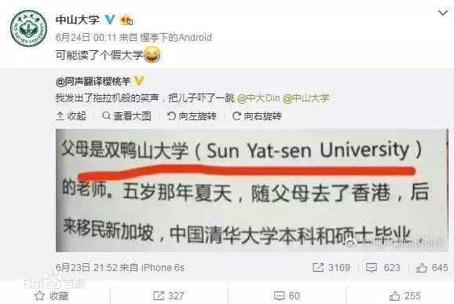
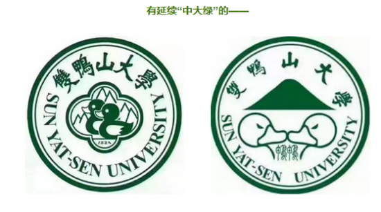
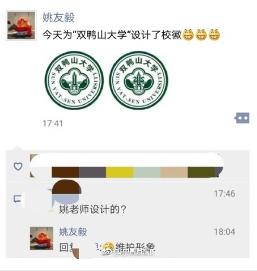

# 双鸭山大学的来源

双鸭山大学是指中山大学，因中山大学英文校名“Sun Yat-sen University”的谐音似“双鸭山”被一位网友翻译为“双鸭山大学”。双鸭山市，位于黑龙江省东北部，与中山大学无关。真实的双鸭山大学不存在。

微博上一本书的截图出现了这样一段话：“1984年出生在中国广东省广州市，父母是双鸭山大学（Sun Yat-sen University）的老师。五岁那年夏天，随父母去了香港，后来全家移民新加坡。中国清华大学本科和硕士毕业，新加坡南洋理工大学博士毕业，现在香港中文大学任助理教授。”

始作俑者“云湖浪子YZ25T”就此回应称，“双鸭山大学”并非错译，而是在自己小圈子里已流传长达五年的一个梗。五年前他在广州坐地铁，路过“中大”站，方知道中山大学的英文名就是“Sun Yat-sen University”，但听报站音像“双鸭山大学”，他还曾在校内网（现人人网）上发照片说：“原来中山大学的英文是双鸭山大学。”

然而，这件事并没有就此停歇：

“双鸭山大学”在中国高校圈就此流传开，除了校友们纷纷刷梗，其他高校也对新网红的诞生表示了浓厚的兴趣：“原来中山大学不在中山，不在南京，在黑龙江！” 就连校徽也表示要被你们玩坏了！

但作为一座名校，咱们怎么能让别人在自己头上动土，所以，我们要自己动。中大校徽的设计者姚有毅副教授终于按捺不住，亲自出手为双鸭山大学设计校徽：

从学生到教师，中大上下都在欢乐的气氛中愉快“自黑”。而这种诙谐的调侃，恰恰延续了当今网络上的“自黑风气”，展示了中山大学开放自由的校园文化，自信大度的名校底蕴。无意中为学校获得了一次宣传，推广，展示的机会。 
作为一名中大人，我在调侃、自黑的同时，也为中大的包容自由，渊源博识而自豪。中山大学，不在中山，不在南京，也不在双鸭山，它座落在华南经济带的中心位置，岭南文化与海外文明交汇的羊城广州.

我来了，亲爱的“双鸭山大学”！
