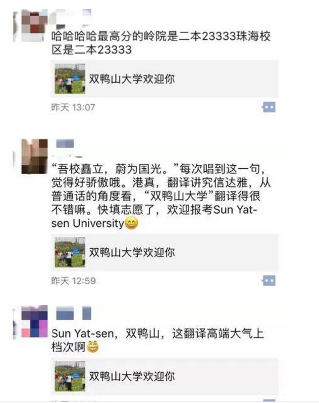
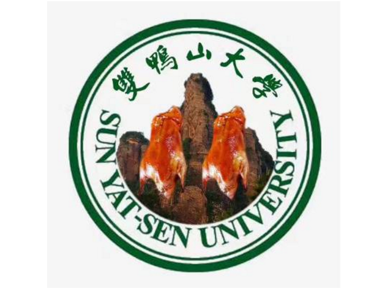

# “双鸭山大学”的来源
    2017年6月底，历史上绝无仅有的一座大学--“双鸭山大学”被一名网友 @同声翻译樱桃羊 创立了，他（她）以轻描淡写的一笔，创造了历史上浓墨重彩的一画，从此“双鸭山大学”的名号刷爆全网:

    然而你会不会奇怪，为何作者却说“可能读了个假大学”？其实只要你仔细看看那串英文--“Sun Yat-sen University”，就会发现我所说的该网友创立了的“双鸭山大学”，竟然是国父中山先生所创立的**中山大学**。其实，在该网友的解释中，我们便能看出其中端倪：

    据说中山先生的英文名便是“Sun Yat-sen”，至于为何，主要有两种说法，一说是孙中山别名孙逸仙的音译，还有更细致的考证说是孙逸仙的粤语音译。
    而继该网友的调侃后，全网一片沸腾，“双鸭山大学”被网友们（当然还有本校学生啦）玩坏：

    还配有文化衫（天哪！）：

    当然还有少不了的鸭大校徽：

    我只能表示：你们还能再优秀点吗？
    不过，中大老师可看不下去了：

    让我们看看放大的图：

    是不是觉得幽默与文化集于一身？只能说中大的老师也是杠杠滴！
    从学生到教师，中大上下都在欢乐的气氛中愉快“自黑”。而这种诙谐的调侃，恰恰延续了当今网络上的“自黑风气”，展示了中山大学开放自由的校园文化，自信大度的名校底蕴。无意中为学校获得了一次宣传，推广，展示的机会。 
作为一名中大人，我在调侃、自黑的同时，也为中大的包容自由，渊源博识而自豪。中山大学，不在中山，不在南京，也不在双鸭山，它座落在华南经济带的中心位置，岭南文化与海外文明交汇的羊城广州，在这里，我期待着开启未来四年的崭新征程。! 
双鸭山大学，请多多指教！

------------------------------------------------------------
本文图片来自各百度上搜索的博客，内容基本自打，可不要抄袭哦！
     
    