#制作HTML5游戏1（入门篇）

嗯...要我怎么说呢？这个作业还真不容易，明明是一个爱国说国语的计算机小白，却非要我看着英文搞游戏制作，表示教授您真的下手好重。嗐！没办法，谁叫我是中大的有志青年，这点小困难还是可以克服滴。诶，我都说了什么？以上不算，这是一篇严肃的技术博客，对，严肃！

  那么，我们要怎样制作一个简易有趣的2D小游戏呢？按照教授大人的指示，首先，你要准备好自己的实验/学习工具：Construct2（https://www.scirra.com/construct2 ）。
  差不多长这个样：
  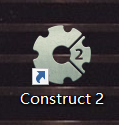
然后，就请在座的你跟随我的步伐，来制作一个有趣的小游戏吧！

1.双击此图标（这不废话吗）

2.这时你会看到这个白白的界面（也可能不是？这不是重点！）请注意，点击左上角的文件。如图红圈圈：

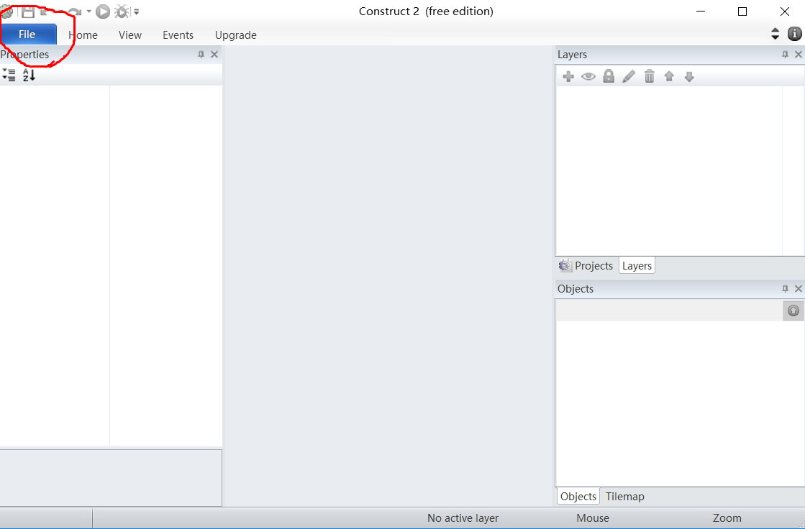  

点击新建New，谢谢

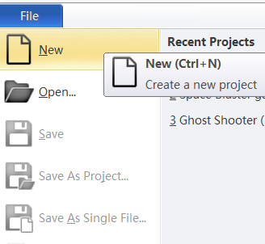  

然后什么也不要点哦，如下图的蓝色框，接着笑笑地点击Open。此时它不再那么单调（至少多了好多你喜欢的英文单词哦!）

3.接着双击中间的白色界面，会出来下面这个图图：

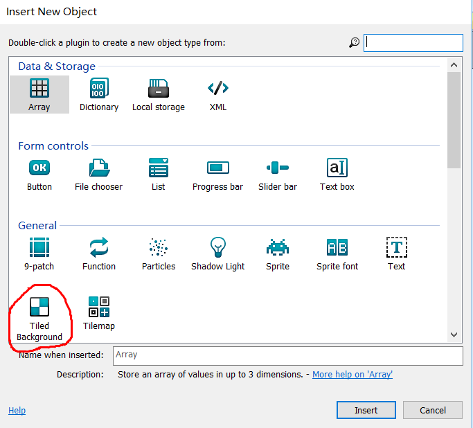

请跟随红色框框，双击或单击该图标后点击Insert。这时它会出现一个十字标，以此单击中间界面，出现了下图，请一定要点击红色圈圈所圈图标：

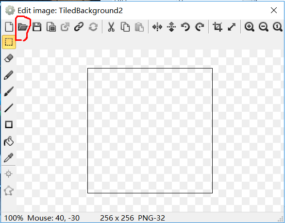

在里面会有你之前所储存的所需图片，（什么，我没提过吗？来来，告诉你我的操作：为图方便，请在桌面新建一个文件夹，然后请勤快的上网查询你喜欢的游戏界面与人物，自己抠图哦！最后把它们放进该文件夹即可）首先请先选择你要的游戏背景（双击即可）。然后会出现这么个东西：

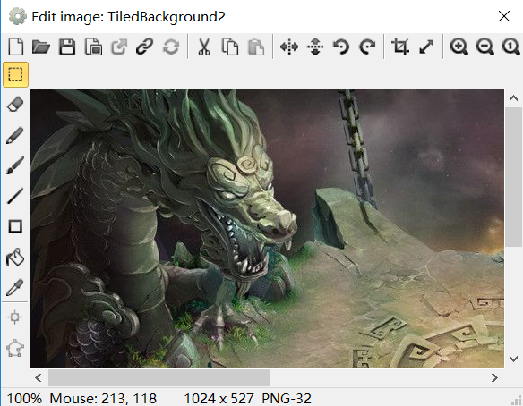

(嘿嘿，酷吧！)
接下来，请不要怀疑，直接将这玩意关闭（点击 X ）。然后？你又得重来了（哈哈）。开玩笑的，接着你就会发现它奇迹般地出现在中间的界面上了。然后请将注意力放到左边的好多英文的界面（请不要慌）,看到下图的红框框没，请看好数字。

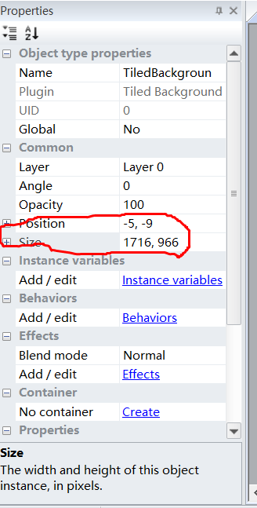

然后点击空白区域，再回到左栏，将Layer Size调整到同样大小。（这里看你个人意愿，直接拉动中间界面的小白点也是可以的）

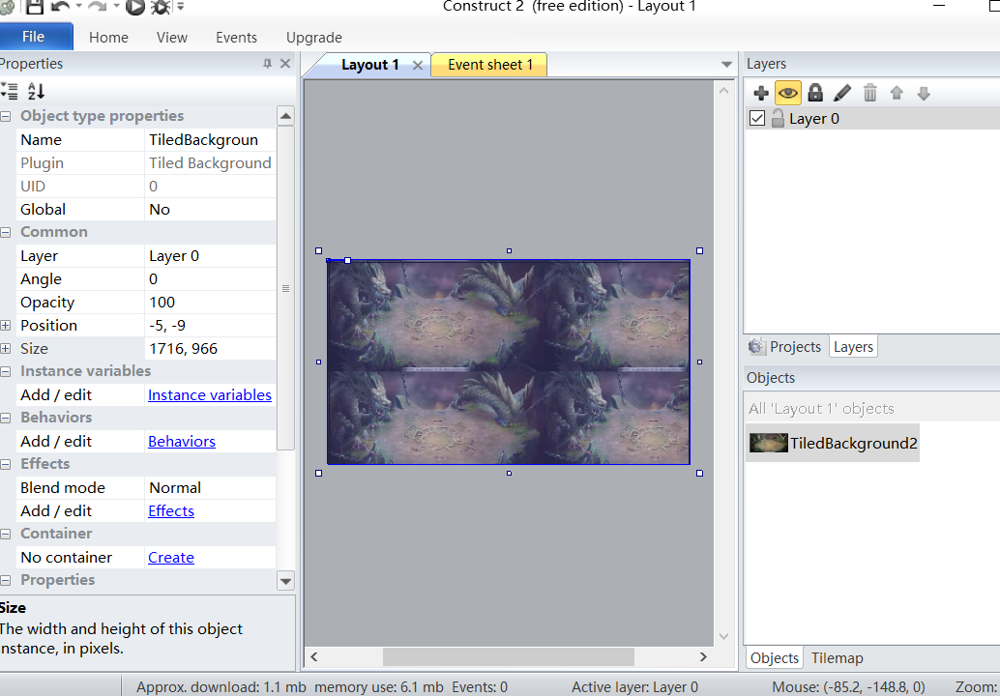

然后，点击右边界面的Layers,如图操作：

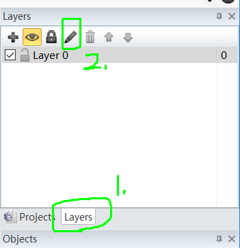

然后改一下Layer_0的名字，以防后面分不清谁是谁（后面你会知道为啥），接着点击上图左上角的加号，是不是出现了Layer_1呀，再来一次操作2，改改名啊。这样是不是清晰多了啊。
现在让我们把注意力转到中间界面上方的Layout 1(点击),再双击中间界面的空白区，再次出现上次双击出现的版面，这次 *注意了注意了：* 

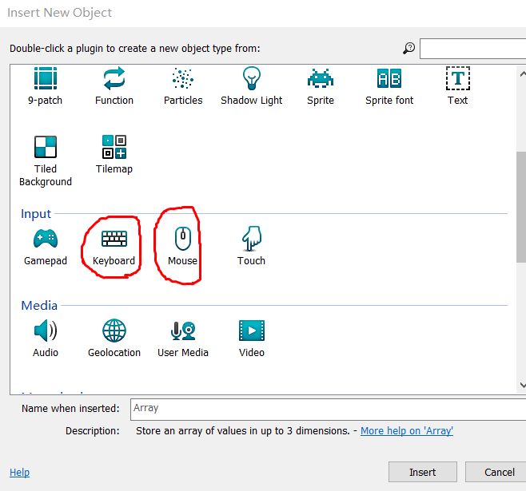

==这两个玩意一定要像上次操作一样Insert哈！==曾今我就栽在这个问题上！

4.现在，是时候把我们的游戏人物与物体添加进去了。想知道怎么搞吗？就不告诉你！
好的，结束！

开玩笑的！
请再次双击...你懂的。

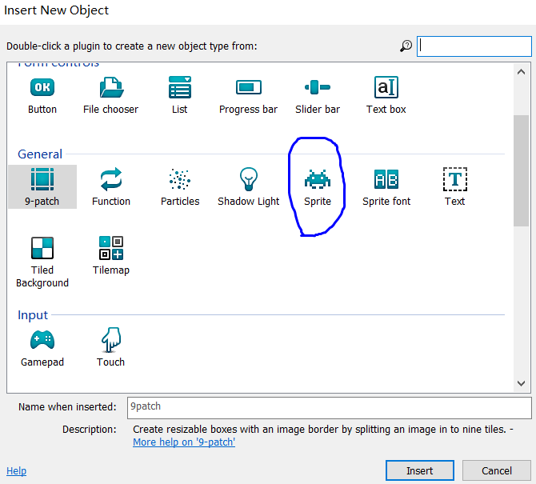

看到蓝色圈圈了吗？双击！
又出现了十字标，请单击，按步骤3点击左上角的文件夹图，
然后选择你所需要的精灵（就是你要的人物或物体），重复操作多次直到你不要更多了。
效果如下：

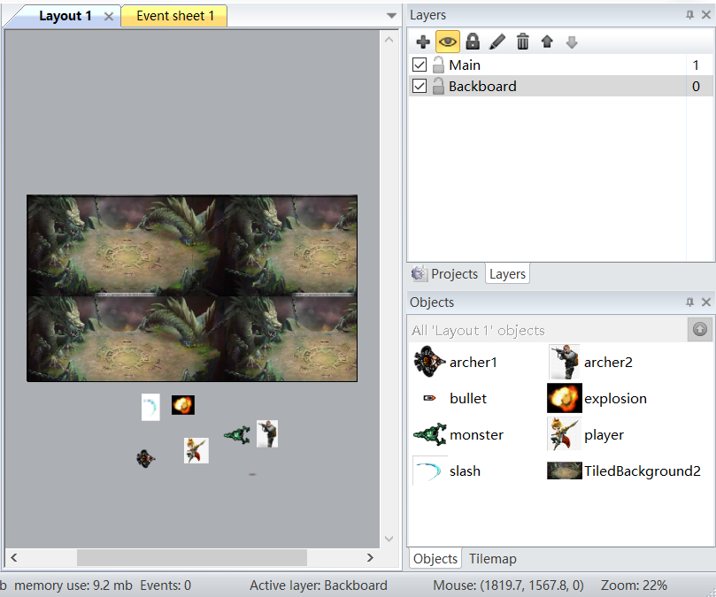

哦，对了，这次也要给自己的精灵们改名字哟！

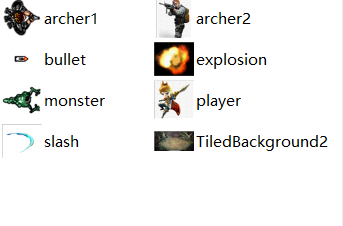

5.现在我们要来添加动作了。
首先让我们来为player添加动作:

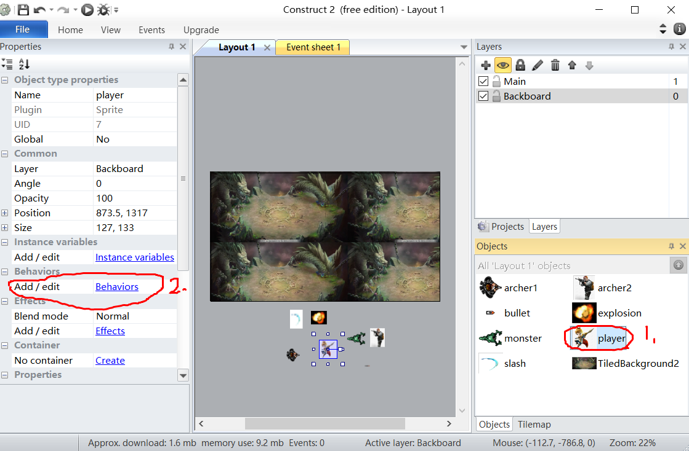

如图点击操作，出现了

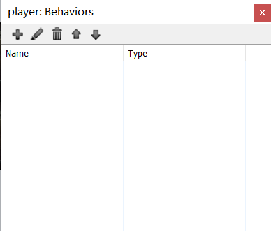

这么个玩意。
点击左上角 + ，出现

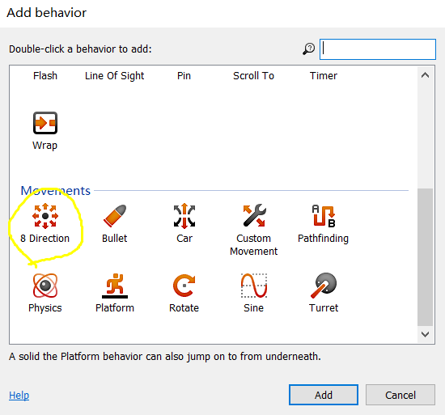

点击黄圈圈然后点击Add.同样的操作，直到如下：

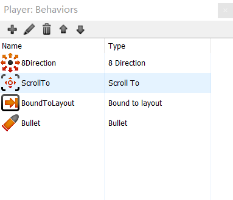

请别问我这都是啥，请自行百度。
现在关掉它，咱来实验一下
：
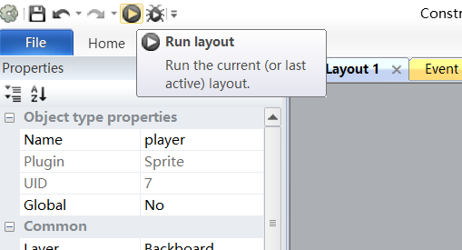

点击左上角的那啥，来，动动你的上下左右键盘，是不是很神奇！
j接下来同样点击bullet和slash(在这里我要提醒一句，每一个精灵的Layer都必须是Main即layer_1>)，然后同样操作，这次点这两个：

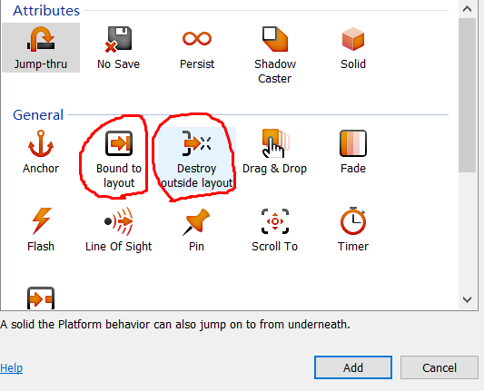

然后操作大概同上：（来来来，秀一段英文）
- Add the Bullet movement and Destroy outside layout to the Bullet（or slash） object (no surprises there)
- Add the Bullet movement to the monster object,archer1 and archer2 (because they just moves forwards as well).
- Add the Fade behavior to the Explosion object.
自行百度哦！
再次点击 monster object,archer1 和 archer2，

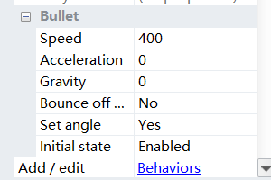

请把Speed从400改为80.
同样，把bullet和slash改为600，explotion的Fade in time改为0.5。

6.现在我们来创造更多的敌人：点击monster或者其他敌人，不要松手，将其拖入中间界面，多次操作即可。

7.好了，现在请点击：

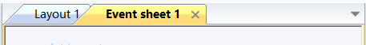

别让我解释这是啥，现阶段我们只要知道接下来如何操作即可（好吧，我也不懂）。
双击中间界面，出现：

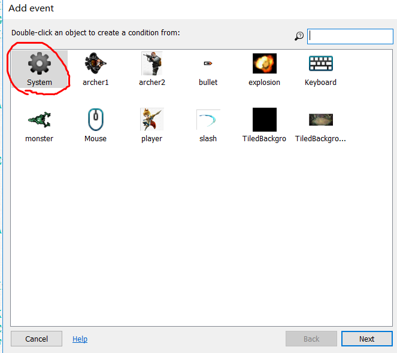

戳它！

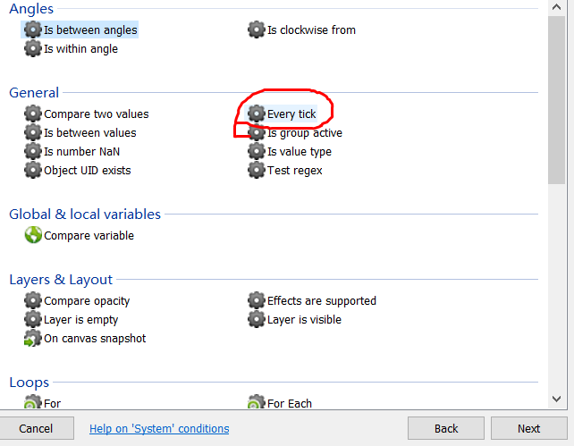

再戳它！
然后出现个不可描述的东西，在它尾巴点击Add action，

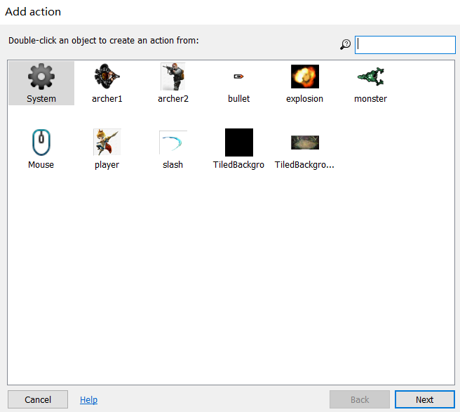

点击Player,再点它：

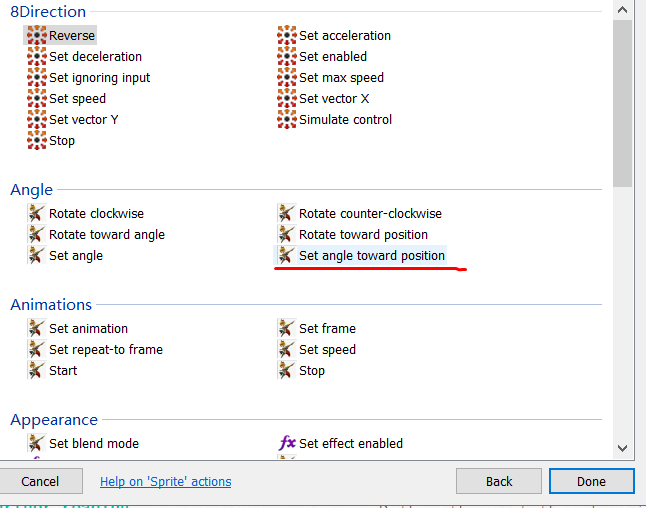

要这样填哦：

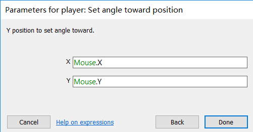

8.好了，咱再来一波英语操作：

1. Double-click to insert a new event, or click an Add action link to add an action.
2. Double-click the object the condition/action is in.
3. Double-click the condition/action you want.
4. Enter parameters, if any are needed.

Condition: Mouse -> On click -> Left clicked (the default)
Action: Player -> Spawn another object -> For Object, choose the slash object. For Layer, put 1 (the "Main" layer is layer 1 - remember Construct 2 counts from zero). Leave Image point as 0.
没错，自行翻译！最后给你们看看完成后的样子：

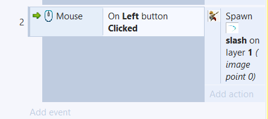

这时你会发现运行时slash不是从剑端发出，这怎么行，所以：

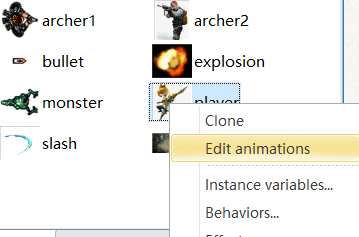

鼠标右击Player,如图点击颜色不同处。然后：

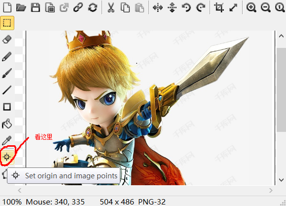
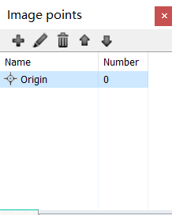
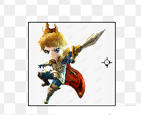

嗯，只可意会，不可言传。
然后关掉它。重新运行....好吧没什么太大效果。但这么操作是没毛病滴！

9.现在我们要如何消灭敌人呢？
我打累了，来，再来一次英文：
不玩了，其实操作基本和上同：
Condition:slash->On collision with another object -> pick monster.
Action: monster -> Destroy
Action: slash->Spawn another object -> Explosion, layer 1
Action: slash -> Destroy
这是一个重复的过程。总之，在一波艰苦操作后，结果如下：

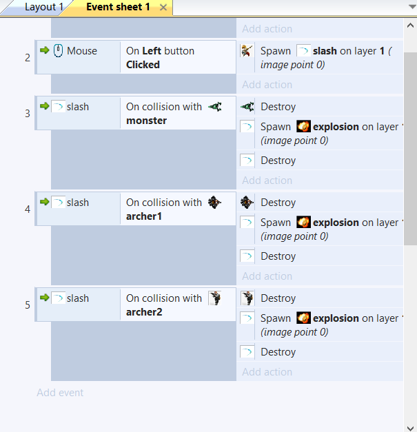

10.但细心的你会发现，当程序运行时，会有如图情况：

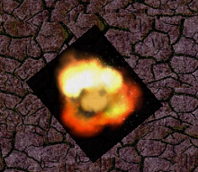

这并不是我们想要的效果，所以，请左击右栏Object或Project里的 explosion，将目光投放到左栏，找到Blend mode,将其中的Normal改为Additive,再运行一次，嗯，感觉舒服多了。

11.现在，我们要让敌人变得更聪明点（让它们不是直线行走而是到处乱走）。怎么做呢？
Condition: System -> On start of Layout
Action: Monster -> Set angle -> random(360)
大概如此：

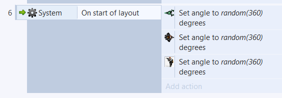

还有，我们不能让敌人走出边界时继续在外游荡，所以我们要让他们回来：
Condition: monster（archer） -> Is outside layout
Action: Monster -> Set angle toward position -> For X, Player.X - for Y, Player.Y.
这样：

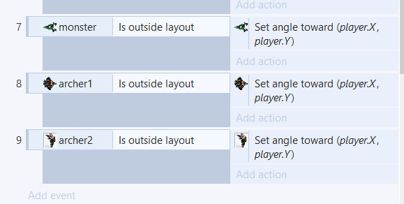

12.现在，我们必须考虑要砍几刀才让敌人destory呢？一刀就完是很无聊的，这里我们让他砍三刀：
Instance variables保证了每个敌人能够储存自己的健康值。唉，我为啥要解释这个？总之，首先你要点击monster和其他敌人，然后左栏走起：

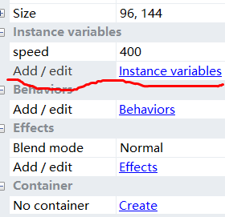

点他！

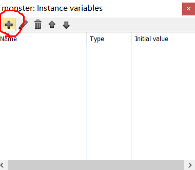

点他！

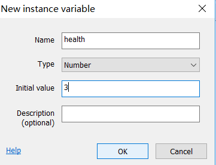

输入！
完美！！！

13.现在我们回到event sheet1，当slash攻击到敌人时我们要把敌人销毁，所以再：

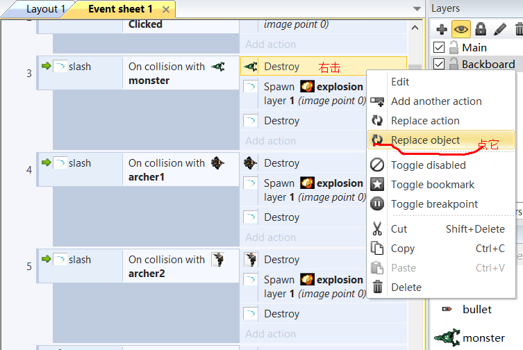  

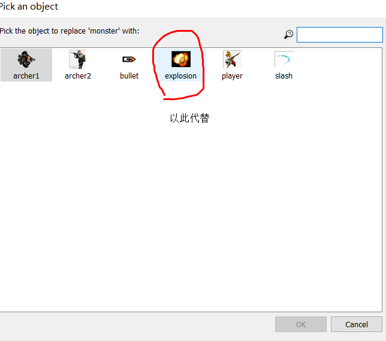  

接着：

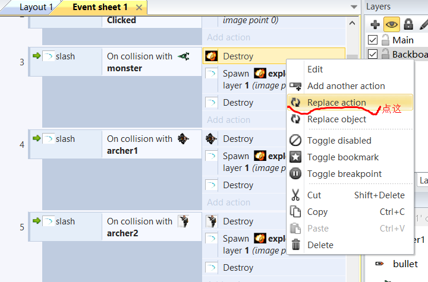  

然后：
Choose Monster -> Subtract from (in the Instance variables category) -> Instance variable "health"，在Value处输入1，结束。
大概如此：

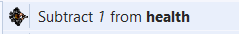

14.现在我们每攻击敌人一次，他们就掉一个health，但我们还没做一个事件去杀死敌人（当他们的health为0时），所以：
Condition: Monster -> Compare instance variable -> Health, Less or equal, 0
Action: Monster -> Spawn another object -> Explosion, layer 1
Action: Monster -> Destroy

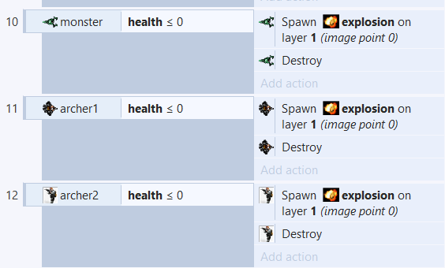

15.玩游戏怎么能不计分呢？所以，请右击中间界面event sheef空白处，然后点击Add global variable。接着：

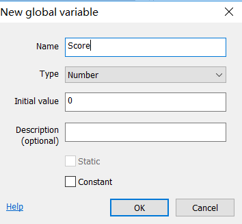

然后最上方就有了这个

现在。。。额，你们还是看图吧！

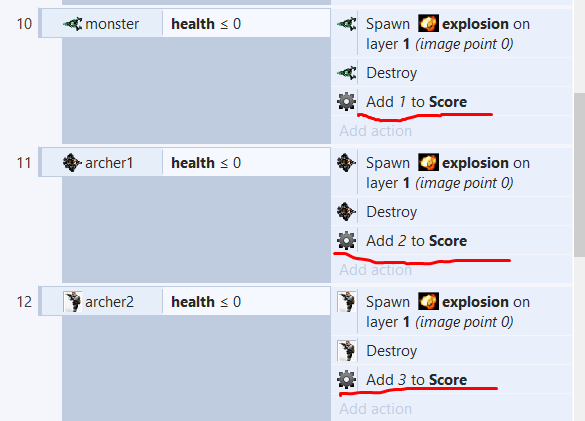

丢给你操作方法：click Add action, and select System -> Add to (under Global & local variables) -> Score, value 
不客气哦！
接着我们要让这个分数显示出来。
先来段英文：Go back to the layers bar we used earlier. Add a new layer called HUD. Make sure it's at the top, and selected (remember this makes it the active layer). The Properties bar should now be displaying its properties. Set the Parallax property to 0, 0 (that's zero on both the X and Y axes).
双击中间空白界面（Layout 1）

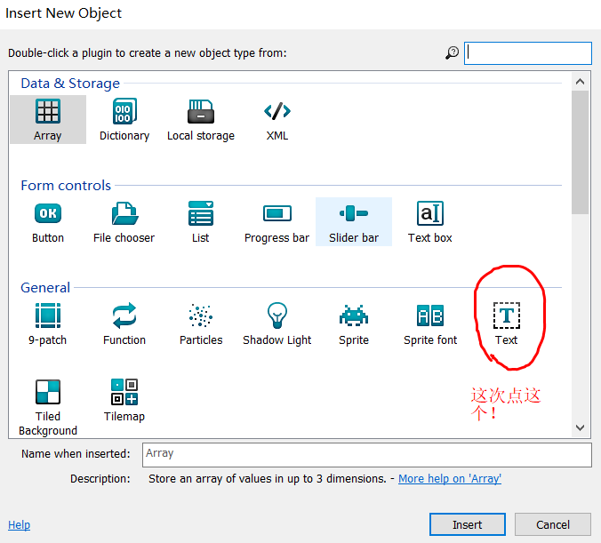

单击界面，然后看向左栏

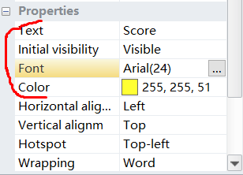

修改标注处！尽量使颜色鲜明，字体清晰。
再回到event sheet,在我们早先添加的Every tick中，我们再添加action Text -> Set text.然后

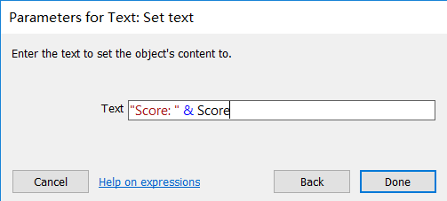

现在我们就能计分了！（但好像没显示出来呢，自己看看出了什么问题吧）

16.最后，我们来让敌人有规律地复活。
Condition: System -> Every X seconds -> 3
Action: System -> Create object -> Monster, layer 1, 1400 (for X), random(1024) (for Y)

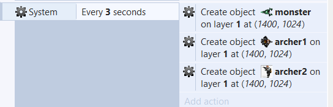

然后，我们还要让敌人也能消灭玩家。
Condition: Monster -> On collision with another object -> Player
Action: Player -> Destroy

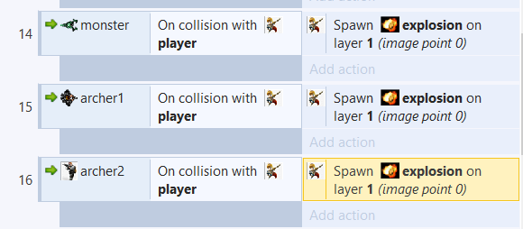

**这样，我们终于完成了属于自己的游戏！！！**
接下来是小小的gif动图哦！（该图会和上面的操作有些不同，但这不影响教学效果,为了让自己加深印象，请自己找出不同之处哟！）

哎呀呀，终于搞定！！！开始你的游戏之旅吧！

  