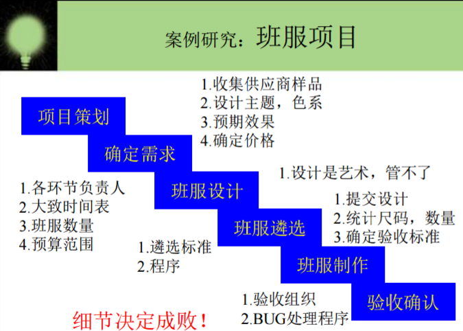

#HTML5游戏设计与制作（进阶篇）

##游戏策划：

 楔子： 公元不知几几年，此时正值天魔大战后一年，天下始有一些恢复之气，新君  一泓  正是风华少年，意欲发奋治世，谁料好友竟下药于他，夺其大权，甚至不欲将他直接杀害，而强其服入只可快走，向前则不可停之药，更有甚者，其行进后退有时无奈翻滚而不可正立，昔日好友就将如此之人，丢入奇异之地，任其自生自灭！哼！岂是自生自灭？此地凶险无比，只有前后两方可行，竟却不知为何有两大奇物阻挡，碰之则忽然身体自爆，其间还间有小块奇石，碰之也亦如中火竹，全身焦灼，且看在此凶险之地，昔日帝王可能突破重难！  

 玩法： 玩家只需简单操作键盘方向键以控制方向，以空格键发出剑气以毁旁边两大奇物。  

 人设和道具：  
 君王一泓： 因服药行动奇异，但也因其行动迅速，出招迅猛，所发剑气竟可摧毁奇物！  
 ps：他应该会飞。

 

 奇物： 有些能漂浮。
 
 
   

要求：玩家需对左右两个奇物其中之一进行剑气攻击，30击便可将奇物摧毁，但游戏人物因中毒较深只能承受十次怪石撞击。只要成功击坏左右其中一块奇物便可成功出逃。

#游戏设计

|object|一泓|
|---|---|
|attributes|
|collaborator|精灵|
|event&actions|碰撞&销毁自己|
||发出剑气&销毁奇物|

|object|剑气|
|---|---|
|attributes||
|collaborator|精灵|
|event&actions|碰撞&销毁自己|

|object|奇物|
|---|---|
|attributes|
|||
|||
|||
|event&action|无|

GIF动图：

------
本游戏所出现的人物却有些不妥，但本人绝不会将其用来牟利或做其他用途（其实这游戏也做不到），只是充当自己做游戏的消遣，还望相关人士海涵！在此感谢。

---
#介绍介绍   IT

##书籍

就我个人最近看的书而言，《黑客与画家》是最好的一本有关IT的书籍，没有之一。为什么？因为我只看过这一本啊。但这并不妨碍它成为一本不错的有关IT行业的好书。百度百科有云：《黑客与画家》是2011年4月人民邮电出版社出版发行的图书，作者是Paul Graham。本书适合所有程序员和互联网创业者，也适合一切对计算机行业感兴趣的读者。Paul Graham是谁，想必IT界的没有多少个不知道。啥？你不知道？没事啊，我也刚刚认识。就让我来介绍介绍：

额...好吧，仍是百度主场。

现在进入正题：如果你要问我看这本书最重要的意义是什么，那么我会说：作为一个读者，我从过去对==黑客==的害怕与厌恶变成了对==黑客==的惊佩与赞扬；作为一个开始踏入IT学习旅途的程序学习员，我从过去对==黑客==的不屑变成了对==黑客==的向往。为什么？因为你将从中感受到，那一种庄周式的鲲鹏之逍遥，那一种孟子式的救世之情操！你将从作者的循循诱导中，认识了解到：黑客并不神秘，更不是技术怪人。Hackers and Painters这个书名就是在提示应该把黑客与画家当作同一种人看待。和画家一样，黑客只是怀有一门特殊手艺、有创造天赋的普通人。这个书名还有另一层含义，即编程是一种艺术创作，黑客就是艺术家，开发软件与画家作画、雕塑家雕刻、建筑师设计房屋并没有本质不同。

而这里面最吸引人的，大概就是所谓的六条*黑客伦理*：

　 (1) 使用计算机以及所有有助于了解这个世界本质的事物都不应受到任何限制。任何事情都应该亲手尝试。
（Access to computers—and anything that might teach you something about the way the world works—should be unlimited and total. Always yield to the Hands-On Imperative!）
(2) 信息应该全部免费。
（All information should be free.）
(3) 不信任权威，提倡去中心化。
（Mistrust Authority—Promote Decentralization.）
(4) 判断一名黑客的水平应该看他的技术能力，而不是看他的学历、年龄或地位等其他标准。
（Hackers should be judged by their hacking, not bogus criteria such as degrees, age, race, or position.）
(5) 你可以用计算机创造美和艺术。
（You can create art and beauty on a computer.）
(6) 计算机使生活更美好。
（Computers can change your life for the better.）

我想你大概会好奇==黑客==一词的来源，会疑惑黑客究竟有怎样的发展历程，会想切身地体验为何“对于黑客来说，关着的门就是一种挑衅，而锁着的门则是一种侮辱。"那么就去看看吧，看看这本书里的黑客，看看他们的优秀与成果。那时你会发现，“黑客”一词，绝不是对他们的谬赞。 

##电影

一说到有关IT的电影，没错，又是我最近看到的没有之一的《黑客帝国》，该影片讲述了一名年轻的网络黑客尼奥发现看似正常的现实世界实际上是由一个名为“矩阵”的计算机人工智能系统控制的，尼奥在一名神秘女郎崔妮蒂的引导下见到了黑客组织的首领墨菲斯，三人走上了抗争矩阵征途的故事。

其实它里面最让我感兴趣的，是它与**希拉里.普特南**的==缸中之脑==的惊人相似。虽然这种想法确实有些悲观主义，但这也反应着人类对于计算机的思考与更新，看完这部影片，我感觉到的不是害怕，而是对计算机更加深厚的热爱。那么如果是你，你在欣赏完这部影片之后，会认识到什么更深刻的东西呢？期待你的发言！

如果你觉得观看影片后还不能太了解它的内涵，推荐你看看《解码 黑客帝国》

当然，还有黑客帝国的后续之作：
《黑客帝国2：重装上阵》及 《黑客帝国3：矩阵革命》

#人物

嗯。。。比尔·盖茨？你们太熟；马云？你们也不陌生.那写谁好呢？上网百度，还真找到了你们可能不认识的IT界人才：

**1.电脑鬼才——陈盈豪**

据初步统计，当年来自台湾的CIH电脑病毒构成全球6000万台电脑瘫痪，涉及多个国家，土耳其、孟加拉、新加坡、马来西亚、俄罗斯、中国内地的电脑均惨遭CIH病毒的攻击，其中韩国损失最为严重，共有30万台电脑中毒，占全国电脑总数的15%以上，损失更是高达两亿韩元以 上。制造这场“电脑大屠杀”时，陈盈豪还是一名在校生，他并没有恶趣味的去写病毒。CIH电脑病毒风暴过后，有的人把CIH的始作俑者陈盈豪抬升为“天才”，有的人把他贬为“鬼才” 。

他不是恶趣味的写病毒，只是对电脑编程的爱好，而且也只是在个人的电脑上有，稍不注意被同学携带出去，才酿成那场大祸。

陈盈豪供职于集嘉通讯公司，担任集嘉通讯公司手机研发中心主任工程师。

**2.90后编程天才—薛来**

1、十七岁的他荣获ISEF(英特尔国际科学与工程大奖赛)团体一等奖;
2009年5月，薛来与林晨阳、李贤基仰仗独立研发的“启示多触式界面数据传输”系统，荣获有全球青少年科学竞赛“世界杯”之称的“英特尔国际科学与工程大奖赛”团体一等奖。

薛来，作为团队的“灵魂人物”，和他的团队制造的“启示多触式界面数据传输”系统，相似微软的多点触控技术，仅以842美圆的价钱PK比尔盖茨的surface：“surface以展现性为主，家庭运用的比较少，而我们提出了一个全新的概念就是无键盘、无鼠标，完好用一块基于视觉的多点触控屏幕来控制电脑，把它带到了日常家庭就能够充沛运用的程度上，还具有体积小、扩容性强等优点”。

2、年仅17岁的薛来被授予“2009-2010影响世界华人盛典——希望之星”。
薛来说：“做中国人是十分自豪的，因为无论在哪儿中国学生都是最优秀的。”
该盛典曾经连续举行了好几年，钱学森、张艺谋、金庸、冯小刚、李连杰、杨紫琼……社会各界顶尖人士都曾获此殊荣。
3、薛来获得的成果得益于对计算机软件编程的酷爱。
薛来的母亲说，从9岁时，薛来就是她和她身边的同事们的“计算机工程师”，担任处置他们遇到的各种电脑技术问题。

在国内读完小学三年级后，8岁的薛来随母亲前往斯洛伐克。他说，在斯洛伐克的那段时间，让他接触到计算机，并对其产生浓重的兴趣。而在国外自在轻松的学习气氛，让他有更宽裕的时间来展开本人的兴趣。不到10岁的他，看完了很多计算机英文原版书籍，至今，仍然坚持每天花10多个小时的时间来研讨计算机，学习软件编程。
薛来的身上，透着90后初生牛犊不怕虎的“张扬”与自信，正如他们在“影响世界华人颁奖仪式”上所说的那样，固然申请了专利，但是没有任何一件事情是圆满的，任何有才干、能对设备中止改良的人都能够运用他们的产品。获奖并不是为了知名，而是希望可以奉献社会。

**3.中国最小的黑客—汪正扬**

  

汪正扬称，愿意被称为“白帽子”，本人目的是辅佐网站修补完善，不会用技术做违法的事。

2009年，汪正扬上小学二年级的时分，“偷”了半年“菜”后觉得光玩游戏没意义，年仅7岁，开端尝试写一些小程;
2011年，汪正扬开端办网站，先是把吃冰棍的钱攒下400多块，买了一个现成的网站主机，放上本人写的程序自娱自乐，坚持了两年多后，2013年11月份做了一个新网站;
2014年4月，汪正扬向360公司的库带方案提交过可能影响上百家教育网站的系统破绽;这是360库带方案目前为止遇到的年龄最小的一位破绽报告者;
2014年9月，在中国互联网平安大会上，年仅12岁的汪正扬成了中国最小黑客。

嗐，他们怎么这么优秀呢？革命尚未成功，同志仍需努力。

---
图文来源：百度

