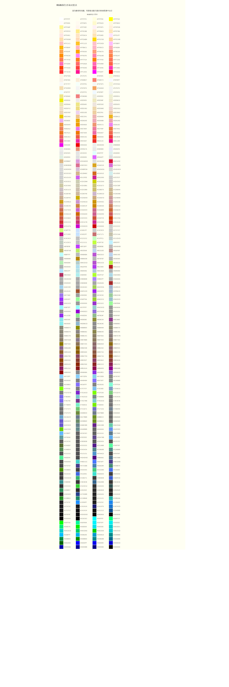

#色彩表示与编码

**一、计算机中的色彩表示**

==1.RGB颜色模式==

RGB颜色模式是一种加色模式，图像使用红(Red绿(Green)、蓝(Blue)3种颜色分量，可取从**0**黑色~**255**白色范围的强度值，其混合颜色即为该像素的颜色，多达1670万种。绝大部分的可见光谱可以用红绿蓝RGB三色光按不同比例和强度的混合来表示，这种颜色模式主要用于计算机显示。

RGB值的概念引出了三维“色空间”。图3-10展示了一种显示色空间的方法。用于表示颜色的数据量称为色深度，通常用表示颜色的位数来表示色深度。增强彩色指色深度为16位的颜色，RGB值中的每个数字由5位表示，剩下的一位有时用于表示透明度。真彩色指色深度为24位的颜色，RGB值中的每个数字由8位表示，即每个数所属的范围是0～255,这样能够生成1670万种以上的颜色。
(256×256×256=16777216种)

下表展示了一些真色彩的RGB值和它们表示的颜色：

小原理：颜色是我们对到达视网膜的各种频率的光的感觉。我们的视网膜有三种颜色感光视觉锥细胞，负责接收不同频率的光。这些感官器分别对应于红绿蓝三种颜色。人眼可以察觉的其他颜色都能由这三种颜色混合而成。

由于网页(WEB)是基于计算机浏览器开发的媒体，所以颜色以光学颜色RGB（红、绿、蓝）为主。网页颜色是以16进制代码表示，一般格式为#DEFABC （字母范围从A-F,数字从0-9 ）；如黑色，在网页代码中便是：#000000(在css编写中可简写为#000)。当颜色代码为#AABB11时，可以简写为#AB1表示，如#135与#113355表示同样的颜色。

RGB555 
RGB555是另一种16位的RGB格式，RGB分量都用5位表示（剩下的1位不用）。使用一个字读出一个像素后，这个字的各个位意义如下： 
高字节 低字节 
X R R R R R G G G G G B B B B B （X表示不用，可以忽略） 
可以组合使用屏蔽字和移位操作来得到RGB各分量的值： 
#define RGB555_MASK_RED 0x7C00 
#define RGB555_MASK_GREEN 0x03E0 
#define RGB555_MASK_BLUE 0x001F 
R = (wPixel & RGB555_MASK_RED) >> 10; // 取值范围0-31 
G = (wPixel & RGB555_MASK_GREEN) >> 5; // 取值范围0-31 
B = wPixel & RGB555_MASK_BLUE; // 取值范围0-31

下面是RGB颜色对应编码：

==2.用颜色对应英文表示==

例如：Red表示红色。这些英文必须是系统中承认的颜色，自己定义的不予认可。大约有200种不到。再比如Wheat表示小麦色。它的颜色表示为（245，222，179）。

==3.CMYK颜色模式==

CMYK颜色模式是一种减色模式，主要用于印刷。C(Cyan)表示青色，M(Msgenta)代表品红色（又称洋红色），Y(Yellow)表示黄色，K(Black)代表黑色（还可代表Key，是打印校准用的）。CMY分别是红绿蓝的互补色，由于这3种颜色混合在一起只能得到暗棕色，而不是真正的黑色，所以另外引入了黑色（且印刷品用黑色比例较多）。在CMYK图像中，当所有的分量的值都是0%时，会产生纯白色。当用印刷打印制作的图像时，，使用CMYK颜色模式。

CMYK也称作印刷色彩模式，它和RGB相比有一个很大的不同：RGB模式是一种发光的色彩模式，你在一间黑暗的房间内仍然能看见屏幕上的内容（就如你能看到我的博客一样）；而CMYK模式是一种依靠反光的色彩模式，比如我们阅读报纸时，是由光照射在报纸上，再反射到我们眼中，我们才看到内容。它需要外界光源，如果你在黑暗的房间内是无法阅读报纸的。总之，只要在屏幕上显示的图像，就是RGB模式表现的。只要是在印刷品上看到的图像，就是CMYK模式表现的。

CMYK的颜色代码如下：

==4.HSV颜色模式==

在计算机中的实际应用中，除了RGB表示方法外，还有一种用的比较多的表示方法就是HSV(又称HSB)表示方法。HSV(Hue, Saturation, Value)是根据颜色的直观特性由A. R. Smith在1978年创建的一种颜色空间, 也称六角锥体模型(Hexcone Model)。

 

它把颜色分为三个参量，

一个是色相Hue,具体表示在色相环上的一种纯色，用角度度量，取值范围为0°～360°，从红色开始按逆时针方向计算，红色为0°，绿色为120°,蓝色为240°。它们的补色是：黄色为60°，青色为180°,品红为300°；

一个是饱和Saturation，具体表示纯色在颜色中的百分比(或表示颜色接近光谱色的程度)，一种颜色，可以看成是某种光谱色与白色混合的结果。其中光谱色所占的比例愈大，颜色接近光谱色的程度就愈高，颜色的饱和度也就愈高。饱和度高，颜色则深而艳。光谱色的白光成分为0，饱和度达到最高。通常取值范围为0%～100%，值越大，颜色越饱和。当S=1时，表示颜色最纯，当S=0时，表示灰度值。

一个是亮（明）度Value，表示颜色的明亮程度，对于光源色，明度值与发光体的光亮度有关；对于物体色，此值和物体的透射比或反射比有关。通常取值范围为0%（黑）到100%（白）。

RGB和CMYK颜色模型都是面向硬件的，而HSV（Hue Saturation Value）颜色模型是面向用户的。

==4.Lab颜色模式==

Lab模式既不依赖光线，也不依赖于颜料，它是CIE组织确定的一个理论上包括了人眼可以看见的所有色彩的色彩模式。Lab模式弥补了RGB和CMYK两种色彩模式的不足。同RGB颜色空间相比，Lab是一种不常用的色彩空间。它是在1931年国际照明委员会（CIE）制定的颜色度量国际标准的基础上建立起来的。1976年，经修改后被正式命名为CIELab。它是一种设备无关的颜色系统，也是一种基于生理特征的颜色系统。这也就意味着，它是用数字化的方法来描述人的视觉感应。Lab颜色空间中的L分量用于表示像素的亮度，取值范围是[0,100],表示从纯黑到纯白；a表示从红色到绿色的范围，取值范围是[127,-128]；b表示从黄色到蓝色的范围，取值范围是[127,-128]。下图所示为Lab颜色空间的图示：

Lab颜色空间比计算机显示器甚至比人类视觉的色域都要大，表示为Lab的位图比RGB或CMYK位图获得同样的精度需要要求更多的像素数据。Lab模式所定义的色彩最多，且与光线及设备无关并且处理速度与RGB模式同样快，比CMYK模式快很多。因此，可以放心大胆地在图像编辑中使用Lab模式。而且，Lab模式在转换成CMYK模式时色彩没有丢失或被替换。因此，最佳避免色彩损失的反法是：应用Lab模式编辑图像，再转换成CMYK模式打印输出。

**5头脑风暴小福利：**

 将RGB转化为Lab值函数
    void RGB2Lab(int R, int G, int B, double &L, double &a, double &b)
    {
    double x,   y,  z;
    double fx, fy, fz;

    // 转至X-Y-Z
    x = 0.412453 * R + 0.357580 * G + 0.180423 * B;
    y = 0.212671 * R + 0.715160 * G + 0.072169 * B;
    z = 0.019334 * R + 0.119193 * G + 0.950227 * B;

    // 除以255，即归一化
    x /= (255.0 * 0.950456);
    y /=  255.0;
    z /= (255.0 * 1.088754);

    // 类似Gamma校正
    if (y > 0.008856)
fy = pow(y, 1.0/3.0);
    else
fy = 7.787 * y + 16.0 / 116.0;

    if (x > 0.008856)
fx = pow(x, 1.0/3.0);
    else
fx = 7.787 * x + 16.0 / 116.0;

    if (z > 0.008856)
fz = pow(z, 1.0/3.0);
    else
fz = 7.787 * z + 16.0 / 116.0;
    L = 116.0 * fy - 16.0;// 对于 y <= 0.008856 的情况，该公式可以简化为 L = 903.3 * y
    a = 500.0 * (fx - fy);
    b = 200.0 * (fy - fz);

    // Lab值归一化
    L = L / 100.0;
    a = (a + 128.0) / 255.0;
    b = (b + 128.0) / 255.0;
     }

   // 将Lab转化为RGB值函数
   void Lab2RGB(double L, double a, double b, int &R, int &G, int &B)
   {
    double  x,  y,  z;
    double fx, fy, fz;
    double dr, dg, db;

    L = L * 100.0;
    a = a * 255.0 - 128.0;
    b = b * 255.0 - 128.0;
   
    fy = (L + 16.0) / 116.0;
    fy = fy*fy*fy;

    if (fy > 0.008856)
   {
y = fy;
fy = (L + 16.0) / 116.0;
    }
    else
    {
y = L / 903.3;
fy = 7.787 * y + 16.0/116.0;
    }

    fx = a / 500.0 + fy;
    if (fx > 0.206893)
x = pow(fx, 3.0);
    else
x = (fx - 16.0/116.0) / 7.787;

    fz = fy - b/200.0;
    if (fz > 0.206893)
z = pow(fz, 3);
    else
z = (fz - 16.0/116.0) / 7.787;

    x *= (255.0 * 0.950456);
    y *= 255.0;
    z *= (255.0 * 1.088754);
   
    dr =  3.240479 * x  - 1.537150 * y - 0.498535 * z;
    dg = -0.969256 * x  + 1.875992 * y + 0.041556 * z;
    db =  0.055648 * x  - 0.204043 * y + 1.057311 * z;

    R = (dr < 0.0) ? 0 : (dr > 255.0) ? 255 : (unsigned int)dr;
    G = (dg < 0.0) ? 0 : (dg > 255.0) ? 255 : (unsigned int)dg;
    B = (db < 0.0) ? 0 : (db > 255.0) ? 255 : (unsigned int)db;
      }

---------
参考资料：
<https://blog.csdn.net/real_myth/article/details/50828171>

<https://blog.csdn.net/sinat_20019511/article/details/78546813?locationNum=7&fps=1>

百度百科