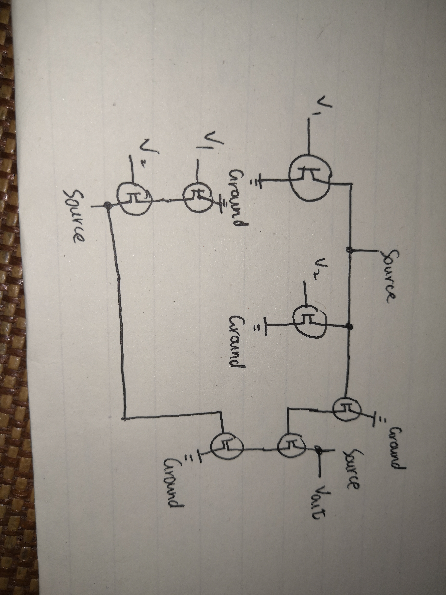

#证明课本104页表格公式

1. AB = BA

由图可知，AB与BA仅是A和B的位置互换，得证。

2. (AB)C = A(BC)

|A|B|c|(AB)C|A(BC)|
|---|---|---|---|---|
|0|0|0|0|0|
|1|0|0|0|0|
|1|1|0|0|0|
|1|0|1|0|0|
|1|1|1|1|1|
|0|1|0|0|0|
|0|1|1|0|0|
|0|0|1|0|0|

由真值表可以看出，(AB)C与A(BC)对于同样的ABC值的值都相同，因此两者等价。

3. A(B + C) = AB + AC

|A|B|C|(B + C)|AB|AC|A(B + C)|AB + AC|
|---|---|---|---|---|---|---|---|
|0|0|0|0|0|0|0|0|
|1|0|0|0|0|0|0|0|
|1|1|0|1|1|0|1|1|
|1|0|1|1|0|0|0|0|
|1|1|1|1|1|1|1|1|
|0|1|0|1|0|0|0|0|
|0|1|1|1|0|0|0|0|
|0|0|1|1|0|0|0|0|

由真值表可以看出，A(B + C)与 AB + AC 对于同样的ABC值的值都相同，因此两者等价。

4. A1 = A

A1表示A and 1，只有当A = 1时，返回值才为1，此时可用A代替，而当A = 0时，返回值为0，仍可用A来代替。

5. A(A') = 0

A'为A取反，所以当A为1时，A'为0，当A为0时，A'为0，二者始终不同为1，故上式成立。

6. (AB)' = A' OR B'

|A|B|A'|B'|(AB)'|A' OR B'|
|---|---|---|---|---|---|
|0|0|1|1|1|1|
|0|1|1|0|1|1|
|1|0|0|1|0|0|
|1|1|0|0|0|0|

由真值表可以看出，(AB)'与 A' OR B' 对于同样的ABC值的值都相同，因此两者等价。

7. A + B = B + A

由上图可知，二者只是把A与B的位置互换，因此二者是等价的。

8. (A + B) + C = A + (B + C)

|A|B|C|A + B|B + C|(A + B) + C|A + (B + C)|
|---|---|---|---|---|---|---|
|0|0|0|0|0|0|0|
|1|0|0|1|0|1|1|
|1|1|0|1|1|1|1|
|1|0|1|1|1|1|1|
|1|1|1|1|1|1|1|
|0|1|0|0|1|1|1|
|0|1|1|1|1|1|1|
|0|0|1|0|1|1|1|

由真值表可以看出，(A + B) + C 与  A + (B + C) 对于同样的ABC值的值都相同，因此两者等价。

9. A + (BC) = (A + B)(A + C) 

|A|B|C|(BC)|A + B|A + C|A + (BC)|(A + B)(A + C)|
|---|---|---|---|---|---|---|---|
|0|0|0|0|0|0|0|0|
|1|0|0|0|1|1|0|0|
|1|1|0|0|1|1|1|1|
|1|0|1|0|1|1|1|1|
|1|1|1|1|1|1|1|1|
|0|1|0|0|1|0|0|0|
|0|0|1|0|0|1|0|0|
|0|1|1|1|1|1|1|1|

由真值表可以看出， A + (BC) 与  (A + B)(A + C) 对于同样的ABC值的值都相同，因此两者等价。

10. A + 0 = A

由上图可知，当 B = 0时，若 A为0，则结果为0，若A为1，则结果为1.因此二者等价。

11. A + (A') = 1

因为A'是A的补集，即当A为1时，A'为0，A为0时A'为1，因此二者的或永远为1.

12. （A + B)' = A'B'

|A|B|(A + B)'|A'B'|
|---|---|---|---|---|
|0|0|1|1|
|1|0|0|0|
|0|1|0|0|
|1|1|0|0|

##亦或的电路图

