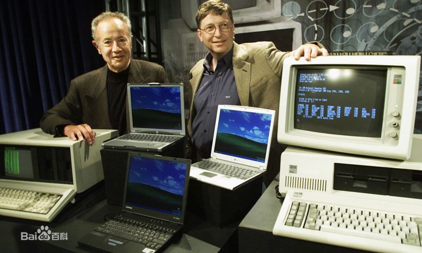

#安迪比尔定律————嘻嘻

**安迪比尔定律(Andy and Bill's Law)**是对IT行业中软件和硬件升级换代关系的一个概括。按照百度百科的说法，其原话是"Andy gives,Bill takes away"(安迪提供什么，比尔拿走什么)。安迪指英特尔前CEO安迪·格鲁夫，比尔指微软前任CEO比尔·盖茨，这句话的意思是，硬件提高的性能，很快被软件消耗掉了。
而在这之前，我们要讲一讲**摩尔定律————价格不变，集成电路上可容纳的元器件数目，约每隔18个月便会翻一倍，性能也将提升一倍。**和**反摩尔定律————如果一个IT公司现在和18个月前卖掉同样多的同样的产品，它的营业额就要下降一半**。简单理解，摩尔定律描述的是硬件的升级与时间关系，虽然现在科技的飞速发展以使产品升级不需要等待18个月之久，但其讲述的升级问题是一个真理。而反摩尔定律则站在了摩尔定律的对立面，以另一方面理解，它可以被解释成：如果现在消费者暂时不买一个IT公司的产品，那么在18月后，他就可以一半的价格购买同等性能的该产品。听起来是不是很兴奋？我们暂不讨论其可行性。假设所有人都有了这样的意识，那么，可能产生的一个问题就是————新的产品对消费者的吸引力不足，因此就难以带来足够的营业额支撑研发、甚至连公司能否正常运行都成了问题，这是很不利于社会、科学的长远发展的。但如果你说“I don't care.”。那我只能说“You think too much!”。
如果你还记得本文第一段的“==安迪比尔定律==”，那你就应该清楚————我这句话不是白打的！
让我们来看看与这条定律紧密相连的**英特尔**公司和**微软**公司。英特尔是美国一家主要以研制CPU处理器的公司，是全球最大的个人计算机零件和CPU制造商，如果你上网百度，你会发现，它绝大部分的成就都与**处理器**有关，而微软是一家美国跨国科技公司，也是世界PC（Personal Computer，个人计算机）软件开发的先导，也即它主要搞软件开发。于是我们就看到了这样有趣的景象：英特尔带来更高的硬件性能，微软就开发更新更强大的操作系统和一系列软件来消化提升的硬件性能。这使得计算机行业能够健康地维持高速发展，将计算机从一个耐用性商品变成了消耗性商品。打个比方：几十年前的汽车如果重新生产还可以重新驾驶（虽然性能不如当代），但十年前的电脑放在现在，你会发现现在许多重要的软件早已运行不起来了！硬件的升级为软件实现更多的功能提供更多的支撑，而软件的发展又使不断提升的硬件性能被消化。那么如果你等到18个月后再去购买相关公司的产品，你会发现你不但没有省钱，反而浪费了钱。因此，需要买该产品的人没有必要等待降价，已经拥有该产品的人也有了一定的动力去购买新的产品。这样的模式看起来并不太友好，但认真比较一下，你就会认同：一个人金钱的损失，如果能换来一个社会科技的进步与人们生活的便利，那么花钱，便是一件快乐的事。

