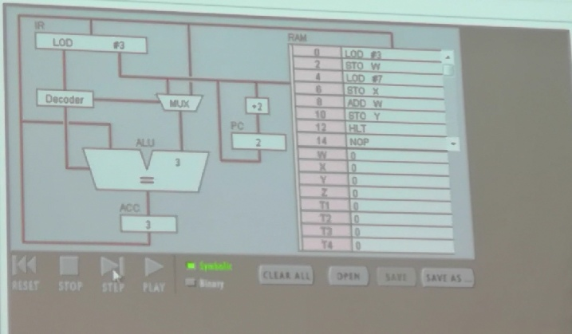
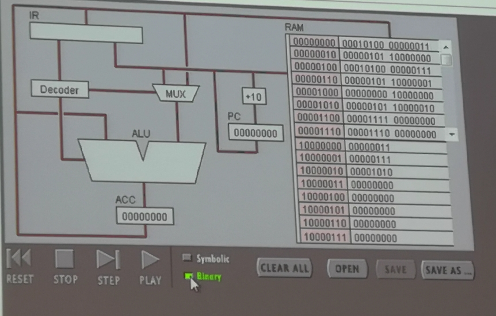

## 任务一
### 一、
1.**PC**（程序计数器）的作用：用于存放指令的地址。PC的初值为程序第一条指令的地址，在顺序执行程序时，控制器首先按程序计数器所指出的指令地址从内存中取出一条指令，然后分析和执行该指令，同时将PC的值加1指向下一条要执行的指令。
**IR**(指令寄存器)的作用：作为CPU运算过程中的数据和指令的存放单元。
取指过程：（百度）
1、现行指令地址送至存储器地址寄存器，记作PC->MAR
2、向主存储器发送读命令，启动主存储器作读操作,记作1->R
3、将MAR（通过地址总线）所指的主存单元中的内容（指令）井数据总线读至MDR内,记作M(MAR)->MDR
4、将MDR的内容送至IR,记作MDR->IR
5、指令的操作码送至CU译码,记作OP（IR）->CU
6、形成下一条的地址,记作（PC）+1->PC
2. **ACC**
全称：Accumulator register 累加寄存器
作用：当运算器的算术逻辑单元(ALU)执行算术或逻辑运算时，为ALU提供一个工作区。累加寄存器暂时存放ALU运算的结果信息。
3. Fetch： 截取指令LOD #3 -> 通过总线到达IR -> Decode instruction： IR将该指令分解为LOD和#3 -> Register： IR将指令LOD传至MUX,后Decoder再将指令LOD传至ALU ->Get data： IR将分解的#3传至MUX，MUX再将数值3传至ALU -> Execute：在ALU中执行指令的操作，得出数值，并将该数值寄存与ACC中
该过程实现了第一个数值3的输入与保存
4. Fetch：从PC输出指令到RAM截取指令ADD W -> 通过总线到达IR -> Decode instruction: 输出的指令到达IR后被分解为ADD和W -> Register：IR将指令ADD传至Decoder，Decoder再将其分先后传至MUX和ALU中，之后ALU将其传至ACC，使先前在ACC中寄存的数值7传至ALU左侧 -> Get data：之后IR将分解的W传至RAM中寻找W地址所对应的内容数值3并取出 -> Execute: 数值3通过总线传至MUX，MUX将其传至ALU，ALU执行加法运算.
该过程实现加3的操作。
5. “LOD #3” 位置在前，先于 “ADD W”执行。
### 二、
1. 二进制形式：00010100 00000111
前八位称为命令指示，第四位为寻址模式，该二进制形式中为1，表示操作数为数值；后八位称为操作数，表示数值或地址，上式中表示数值7.整个式子表示输入数值7.
2. 在RAM中，每一条指令占两个字节，因此左栏中的进为为2，即第一行为00000000，第二行为00000010，第三行为00000100，以此类推；右栏中，前八位是命令指示，第四位为寻址模式，若为1，表示操作数为数值，若为0，表示操作数为地址。后八位为操作数，其第一位为1表示地址，为0表示为数值。
3. 8位。
4. 
```
#include <stdio.h>

int main() {
    int a = 3;
    int b = a + 7;
    printf("%d", b);
    return 0;
}
``` 
## 任务二 
**一、**
1. 将10依次减一直到0
2. 
```
#include <stdio.h>

int main() {
    int i = 10;
    while(i > 0) {
        -- i;
    }
    return 0;
}
```
**二、**
1. 
```
#include <stdio.h>

int main() {
    int i;
    int sum = 0;
    for(i = 10; i => 1,; --i) {
        sum += i;
    }
    return 0;
}
```



2.  00010100 00001010 -> 00000101 100000000 ->       00010100 00001001 -> 00000101 10000001 -> 00000000 10000000-> 00000101 10000010 -> 00010100 00001000 -> 00000101 10000011 -> 00000000 10000010 -> 00000101 10000100 -> 00010100 00000111 -> 00000101 10000101-> 00000000 10000100 -> 00000101 10000110 -> 00010100 00000110 -> 00000101 10000111 -> 00000000 10000110 -> 00000101 10001000 -> 00010100 00000101 -> 00000101 10001001 -> 00000000 10001000 -> 00000101 10001010 -> 00010100 00000100 -> 00000101 10001011 -> 00000000 10001000 -> 00000101 10001100 -> 00010100 00000011 -> 00000101 10001101 -> 00000000 10001100 -> 00000101 10001111 -> 00010100 00000010 -> 00000101 10010000 -> 00000000 10001111 -> 00000101 10010001 -> 00010100 00000001 -> 00000101 10010011 -> 00000000 10010001 -> 00000101 10010100 -> 00001111 00000000 -> 00001110 00000000.

3. 区别： **机器语言**是一种指令集的体系。这种指令集，称机器码（machine code），是电脑的CPU可直接解读的数据。是一种低级语言，是计算机唯一能接受和执行的语言。机器语言由二进制码组成，每一串二进制码叫做一条指令。
**高级语言**是以人类的日常语言为基础的一种编程语言，使用一般人易于接受的文字来表示（例如汉字、不规则英文或其他外语），从而使程序编写员编写更容易，亦有较高的可读性，以方便对电脑认知较浅的人亦可以大概明白其内容。。它并不是特指的某一种语言，而是包括很多编程语言，如目前流行的Java，C，C++,C#,Pascal,Python,Lisp,Prolog,Foxpro,VC,易语言，中文版的C语言习语言等等，这些语言的语法、命令格式都不相同。
**高级语言**相对于**机器语言**而言，是高度封装了的**编程语言**。
联系：**高级语言**用起来方便，但编译麻烦，最终也是**机器语言**运行。同时**汇编语言**与机器语言有着一一对应的关系，而高级语言与机器语言却是一对多。