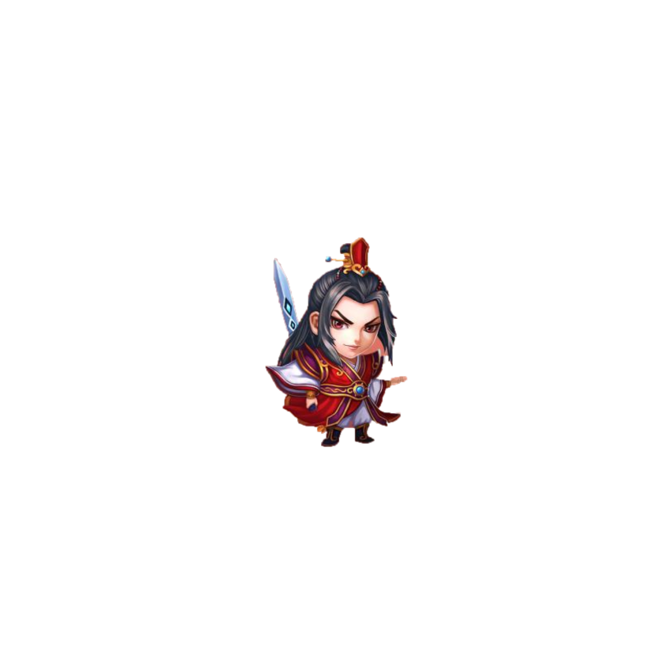
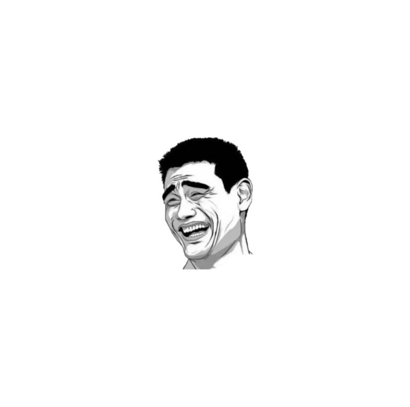
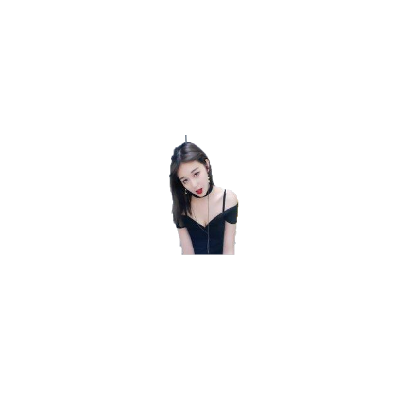
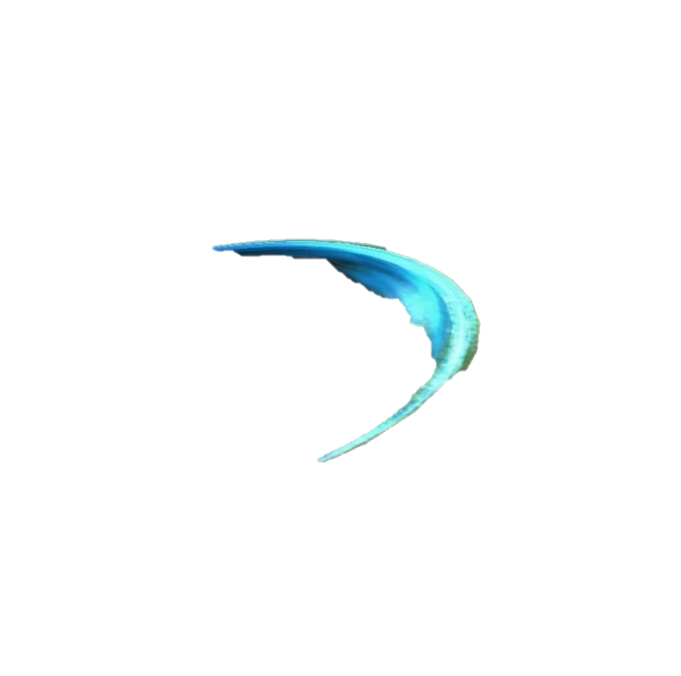

 #HTML5游戏设计与制作（进阶篇）

 ##游戏策划：

 楔子： 公元不知几几年，此时正值天魔大战后一年，天下始有一些恢复之气，新君  一泓  正是风华少年，意欲发奋治世，谁料好友竟下药于他，夺其大权，甚至不欲将他直接杀害，而强其服入只可快走，向前则不可停之药，更有甚者，其行进后退有时无奈翻滚而不可正立，昔日好友就将如此之人，丢入奇异之地，任其自生自灭！哼！岂是自生自灭？此地凶险无比，只有前后两方可行，竟却不知为何有两大奇物阻挡，碰之则忽然身体自爆，其间还间有小块奇石，碰之也亦如中火竹，全身焦灼，且看在此凶险之地，昔日帝王可能突破重难！  

 玩法： 玩家只需简单操作键盘方向键以控制方向，以空格键发出剑气以毁旁边两大奇物。  

 人设和道具：  
 君王一泓： 因服药行动奇异，但也因其行动迅速，出招迅猛，所发剑气竟可摧毁奇物！  
 ps：他应该会飞。

 

 奇物： 有些能漂浮。
 
 
   

要求：玩家需对左右两个奇物其中之一进行剑气攻击，30击便可将奇物摧毁，但游戏人物因中毒较深只能承受十次怪石撞击。只要成功击坏左右其中一块奇物便可成功出逃。

 #游戏设计

|object|一泓|
|---|---|
|attributes|
|collaborator|精灵|
|event&actions|碰撞&销毁自己|
||发出剑气&销毁奇物|

|object|剑气|
|---|---|
|attributes||
|collaborator|精灵|
|event&actions|碰撞&销毁自己|

|object|奇物|
|---|---|
|attributes|
|||
|||
|||
|event&action|无|

GIF动图：

------
本游戏所出现的人物却有些不妥，但本人绝不会将其用来牟利或做其他用途（其实这游戏也做不到），只是充当自己做游戏的消遣，还望相关人士海涵！在此感谢。