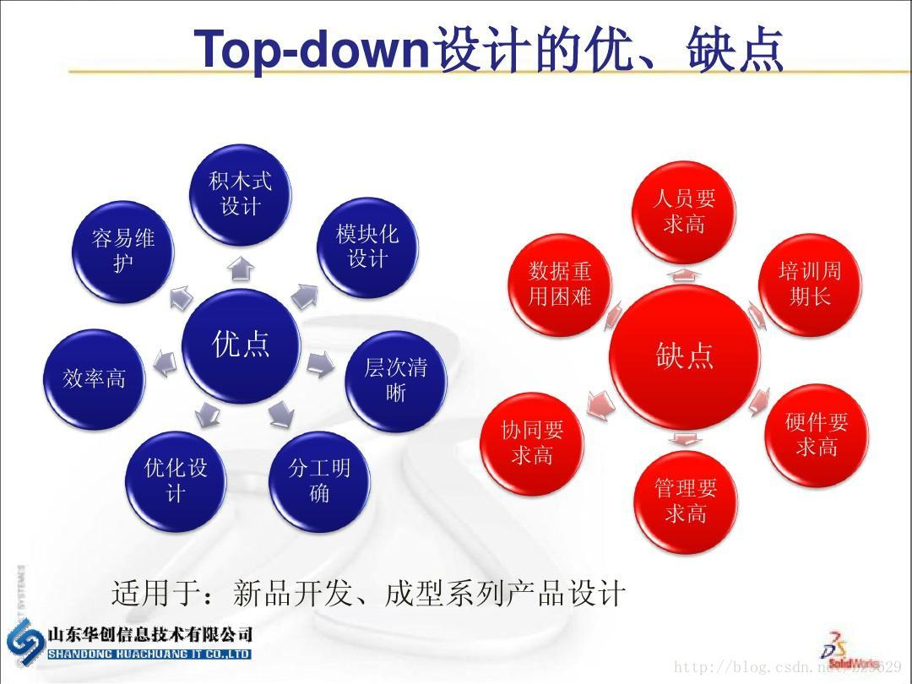

#“自顶向下，逐步求精”的小理解之我爱洗衣机

##What is Top-down design?

百度百科有言：<font color=#DC143C>**自顶向下设计**（Top-down design），是一种逐步求精的设计程序的过程和方法</font><br/>。对要完成的任务进行分解，先对最高层次中的问题进行定义、设计、编程和测试，而将其中未解决的问题作为一个子任务放到下一层中去解决。这样逐层、逐个地进行定义、设计、编程和测试，直到所有层次上的问题均由实用程序来解决，就能设计出具有层次结构的程序。

**四个主要步骤：**

1. 分析问题

理解问题，列出必须处理的信息（如问题中的数据等），明确所需采取的方案（如果是报表，明确采用的格式）。列出自己对问题或信息的假设，思考如何动手解决问题，开发一个全面的算法或通用方案。

2. 编写主要模块

用自然语言或伪代码在主模块中重述问题。用模块名把问题分解成功能区块。如果主模块太长，说明这一层中的细节太多了。此时可以引用一些控制结构。如果必要，可以进行逻辑重组，把细节推延到下一层模块。 

如果目前你不知道如何解决未成文的模块，不必担心。假装你有个非常聪明的朋友知道答案，把这个问题推迟到以后再解决即可。在主模块中所要做的，只是给下一层中每个解决任务的模块一个名字，要采用含义明确的标识符。


3. 编写其余模块

编写方案中的层数并不确定。每一层中的模块可以载入多个下层模块。虽然上层模块引用的是未成文的下层模块，但上层模块必须完整。不断细化每个模块，直到模块中的每条语句都是具体的步骤为止。

4. 根据需要进行重组和改写

为变化做好打算。不要害怕从头来过。一些尝试和细化操作是必要的。要维持透明性，简单直接地表达你的想法。

##What's its advantage and disadvantage?

看图见分晓：


##洗衣机小案例

现在洗衣机大概是每家每户都有一台了，相信它的操作方式大家都很清楚，但是，如果有人问起你“你知道它是怎么运作的吗？”。大概大部分人都是一脸懵圈。当然，我本人也不知道，但我们可以简化地想一想，如果让你自己去设想一个方案，设计出一套操作程序，那么只要用上一点生活用洗衣机地小常识，我们还是能够用上伪代码来秀一秀操作的（伪代码是什么？百度一下，你就知道），这里先科普一下基本的伪代码：<http://users.csc.calpoly.edu/~jdalbey/SWE/pdl_std.html>
虽然都是英文就对了~~

现在让我们用上面“自顶向下”的思想，来用伪代码描述洗衣机的控制程序设计：

首先，我们先用自然语言（比如我们说的文字）来分解一下洗衣机洗衣的程序步骤：

1、选择洗衣模式（这里一般我们都选择漂洗吧）   输入水位、时间（现在一般时间都由洗衣模式决定，这里我们也设置一下加深了解）

2、开始注水到预设水位

3、浸泡

4、漂洗：这里按照正常现象，一般要分几个周期（这里我们设置：每个周期  电机转动右5秒，左5秒）

5、排水至水位为0

6、脱水：电机快速转动（一般洗衣机好像都只往一边转，不过这里设置每周期左100秒右100秒 5个周期）

7、关闭电源


先提前声明一下接下来可能会用到的一些代码：

water_in_switch(open_close) // open 打开上水开关，close关闭

water_out_switch(open_close) // open 打开排水开关，close关闭

get_water_volume() //返回洗衣机内部水的高度

motor_run(direction) // 电机转动。left左转，right右转，stop停

time_counter() // 返回当前时间计数，以秒为单位

halt(returncode) //停机，success 成功 failure 失败

现在来写写伪代码：

```
1.FUNCTION 注水(volume, timeout)
    SET now = time_counter()
    WHILE get_water_volume() < volume
        water_in_switch(open)
        IF time_counter() == now + timeout
            halt(failure)
            BREAK
        ENDIF
    ENDWHILE

    water_in_switch(close)

ENDFUNCTION

2.FUNCTION 漂洗(soak_time)
    SET now = time_counter()
    WHILE time_counter() <= now + soak_time
        SET now1 = time_counter()
        motorrun(right)
        IF time_counter() = now1 + 5
            motorrun(left)
        ENDIF

        IF time_counter() == now1 + 10
            motorrun(stop)
        ENDIF
    ENDWHILE 
ENDFUNCTION

3.FUNCTION 排水(timeout)
    SET now = time_counter()
    WHILE get_water_volume() > 0
        water_out_switch(open)
        IF time_counter() == now + timeout
            halt(failure)
            BAREAK
        ENDIF
    ENDWHILE
ENDFUNCTION

4.FUNCTION 脱水()
    FOR i = 1 to 5
        now1 = time_counter()
        motorrun(left)
        IF time_counter() == now1 + 100
            motorrun(right)
        ENDIF
    ENDFOR
ENDFUNCTION

5.FONCTION READ(water_line, soak_time, rinse_time)
    注水(volume, timeout)

    漂洗(soak_time)

    排水(timeout)

    脱水()

    water_out_switch(close)

    halt(success)
ENDFUNCTION
```

上面的伪代码总共有5个函数，其中前四个函数是对注水等操作的分别分析，这体现了一种“分而治之”的思想，上面也已讲过。你会发现里面没有体现浸泡这一过程，其实只是因为浸泡主要体现的是时间问题，只需在漂洗前设定一个时间段即可，如果选择快洗，那么浸泡过程是可以忽略的。而之所以不将关机过程写成函数，那是因为该步骤过于简单，写成函数反而显得冗杂。

好了，在此谢谢你的阅读！！！
------
参考文献:

百度百科

<https://blog.csdn.net/zz9629/article/details/78585295?locationNum=5&fps=1>

<https://blog.csdn.net/yuxy36/article/details/78634047>
