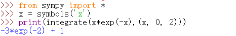
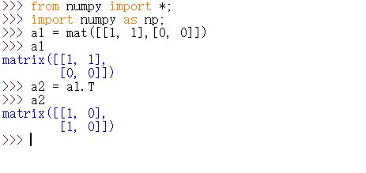

 #实验一

1. 计算定积分

```
>>> from sympy import *
>>> x = symbols('x')
>>> print(integrate(x*exp(-x),(x, 0, 2)))

```

结果如下：



2. 求极限

```
>>> from sympy import *
>>> import math
>>> f = sin(x)/x
>>> print(limit(f, x, 0))

```

结果如下：


 #实验二

1. 计算矩阵的逆

例：

```
>>> from numpy import *;
>>> import numpy as np;
(or :  import numpy as np)
>>> a1 = mat(eye(2, 2) * 0.5)
>>> a1

>>>a2 = a1.I      #compute the inverse of a1
>>>a2
```

结果如下：


2. 计算矩阵的转置

例：

```
>>> from numpy import *;
>>> import numpy as np;
>>> a1 = mat([[1, 1],[0, 0]])
>>> a1

>>> a2 = a1.T
>>> a2

```

结果如下：



---
确实需要承认，完全没有python基础确实是连简单的计算都不知道要怎么操作的，但我也努力尝试了，只不过python不是一朝一夕便能学会，但它让我看到了它的方便与快捷，确实让人心生喜爱，希望有朝一日我也能熟练的掌握它！