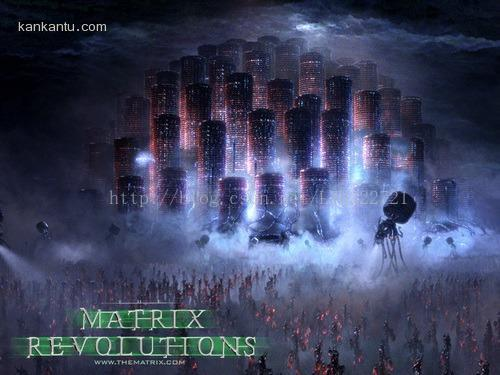
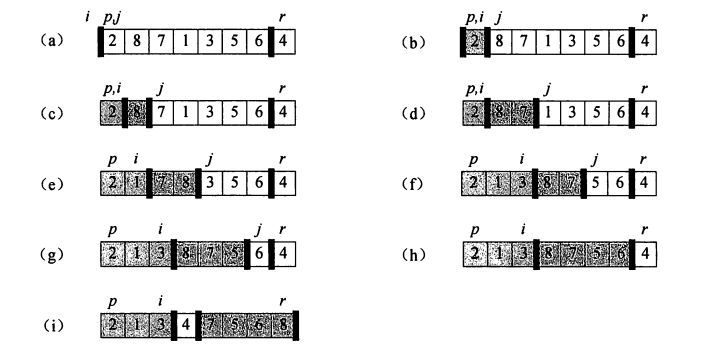

#IT伦理与道德

近年来随着IT行业的蓬勃发展，带给人们巨大便易，财富的同时也会随之带来一些问题，伦理与道德在这一领域也应逐渐受到重视。

**一、现代意义的黑客**

作为一名程序猿，我们（虽然我还不是）应该具备一些道德准则，首先对于公司，程序员应该做到保护公司的商业机密，决不允许发生泄露公司源代码，重要文档的内容；对于竞争对手我们要尊重他人的劳动成果，不能窃取他人成果为己所用：对于国家，一定不能利用自己的知识，技能做任何对国家不利的事。

但是，这世上是总是不乏黑客的：

据美国网站Visual Capitalist，随着最近优步、Equifax和HBO等大公司相继遭到黑客攻击，网络安全已成为全球各大公司最需要关心的问题之一。数据显示，自2013年以来，全球有超过90亿的记录被丢失或被盗，而光是财富500强公司，就有80%的价值来自知识产权和其他无形资产，这意味着资产数字化也带来了巨大的网络安全风险。劳埃德银行和Cyence的报告指出，一次大规模的黑客攻击可能导致高达530亿美元的损失，这相当于一场自然灾害的规模。大规模网络攻击的潜在影响比以往任何时候都要大，网络安全也变成国家安全、国际关系的重要关切。



2000年，绰号黑手党男孩、年仅15岁的黑客成功入侵包括雅虎、eBay和Amazon在内的大型网站服务器，使服务器无法向用户提供内容。

现代意义的黑客行为是有违伦理与道德的，对个人、社会、国家来说，危害也是极大的。如果你是黑客，或许你会得意洋洋与自己的“高超技术”，但你却一定不能忘记，自己的快乐，是建立在他人，社会乃至国家的痛苦之上的。如果你切身体会过对某一事物的痛恨，那你也一定懂得一个普通人对黑客的厌恶。

**二、个人隐私问题--婚恋网站**
随着计算机在人们生活中的深入，越来越多的信息被盗到网络中，人们的身份证号，手机号码，甚至银行账号及密码都会存入计算机中。但计算机会通过网络来与世界相联系，不免会有人通过网络来获取一些其他人的隐私信息来达到一些不可告人的秘密。所以如今的个人隐私安全已经不再安全，一旦泄露，就有可能对用户造成物质上和精神上的双重打击，计算机隐私侵权行为还可能导致人们价值观、人生观的变化，引起伦理道德的崩溃，引发一系列网络社会和现实社会问题，不利于和谐社会的构建。


中国是一个人口大国，婚恋网站虽然作为互联网行业的新兴行业，但是目前发展规模却很庞大。据统计，目前国内用户规模最大的是有缘网，累计用户数达到1.9386亿人。世纪佳缘以1.26亿人的用户规模排位第二；而第三位是百合网，用户规模为8500万人。如此庞大的用户规模，信息管理如何更加优化也着实考验着这些网站的能力。

虽然现在许多婚恋交友网站的注册用户都提供了身份认证信息，但我们依旧可以看到某些婚恋网站上用户信息的模糊性和虚假性的存在。再加上在某些等价条件下就可以知道对方的个人信息，那么某种程度上说，我们的信息若是真实的就会有泄露信息的风险，若为假则有欺骗其他用户的嫌疑。如此矛盾的信息安全问题，如果婚恋交友公司不能得到很好的解决，那么婚恋网站的信用问题就会不时出现。

信用危机意识其实也是一种道德伦理意识，因为这往往关系到企业对用户的责任，尤其是互联网的某些非接触性特点的行业，这一点显得尤为重要。

**三、计算机软件产权问题**

软件知识产权是计算机软件人员对自己的研发成果依法享有的权利。知识产权是无形的劳动成果，计算机软件作为新兴学科，其发展速度惊人，更新换代极快，更需要对其进行保护。学过初中政治的人都知道：只有对其进行保护，才能激发开发人员的热情积极性，促进软件产业的发展，进而为社会创造更大的效益，促进社会的高速发展。试想如果有人抢先把你辛苦写好的论文提前发表，让你的一切努力功亏一篑，你必定会对其恨之入骨。程序员也一样：每一个软件都是开发人员高度智慧的结晶，每一个软件走到用户手中，都是经过程序员不断辛勤调试的结果，如果软件的代码与核心思想未经开发者允许而被人直接复制使用，那么侵权者可以不费吹灰之力谋求经济效益。而开发人员却因此反而招损。这不仅对开发人员造成巨大打击，对整个社会的发展也将产生巨大影响，甚至计算机软件产业可能因此而停滞不前，进而影响经济的繁荣与发展。 

这里有一篇关于腾讯的博客，或许你能从中得到一些启示：

<http://chengyiqun2008.blog.163.com/blog/static/1115111202012229111654744/>

软件设计者要对自己的成果申请知识产权，对没有经过允许却使用自己的成果行为坚决使用法律保护自己的知识产权。使用者也应经设计者同意才可使用该成果。国家也应制定出既能保护软件知识产权又能促进软件行业发展的法律。

总之，作为IT行业的一员或将进入IT行业的一员，我们要紧守伦理与道德，作为一个直接或间接接触IT行业的人，我们又怎能把伦理与道德抛弃不顾？

##排序的算法

1. 冒泡排序

基本思想：比较相邻的两个数，如果前者比后者大，则进行交换（降序），或者后者比前者大，则进行交换（升序）。

例：将“11，35，13，78， 45，67，23” 进行升序

```c
#include <stdio.h>

void bubbleSort(int *array, int n) {
    int temp;
    //升序：内层循环是每次将最大的数排到最右边，外层循环是内层循环所需重复的次数
    for (int i = 0; i < n - 1; i ++) {
        for (int j = 0; j < n - i - 1; j ++) {
            //升序：如果前面的数比后面的数大，进行交换
            if (array[j] > array[j + 1]) {
                //若为降序，只需(array[j] < array[j + 1])
                temp = array[j];
                array[j] = array[j + 1];
                array[j + 1] = temp;
            }
        }
    }
}

int main() {
    int nums[] = {11, 35, 13, 78, 45, 67, 23};
    int n = sizeof(nums) / sizeof(nums[0]);//计算数组元素个数
    bubbleSort(nums, n);
    printf("排好的数组为：\n");
    for (int i = 0; i < n; i ++) {
        printf("%d\t", nums[i]);
    }
    return 0;
}
```

2. 快速排序

基本思想：选取一个基准元素（通常为数组最后一个元素/或第一个元素）。从前向后遍历数组，当遇到小于基准元素的元素时，把它和左边第一个大于基准元素的元素进行交换。再利用分治策略从已经分好的两组中分别进行以上步骤，直到排序完成。如图：



例：10,6,5,7,12,8,1,3,11,4,2,9,16,13,15,14 

```c
#include <stdio.h>

void swap (int *x, int *y) {
    int temp = *x;
    *x = *y;
    *y = temp;
}

int patition(int *arr, int left, int right) {
    int j = left; //用来遍历数组
    int i = j - 1; //用来指向小于基准元素的位置
    int key = arr[right]; //基准元素
    //从左到右遍历数组，把小于等于基准元素的放到左边，大于基准元素的放到右边
    for (; j < right; j ++) {
        if (arr[j] <= key) 
            swap(&arr[j], &arr[++ i];)
    }
    //把基准元素放中间
    swap(&arr[right], &arr[++ i]);
    //返回数组的中间位置
    return i;
}

//快速排序
void quickSort(int *arr, int left, int right) {
    if (left >= right) return;
    int mid = patition(arr, left, right);
    quickSort(arr, left, mid - 1);
    quickSort(arr, mid + 1, right);
}

int main() {
    int nums[] = {10,6,5,7,12,8,1,3,11,4,2,9,16,13,15,14};
    int n = sizeof(nums) / sizeof(int);
    quickSort(nums, 0, n - 1);
    printf("排好的数组为：\n");
    for (int i = 0; i < n; i ++) {
        printf("%d\t", nums[i]);
    }
    return 0;
}
```

当数组元素基本有序时，快速排序将没有任何优势，基本退化为冒泡排序，可在选取基准元素时选取中间值进行优化。

3. 插入排序

基本思想：用一个临时变量储存当前值。当前面的元素比后面大时，先把后面的元素存入临时变量，前面元素的值放到后面元素位置，再到最后把其值插入到合适的数组位置。

例：11,7,9,22,10,18,4,43,5,1,32

```c
#include <stdio.h>

void InsertSort(int *array, int n) {
    int temp = 0;
    for (int i = 1; i < n; i ++) {
        int j = i - 1;
        if (array[i] < array[j]) {
            temp = array[i];
            array[i] = array[j];
            while (temp < array[j - 1]) {
                array[j] = array[j - 1];
                j -- ;
            }
            array[j] = temp;
        }
    }
}

int main() {
    int nums[] = {11,7,9,22,10,18,4,43,5,1,32};
    int n = sizeof(nums) / sizeof(nums[0]);
    InsertSort(nums, n);
    printf("排好序的数组为：\n");
    for (int i = 0; i < n; i ++) {
        printf("%d\t", nums[i]);
    }
    return 0;
}
```

------
资料来源：百度