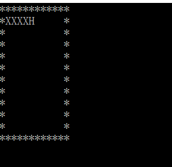

# 字符游戏--贪吃蛇（1）

#### 任务一

1. 总控伪代码

```
输出字符矩阵
    WHILE not 游戏结束 DO
        ch = 等待输入
        CASH ch DO
        ‘A’: 左向前进一步，break
        ‘D’:右前进一步，break    
		‘W’:上前进一步，break    
		‘S’:下前进一步，break    
		END CASE
		输出字符矩阵
	END WHILE
	输出 Game Over!!! 
```

1. 总控代码：

```c
#include <stdio.h>
#include <time.h>
#include <stdlib.h> 
#include <conio.h>

#define SNAKE_MAX_LENGTH 20 
#define SNAKE_HEAD 'H'
#define SNAKE_BOOY 'X'
#define BLANK_CELL ' ' 
#define WALL_CELL '*'

void PrintMap(void);//打印结果
void GameOver(void);//游戏结束
void InitGame(void);//初始化整个游戏的对象
void MoveSnake(void);//实现蛇的运动

int snakeX[SNAKE_MAX_LENGTH] = {5, 4, 3, 2, 1};
int snakeY[SNAKE_MAX_LENGTH] = {1, 1, 1, 1, 1};
int length = 5;//蛇的初始长度

int main() {
    InitGame();
	while (gamerun) {
		MoveSnake();
		PrintMap();
	}
	if (!gamerun) GameOver();
	return 0;
}
```
2. 完成涉及的函数

```c
int gamerun = 1;
char ch;

void PrintMap() { 
	system("cls"); //清空屏幕上的内容
	for (int i = 0; i < 12; i ++) {
		printf("%s\n", map[i]);
	}
}

void GameOver() {
	gamerun = 0;
	printf("GAME OVER!\n");
}

void InitGame() {
	map[snakeY[0]][snakeX[0]] = SNAKE_HEAD;
	map[snakeY[1]][snakeX[1]] = SNAKE_BOOY;
	map[snakeY[2]][snakeX[2]] = SNAKE_BOOY;
	map[snakeY[3]][snakeX[3]] = SNAKE_BOOY;
	map[snakeY[4]][snakeX[4]] = SNAKE_BOOY;
	gamerun = 1;
	PrintMap();
}

void MoveSnake() {
	ch = getch();
	map[snakeY[length - 1]][snakeX[length - 1]] = BLANK_CELL;//实现蛇改变方向时"头尾互换"的操作
	map[snakeY[0]][snakeX[0]] = SNAKE_BOOY;
	for (int i = length - 1; i; i --) {
		snakeX[i] = snakeX[i - 1];
		snakeY[i] = snakeY[i - 1];
	}
	
	//游戏通过键盘上的小写‘w’，’a’，’s’，’d’控制蛇的移动
	switch (ch) {
		case 'w':
			snakeY[0] -- ;
			break;
		case 's':
			snakeY[0] ++ ;
			break;
		case 'a':
			snakeX[0] -- ;
			break;
		case 'd':
			snakeX[0] ++ ;
			break;
	}
	if (map[snakeY[0]][snakeX[0]] != BLANK_CELL) 
		GameOver();
	else map[snakeY[0]][snakeX[0]] = SNAKE_HEAD;
}
```
现在我们就得到了一条会动的蛇啦！

#### 任务二

下面我们进行一些改动实现“吃”的功能

```c
#define SNAKE_FOOD '$'

//明确食物的坐标
struct Food {
    int x; 
    int y;
}food;
```

在主程序中加上一步"吞食“的操作

```c
int IsFood = 0;

void SpawnFood(void);

void SpawnFood() {
    food.x = rand() % 10 + 1;
	food.y = rand() % 11 + 1;
	while(map[food.y][food.x] != BLANK_CELL) {
		food.x = rand() % 10 + 1;
		food.y = rand() % 11 + 1;
	}
	map[food.y][food.x] = SNAKE_FOOD;
	IsFood = 1;
}

//同时，函数MoveSnake()也应有所改动：

void MoveSnake() {
	ch = getch();
	map[snakeY[length - 1]][snakeX[length - 1]] = BLANK_CELL;//实现蛇改变方向时"头尾互换"的操作
	map[snakeY[0]][snakeX[0]] = SNAKE_BOOY;
	for (int i = length - 1; i; i --) {
		snakeX[i] = snakeX[i - 1];
		snakeY[i] = snakeY[i - 1];
	}
	
    //游戏通过键盘上的小写‘w’，’a’，’s’，’d’控制蛇的移动
	switch (ch) {
		case 'w':
			snakeY[0] -- ;
			break;
		case 's':
			snakeY[0] ++ ;
			break;
		case 'a':
			snakeX[0] -- ;
			break;
		case 'd':
			snakeX[0] ++ ;
			break;
	}
    //此下为改动处：
	if (map[snakeY[0]][snakeX[0]] != BLANK_CELL && map[snakeY[0]][snakeX[0]] != SNAKE_FOOD)
		GameOver();
	if (map[snakeY[0]][snakeX[0]] == SNAKE_FOOD) {
		map[snakeY[0]][snakeX[0]] = SNAKE_HEAD;
		length ++ ;
		IsFood = 0;
	}
	else map[snakeY[0]][snakeX[0]] = SNAKE_HEAD;
}
```

这样会吃食的蛇就完成了，下面是整理好的完整代码：

```c
#include <stdio.h>
#include <time.h>
#include <stdlib.h> 
#include <conio.h>

#define SNAKE_MAX_LENGTH 20 
#define SNAKE_HEAD 'H'
#define SNAKE_BOOY 'X'
#define BLANK_CELL ' '
#define SNAKE_FOOD '$' 
#define WALL_CELL '*'


char map[12][13] = {
	"************",
	"*          *",
	"*          *",
	"*          *",
	"*          *",
	"*          *",
	"*          *",
	"*          *",
	"*          *",
	"*          *",
	"*          *",
	"************"
};

struct FOOD
{
    int x;
    int y;
}food;

int snakeX[SNAKE_MAX_LENGTH] = {5, 4, 3, 2, 1};
int snakeY[SNAKE_MAX_LENGTH] = {1, 1, 1, 1, 1};
int length = 5;//蛇的初始长度 
int gamerun = 1;
int IsFood;
char ch;

void PrintMap() { 
	system("cls"); //清空屏幕上的内容
	for (int i = 0; i < 12; i ++) {
		printf("%s\n", map[i]);
	}
}

void GameOver() {
	gamerun = 0;
	printf("GAME OVER!\n");
}


//初始化整个游戏的对象
void InitGame() {
	map[snakeY[0]][snakeX[0]] = SNAKE_HEAD;
	map[snakeY[1]][snakeX[1]] = SNAKE_BOOY;
	map[snakeY[2]][snakeX[2]] = SNAKE_BOOY;
	map[snakeY[3]][snakeX[3]] = SNAKE_BOOY;
	map[snakeY[4]][snakeX[4]] = SNAKE_BOOY;
	gamerun = 1;
	PrintMap();
}

void MoveSnake() {
	ch = getch();
	map[snakeY[length - 1]][snakeX[length - 1]] = BLANK_CELL;//实现蛇改变方向时"头尾互换"的操作
	map[snakeY[0]][snakeX[0]] = SNAKE_BOOY;
	for (int i = length - 1; i; i --) {
		snakeX[i] = snakeX[i - 1];
		snakeY[i] = snakeY[i - 1];
	}
	
	//游戏通过键盘上的小写‘w’，’a’，’s’，’d’控制蛇的移动
	switch (ch) {
		case 'w':
			snakeY[0] -- ;
			break;
		case 's':
			snakeY[0] ++ ;
			break;
		case 'a':
			snakeX[0] -- ;
			break;
		case 'd':
			snakeX[0] ++ ;
			break;
	}
	if (map[snakeY[0]][snakeX[0]] != BLANK_CELL && map[snakeY[0]][snakeX[0]] != SNAKE_FOOD)
		GameOver();
	if (map[snakeY[0]][snakeX[0]] == SNAKE_FOOD) {
		map[snakeY[0]][snakeX[0]] = SNAKE_HEAD;
		length ++ ;
		IsFood = 0;
	}
	else map[snakeY[0]][snakeX[0]] = SNAKE_HEAD;
}

void SpawnFood() {
	food.x = rand() % 10 + 1;
	food.y = rand() % 11 + 1;
	while(map[food.y][food.x] != BLANK_CELL) {
		food.x = rand() % 10 + 1;
		food.y = rand() % 11 + 1;
	}
	map[food.y][food.x] = SNAKE_FOOD;
	IsFood = 1;	
} 

int main() {
	InitGame();
	while (gamerun) {
		srand(time(NULL));
		MoveSnake();
		if (!IsFood) SpawnFood ();
		PrintMap();
	}
	if (!gamerun) GameOver();
	return 0;
}
```

下面我们来看一下实际运行效果：



不过，此程序只能不断操作按键蛇才能进行运动，希望以后我能够把它做的更好！