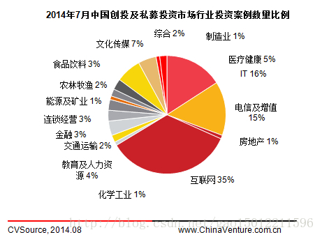
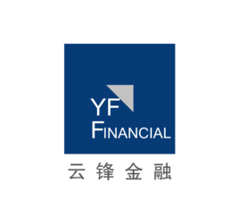
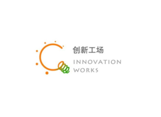
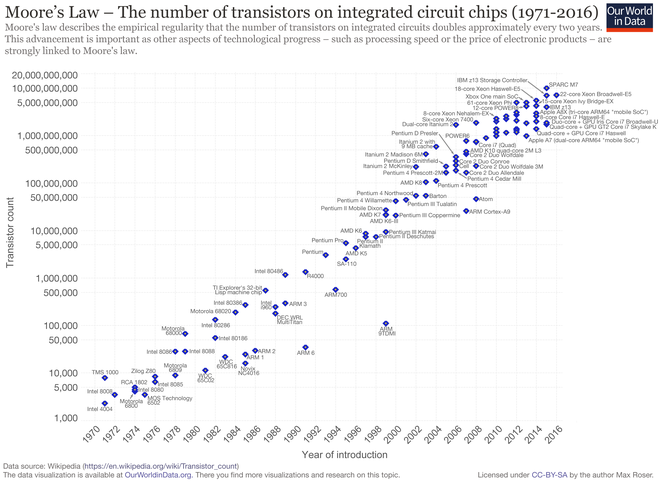
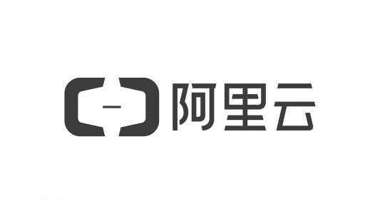

# 国内IT行业风投

 作为一个刚刚接触IT领域的小萌新，我对风投的概念表示一脸懵圈，于是百度再次成为我的得力小秘，向我打开了新世界的大门：

 **风险投资**（英语：Venture Capital，缩写为VC）简称**风投**，又译称为创业投资，主要是指向初创企业提供资金支持并取得该公司股份的一种融资方式。广义的风险投资泛指一切具有高风险、高潜在收益的投资；狭义的风险投资是指以高新技术为基础，生产与经营技术密集型产品的投资。风险投资是私人股权投资的一种形式。风险投资公司为一专业的投资公司，由一群具有科技及财务相关知识与经验的人所组合而成的，经由直接投资获取投资公司股权的方式，提供资金给需要资金者（被投资公司）。风投公司的资金大多用于投资新创事业或是未上市企业（虽然现今法规上已大幅放宽资金用途），并不以经营被投资公司为目的，仅是提供资金及专业上的知识与经验，以协助被投资公司获取更大的利润为目的，所以是一追求长期利润的高风险高报酬事业。

 根据接受风险投资的企业发展的不同阶段，我们一般可将风险投资分为四种类型。 

1、种子资本(seed capital) 
2、导入资本(start-up funds) 
3、发展资本(development capital) 
4、风险并购资本(venture A capital) 

风险投资一般采取风险投资基金的方式运作。风险投资基金的法律结构是采取有限合伙的形式，而风险投资公司则作为普通合伙人管理该基金的投资运作，并获得相应的报酬。在美国采取有限合伙制的风险投资基金，可以获得税收上的优惠，政府也通过这种方式鼓励风险投资的发展。 

如今IT领域仍是风投宠儿，IT名人接连转行争做投资人。 

2017年8月，中国私募股权投资市场共披露投资案例8起，环比上升33.3％；总投资金额46.5亿美元，环比大幅上涨1146.8％；8月的创投市场规模虽然较前几月呈现一定的下降趋势，但互联网、传媒等行业仍然是投资的热点。IT和互联网行业披露案例均为6起，在各行业中案例数量最多。

IT人向投资者的角色转换，2002年就开始考虑投资的柳传志在提到自己转行的原因时说，“我想做的事情就是在退出联想的管理一线以后，继续培养人，通过我选的人把联想的基础管理思想，特别是建班子、定战略、带队伍‘三要素’传承下去。做投资是体现这种价值最好的一种方式。”成为投资人以后，回报变成“基金管理费＋分红”的形式让他感到新鲜。另外，和做实业不同的是，“做投资以后，知识和眼界可能就要更宽一点，必须对更多的行业有了解，对地域要有了解，甚至对世界的政治经济的大气候都要了解。”柳传志说。 

#### 风投小知识

1. 风投的起源

 第二次世界大战后，美国取代英国主导了世界的金融业，在二战后的较长时间里，美国是资本的净输出国，比其它国家有多得多的资本可以进行投资。传统的投资方法是将资本投入到股市上去（PublicEquity）或者购买债券（Bonds，比如国债）。

 而对私有企业的投资大致有两种，一种是收买长期盈利看好但暂时遇到困难的企业，另一种是投资到一个新的小技术公司中，将它做大上市或者被其它公司收购。后者就是风险投资的对象。和抵押贷款不同，风险投资是无抵押的，一旦投资失败就血本全无。

 2. 风投结构

 风险投资基金（VentureCapitalFunds）主要有两个来源：机构（Institutes）和非常有钱的个人。风险投资基金一般是由风险投资公司出面，邀集包括自己在内的不超过499位投资者（和投资法人），组成一个有限责任公司（LimitedLiabilityCompany，LLC）。为什么不能超过499人呢？因为根据美国法律规定，一旦一个公司的股东超过五百人，就必须像上市公司那样公布自己的财务情况和经营情况。而风险投资公司不希望外界了解自己投资的去处和资金的运作，以及在所投资公司所占的股份等细节，一般选择不公开财务和经营情况，因此股东不能超过五百人。每一轮基金融资开始时，风投公司要到特拉华等地注册相应的有限责任公司，在注册文件中必须说好最高的融资金额、投资的去处和目的。风险投资公司会定一个最低投资额，作为每个投资人参与这一期投资的条件。

 3. 运作方式

 风险投资一般采取风险投资基金的方式运作。风险投资基金在法律结构是采取有限合伙的形式，而风险投资公司则作为普通合伙人管理该基金的投资运作，并获得相应报酬。在美国采取有限合伙制的风险投资基金，可以获得税收上的优惠，政府也通过这种方式鼓励风险投资的发展。

#### 中国IT界的风投事件

**一、中国的风投公司**

**1. 上海云峰投资管理有限公司**

云峰基金成立于2010年初，是以阿里巴巴董事局主席马云和聚众传媒创始人虞锋的名字命名而成，并联合一批行业领袖、成功企业家和成功创业者共同发起创立的私募基金。其宗旨是除了投入资金外，把各自的创业经验与企业分享，在发展战略、组织管理、品牌建设等方面帮助企业更好发展，关注年轻的企业家，创造下一代的领导者，培育未来有影响力的企业。目前云锋基金旗下拥有多支美元基金、人民币基金和专项基金。云锋基金主要涉足互联网、医疗、大文娱、金融、物流与消费等领域。

**2. 北京创新方舟科技有限公司(创新工场)**

创新工场（Sinovation Ventures）由李开复博士创办于2009年9月，是一家致力于早期阶段投资，并提供全方位创业培育的投资机构与创业平台，旨在培育创新人才和新一代高科技企业。 
创新工场通过针对早期创业者需求的资金、商业、技术、市场、人力、法律、培训等提供一揽子服务， 帮助早期阶段的创业公司顺利启动和快速成长。同时帮助创业者开创出一批最有市场价值和商业潜力的产品。创新工场的投资方向将立足信息产业最热门领域：移动互联网、消费互联网、电子商务和云计算。

**3. 软银中国**

软银中国 全称 软银中国资本(SBCVC)。软银中国资本成立于2000年，是一家领先的风险投资和私募股权基金管理公司，致力于在大中华地区投资优秀的高成长、高科技企业。

曾成功投资了阿里巴巴、淘宝网、分众传媒、万国数据、神雾、普丽盛、迪安诊断、理邦仪器等一系列优秀企业。如今软银中国资本同时管理着多支美元和人民币基金，投资领域包括信息技术、清洁技术、医疗健康、消费零售和高端制造等行业，投资阶段涵盖早期、成长期和中后期各个阶段。

软银中国资本的团队拥有成功的创业经历、丰富的运营经验以及深厚的技术背景，同时具有优秀的投资业绩。除资本支持外，软银中国资本的团队还在战略发展、市场开拓、资源整合、人才引进等多方面助力企业发展，帮助被投企业获得成功。

**二、风投事件**

1. E诊断获得数千万人民币天使轮融资

E诊断是一个医学影像诊断云服务平台，为患者提供优质的远程医学影像会诊，深度体检，早癌筛查，成本低，效率高，提供医生社交执业APP，随时会诊，隶属于西安沸腾医疗软件科技有限公司，2017年 E诊断获得数千万人民币天使轮融资，投资方是西安交通大学资产管理有限公司。

2. 易乐学车获得种子轮融资

易乐学车是一家互联网驾校，易乐学车面向的主要用户群体是在校大学生和应往届毕业生团体。 易乐学车在所覆盖的地区高校都有校园负责人，实现O2O驾校模式，2017年，易乐学车获得种子轮融资。

3. 阿里云收购趣拍云

趣拍云是一家短视频和直播技术服务解决方案提供商，专注于手机短视频拍摄和分享应用趣拍，基于阿里云运行，隶属于杭州短趣网络传媒技术有限公司，2017年，阿里云收购趣拍云。

4. 唯彩会完成5850万元B轮融资

唯彩会是彩民聚合平台和彩票媒体平台，隶属于广州唯彩会网络科技有限公司。 Maglia Stephen Curry, 2017年，唯彩会宣布获得5850万元B轮融资，由招商创新以及招商万凯联合领投，IDG资本、华美国际跟投。

5. 北森云计算得数亿美元投资

北京北森云计算股份有限公司，即北森是一个人才管理云平台，平台融合运用人才管理专业及云计算技术，为大中型企业提供招聘、人才测评、绩效、员工调查等人才管理业务的SaaS软件及服务，并基于大数据挖掘为企业提供人才管理洞察，优化人才管理决策。2018年10月23日，共青城元生投资管理有限公司、经纬创投（北京）投资管理顾问有限公司、红杉资本中国基金投资北京北森云计算股份有限公司数亿美元。

6. 高通风险投资、红杉中国投资深度视觉

北京深度视觉科技有限公司是一家轴承检测服务提供商，运用计算机视觉和人工智能为轴承检测提供整体解决方案，帮助轴承厂提高良品率。不过本次投资事件是非公开事件，我也并不清楚具体内容。

----
资料来源：

百度百科

《浪潮之巅》

<https://blog.csdn.net/akanine/article/details/78846119>

<https://zdb.pedaily.cn/inv/v3067-y2018-h690/>

<https://blog.csdn.net/gao15012211596/article/details/78838004>

