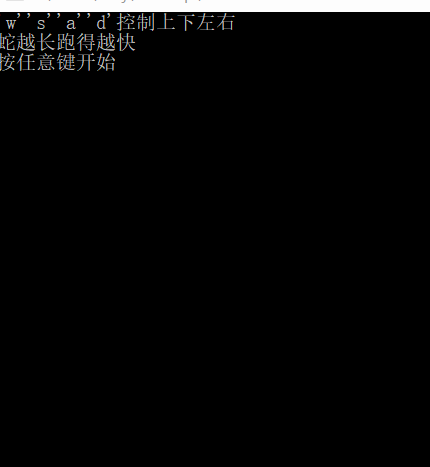

# 字符版本贪吃蛇游戏设计及算法 + 智能蛇

对于普通版贪吃蛇（需要手动操作）的C语言代码在上一次博客中已有提到：

```c
#include <stdio.h>
#include <time.h>
#include <stdlib.h> 
#include <conio.h>

#define SNAKE_MAX_LENGTH 20 
#define SNAKE_HEAD 'H'
#define SNAKE_BOOY 'X'
#define BLANK_CELL ' '
#define SNAKE_FOOD '$' 
#define WALL_CELL '*'


char map[12][13] = {
	"************",
	"*          *",
	"*          *",
	"*          *",
	"*          *",
	"*          *",
	"*          *",
	"*          *",
	"*          *",
	"*          *",
	"*          *",
	"************"
};

struct FOOD
{
    int x;
    int y;
}food;

int snakeX[SNAKE_MAX_LENGTH] = {5, 4, 3, 2, 1};
int snakeY[SNAKE_MAX_LENGTH] = {1, 1, 1, 1, 1};
int length = 5;//蛇的初始长度 
int gamerun = 1;
int IsFood;
char ch;

void PrintMap() { 
	system("cls"); //清空屏幕上的内容
	for (int i = 0; i < 12; i ++) {
		printf("%s\n", map[i]);
	}
}

void GameOver() {
	gamerun = 0;
	printf("GAME OVER!\n");
}


//初始化整个游戏的对象
void InitGame() {
	map[snakeY[0]][snakeX[0]] = SNAKE_HEAD;
	map[snakeY[1]][snakeX[1]] = SNAKE_BOOY;
	map[snakeY[2]][snakeX[2]] = SNAKE_BOOY;
	map[snakeY[3]][snakeX[3]] = SNAKE_BOOY;
	map[snakeY[4]][snakeX[4]] = SNAKE_BOOY;
	gamerun = 1;
	PrintMap();
}

void MoveSnake() {
	ch = getch();
	map[snakeY[length - 1]][snakeX[length - 1]] = BLANK_CELL;//实现蛇改变方向时"头尾互换"的操作
	map[snakeY[0]][snakeX[0]] = SNAKE_BOOY;
	for (int i = length - 1; i; i --) {
		snakeX[i] = snakeX[i - 1];
		snakeY[i] = snakeY[i - 1];
	}
	
	//游戏通过键盘上的小写‘w’，’a’，’s’，’d’控制蛇的移动
	switch (ch) {
		case 'w':
			snakeY[0] -- ;
			break;
		case 's':
			snakeY[0] ++ ;
			break;
		case 'a':
			snakeX[0] -- ;
			break;
		case 'd':
			snakeX[0] ++ ;
			break;
	}
	if (map[snakeY[0]][snakeX[0]] != BLANK_CELL && map[snakeY[0]][snakeX[0]] != SNAKE_FOOD)
		GameOver();
	if (map[snakeY[0]][snakeX[0]] == SNAKE_FOOD) {
		map[snakeY[0]][snakeX[0]] = SNAKE_HEAD;
		length ++ ;
		IsFood = 0;
	}
	else map[snakeY[0]][snakeX[0]] = SNAKE_HEAD;
}

void SpawnFood() {
	food.x = rand() % 10 + 1;
	food.y = rand() % 11 + 1;
	while(map[food.y][food.x] != BLANK_CELL) {
		food.x = rand() % 10 + 1;
		food.y = rand() % 11 + 1;
	}
	map[food.y][food.x] = SNAKE_FOOD;
	IsFood = 1;	
} 

int main() {
	InitGame();
	while (gamerun) {
		srand(time(NULL));
		MoveSnake();
		if (!IsFood) SpawnFood ();
		PrintMap();
	}
	if (!gamerun) GameOver();
	return 0;
}
```
     
不过最近我又发现了一种能解决上次博客所提到的间断问题，因为距离时间较长，代码出入会比较大，下面是完整代码：（ps：这是从网上参考来的）

```c
#include <stdio.h>
#include <windows.h>
#include <stdlib.h>
#include <math.h>
#include <conio.h>
#include <string.h>
#include <time.h>

void ini();//初始化界面
void food();//生成食物
void turn();//转弯
void move();//蛇的移动
void check();//检查是否死亡或吃到食物
void show();//显示界面

int  dy[4] = { 0, 1, 0, -1 };
int  dx[4] = { -1, 0, 1, 0 };
int sum = 5;  //蛇总长度
int over = 0;
int speed;   

char map[17][17];

struct snake {
    int x, y;  //身体坐标 
    int dir;  //方向（只有蛇头的方向是有用的） 
} A[100];

void ini() {  
    speed = 500;
    over = 0;
    sum = 5;
    int i, j;
	//初始化蛇头和蛇身的数据
    for (i = 0; i < 100; i++) {  
        A[i].dir = 0;
        A[i].x = 0;
        A[i].y = 0;
    }
	//地图左上角设置一条长度为5的蛇
    A[0].x = 1; A[0].y = 1;  
    A[1].x = 1; A[1].y = 2;
    A[2].x = 1; A[2].y = 3;
    A[3].x = 1; A[3].y = 4;
    A[4].x = 1; A[4].y = 5; A[4].dir = 1;
    srand(time(0));
	//设置地图
    for (i = 0; i < 17; i++) {  
        for (j = 0; j < 17; j++) {
            map[i][j] = '*';
        }
    }
    for (i = 1; i < 16; i++) {
        for (j = 1; j < 16; j++) {
            map[i][j] = ' ';
        }
    }

    map[A[4].x][A[4].y] = 'H';  //设置蛇头
	//设置蛇身
    for (i = 0; i < sum - 1; i++) {  
        map[A[i].x][A[i].y] = 'X';
    }
    food();
}

void show() {  
    int i, j, x, y;
	//显示界面
    for (i = 0; i < 17; i++) {  
        for (j = 0; j < 17; j++) {
            printf("%c", map[i][j]);
        }
        printf("\n");
    }
    while (1) {
        Sleep(speed);  //界面刷新速度
        turn();
        move(); 
		//设置蛇死掉后可以进行的操作
        if (over) {  
            while (1) {
                char ch = _getch(); 
				//输入‘q’结束 
                if (ch == 113) { 
                    return;
                }
				//输入‘r’重新开始 
                else if (ch == 114) {  
                    ini();
                    break;
                }
            }
        }
        system("cls");  //清屏 
		//重新显示界面
        for (i = 0; i < 17; i++) {  
            for (j = 0; j < 17; j++) {
                printf("%c", map[i][j]);
            }
            printf("\n");
        }

    }
}

void food() {  
    int x, y;
    while (1) {
        x = (int)(15 * rand() / (RAND_MAX + 1.0));  //随机产生一组食物坐标
        y = (int)(15 * rand() / (RAND_MAX + 1.0));
		//如果是空格则在该处生成食物
        if (map[x][y] == ' ') {  
            map[x][y] = '$';
            break;
        }
    }
}


void move() {  
    int i, x, y;
    int t = sum;  //t记录当前蛇总长度 
    check();  //移动前检查按当前方向移动一步后的情况
    if (t == sum) {  //没有吃到苹果
        for (i = 0; i < sum - 1; i++) {
            if (i == 0) {  //蛇尾坐标处变成空格，把蛇尾坐标变成前一个蛇身的坐标 
                map[A[i].x][A[i].y] = ' ';
                A[i].x = A[i + 1].x;
                A[i].y = A[i + 1].y;
            }
            else {  //每个蛇身坐标都变为它前一个蛇身的坐标
                A[i].x = A[i + 1].x;
                A[i].y = A[i + 1].y;
            }
            map[A[i].x][A[i].y] = 'X';  //把地图上蛇身坐标处的字符设置成‘X’
        }
        A[sum - 1].x = A[sum - 1].x + dx[A[sum - 1].dir];  //蛇头按当前方向移动一格 
        A[sum - 1].y = A[sum - 1].y + dy[A[sum - 1].dir];
        map[A[sum - 1].x][A[sum - 1].y] = 'H';  //把地图上蛇头坐标处的字符设置成‘H’
    }
	//吃到苹果（sum会加1）
    else {  
		//把地图上原蛇头坐标处的字符设置成‘X’
        map[A[sum - 2].x][A[sum - 2].y] = 'X';  
		//新蛇头的坐标是原蛇头沿当前方向移动一格后的坐标 
        A[sum - 1].x = A[sum - 2].x + dx[A[sum - 2].dir];  
        A[sum - 1].y = A[sum - 2].y + dy[A[sum - 2].dir];
		//新蛇头方向为原蛇头的方向
        A[sum - 1].dir = A[sum - 2].dir;  
		//把地图上蛇头坐标处的字符设置成‘H’
        map[A[sum - 1].x][A[sum - 1].y] = 'H';  
        food();
    }
}

void check() {  
    int x, y, i, j;
	//记录按当前方向移动一格后蛇头的坐标
    x = A[sum - 1].x + dx[A[sum - 1].dir];   
    y = A[sum - 1].y + dy[A[sum - 1].dir]; 
	//如果地图上该坐标处字符为‘*’或‘X’就死亡 
    if (map[x][y] == '*' || map[x][y] == 'X') { 
		 //蛇尾除外
        if (x != A[0].x || y != A[0].y) {  
            map[8][4] = 'G'; map[8][5] = 'A'; map[8][6] = 'M'; map[8][7] = 'E';  //输出“GAME OVER” 
            map[8][9] = 'O'; map[8][10] = 'V'; map[8][11] = 'E'; map[8][12] = 'R';
            map[8][8] = ' ';
            system("cls");
            for (i = 0; i < 17; i++) {
                for (j = 0; j < 17; j++) {
                    printf("%c", map[i][j]);
                }
                printf("\n");
            }
            printf("Input 'r' to restart\nInput 'q' to quit\n");
            over = 1;
        }
    }
	//吃到苹果
    else if (map[x][y] == 'O') {   
        sum++;  //蛇身总长加1 
        speed = ((600 - sum * 20)>100) ? (600 - sum * 20) : 100; //速度加快 
    }
}

void turn() {  
    if (_kbhit()) {
        char dir = _getch();  //读取输入的键 
		//改变方向 
        switch (dir) {  
        case 119: A[sum - 1].dir = (A[sum - 1].dir == 2)?2:0; break;
        case 100: A[sum - 1].dir = (A[sum - 1].dir == 3)?3:1; break;
        case 115: A[sum - 1].dir = (A[sum - 1].dir == 0)?0:2; break;
        case 97: A[sum - 1].dir = (A[sum - 1].dir == 1)?1:3; break;
        }
    }
}


int main() {
    printf("'w''s''a''d'控制上下左右\n蛇越长跑得越快\n");
    printf("按任意键开始\n");
    char ch = _getch();
    system("cls");
    ini();
    show();
    return 0;
}
```

运行结果如下：



不过还是很卡顿啊！

**而对于智能蛇**如下：

```c
/*蛇越长跑得越快*/
/*蛇能自己找食物*/
#include <stdio.h>
#include <windows.h>
#include <stdlib.h>
#include <math.h>
#include <conio.h>
#include <string.h>
#include <time.h>
void food();
void show();
void move();
void turn();
void check();
void ini();
void calculate();
int movable[4] = {0, 1, 1, 0};  //数组的下标表示方向，0123分别表示上下左右，下同
int distance[4] = {9999, 9999, 9999, 9999};
int  dy[4] = {0, 1, 0, -1};
int  dx[4] = {-1, 0, 1, 0};
int sum = 5;  //蛇总长度
int over = 0;
int speed;   
int foodx, foody;  //食物的坐标
char map[17][17];

struct snake {
    int x, y;  //身体坐标 
    int dir;  //方向（只有蛇头的方向是有用的） 
} A[100];

void ini() {  //初始化界面
    speed = 500;
    over = 0;
    sum = 5;
    movable[0] = 0; movable[1] = 1; movable[2] = 1; movable[3] = 0;
    distance[0] = 9999; distance[1] = 9999; distance[2] = 9999; distance[3] = 9999;
    int i, j;
    for (i = 0; i < 100; i++) {  //初始化蛇头和蛇身的数据
        A[i].dir = 0;
        A[i].x = 0;
        A[i].y = 0;
    }
    A[0].x = 1; A[0].y = 1;  //地图左上角设置一条长度为5的蛇
    A[1].x = 1; A[1].y = 2;
    A[2].x = 1; A[2].y = 3;
    A[3].x = 1; A[3].y = 4;
    A[4].x = 1; A[4].y = 5; A[4].dir = 1;
    srand(time(0));
    for (i = 0; i < 17; i++) {  //设置地图
        for (j = 0; j < 17; j++) {
            map[i][j] = '*';
        }
    }
    for (i = 1; i < 16; i++) {
        for (j = 1; j < 16; j++) {
            map[i][j] = ' ';
        }
    }
    //map[6][5] = '*'; map[6][6] = '*'; map[6][7] = '*';
    //map[7][5] = '*'; map[7][7] = '*';
    map[A[4].x][A[4].y] = 'H';  //设置蛇头
    for (i = 0; i < sum - 1; i++) {  //设置蛇身
        map[A[i].x][A[i].y] = 'X';
    }
    food();
    calculate();
}


void show() {  //显示界面 
    int i, j, x, y;
    for (i = 0; i < 17; i++) {  //显示界面
        for (j = 0; j < 17; j++) {
            printf("%c", map[i][j]);
        }
        printf("\n");
    }
    while (1) {
        Sleep(speed);  //界面刷新速度
        turn();
        move();
        if (over) {  //设置蛇死掉后可以进行的操作 
            while (1) {
                char ch = _getch();
                if (ch == 113) {  //输入‘q’结束 
                    return;
                }
                else if (ch == 114) {  //输入‘r’重新开始 
                    ini();
                    break;
                }
            }
        }
        system("cls");  //清屏 
        for (i = 0; i < 17; i++) {  //重新显示界面
            for (j = 0; j < 17; j++) {
                printf("%c", map[i][j]);
            }
            printf("\n");
        }
        calculate(); //计算并记录蛇头与食物距离
    }
}

void food() {  //生成食物
    int x, y;
    while (1) {
        x = (int)(15 * rand() / (RAND_MAX + 1.0));  //随机产生一组食物坐标
        y = (int)(15 * rand() / (RAND_MAX + 1.0));
        if (map[x][y] == ' ') {  //如果是空格则在该处生成食物
            map[x][y] = 'O';
            foodx = x;  //记录食物坐标 
            foody = y;
            break;
        }
    }
}


void move() {  //蛇移动
    int i, x, y;
    int t = sum;  //t记录当前蛇总长度 
    check();  //移动前检查按当前方向移动一步后的情况
    if (t == sum) {  //没有吃到苹果
        for (i = 0; i < sum - 1; i++) {
            if (i == 0) {  //蛇尾坐标处变成空格，把蛇尾坐标变成前一个蛇身的坐标 
                map[A[i].x][A[i].y] = ' ';
                A[i].x = A[i + 1].x;
                A[i].y = A[i + 1].y;
            }
            else {  //每个蛇身坐标都变为它前一个蛇身的坐标
                A[i].x = A[i + 1].x;
                A[i].y = A[i + 1].y;
            }
            map[A[i].x][A[i].y] = 'X';  //把地图上蛇身坐标处的字符设置成‘X’
        }
        A[sum - 1].x = A[sum - 1].x + dx[A[sum - 1].dir];  //蛇头按当前方向移动一格 
        A[sum - 1].y = A[sum - 1].y + dy[A[sum - 1].dir];
        map[A[sum - 1].x][A[sum - 1].y] = 'H';  //把地图上蛇头坐标处的字符设置成‘H’
    }
    else {  //吃到苹果（sum会加1）
        map[A[sum - 2].x][A[sum - 2].y] = 'X';  //把地图上原蛇头坐标处的字符设置成‘X’
        A[sum - 1].x = A[sum - 2].x + dx[A[sum - 2].dir];  //新蛇头的坐标是原蛇头沿当前方向移动一格后的坐标 
        A[sum - 1].y = A[sum - 2].y + dy[A[sum - 2].dir];
        A[sum - 1].dir = A[sum - 2].dir;  //新蛇头方向为原蛇头的方向
        map[A[sum - 1].x][A[sum - 1].y] = 'H';  //把地图上蛇头坐标处的字符设置成‘H’
        food();
    }
    for(i = 0; i < 4; i++) {  //记录下能走的方向
        x = A[sum - 1].x + dx[i];
        y = A[sum - 1].y + dy[i];
        if(map[x][y] == ' ' || map[x][y] == 'O') {
            movable[i] = 1;  //能走就把对应方向的值设置为1 
        } else {
            if(x != A[0].x || y != A[0].y) {
                movable[i] = 0;  //不能走就把对应方向的值设置为0 
            } else {
                movable[i] = 1;
            }
        }
    }
}

void check() {  //检查是否死亡或者吃到食物
    int x, y, i, j;
    x = A[sum - 1].x + dx[A[sum - 1].dir];  //记录按当前方向移动一格后蛇头的坐标 
    y = A[sum - 1].y + dy[A[sum - 1].dir];
    if (map[x][y] == '*' || map[x][y] == 'X') {  //如果地图上该坐标处字符为‘*’或‘X’就死亡 
        if (x != A[0].x || y != A[0].y) {  //蛇尾除外 
            map[8][4] = 'G'; map[8][5] = 'A'; map[8][6] = 'M'; map[8][7] = 'E';  //输出“GAME OVER” 
            map[8][9] = 'O'; map[8][10] = 'V'; map[8][11] = 'E'; map[8][12] = 'R';
            map[8][8] = ' ';
            system("cls");
            for (i = 0; i < 17; i++) {
                for (j = 0; j < 17; j++) {
                    printf("%c", map[i][j]);
                }
                printf("\n");
            }
            printf("Input 'r' to restart\nInput 'q' to quit\n");
            over = 1;
        }
    }
    else if (map[x][y] == 'O') {  //吃到苹果 
        sum++;  //蛇身总长加1 
        speed = ((600 - sum * 20)>100) ? (600 - sum * 20) : 100; //速度加快 
    }
}

void turn() {  //转弯
    int i, k = 0;
    for(i = 1; i < 4; i++) {  //找到走一步后离食物距离最短的方向
        if(distance[k] > distance[i]) {
            k = i;
        }
    }
    switch (k) {  //把把蛇头方向改为该方向 
        case 0: A[sum - 1].dir = (A[sum - 1].dir == 2)?2:0; break;
        case 1: A[sum - 1].dir = (A[sum - 1].dir == 3)?3:1; break;
        case 2: A[sum - 1].dir = (A[sum - 1].dir == 0)?0:2; break;
        case 3: A[sum - 1].dir = (A[sum - 1].dir == 1)?1:3; break;
    }
}

void calculate() {  //计算并记录蛇头与食物距离
    int i = 0, x, y;
    for(i = 0; i < 4; i++) {
        if(movable[i] == 1) {  //如果该方向能走，则记录下沿该方向走一步后与食物的距离 
            x = A[sum - 1].x + dx[i];
            y = A[sum - 1].y + dy[i];
            distance[i] = abs(foodx-x)+abs(foody-y);
        } else {  //如果不能走则把距离设置为9999 
            distance[i] = 9999;
        }
    }
}

int main() {
    printf("按任意键开始，静静地看着它跑\n");
    char ch = _getch();
    system("cls");
    ini();
    show();
    return 0;
}

```


