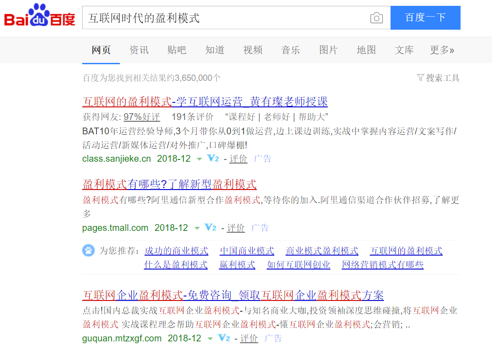
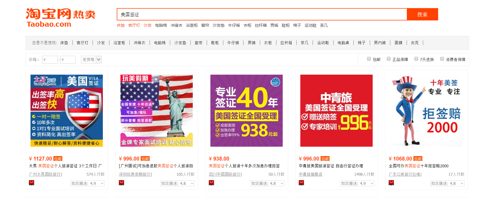
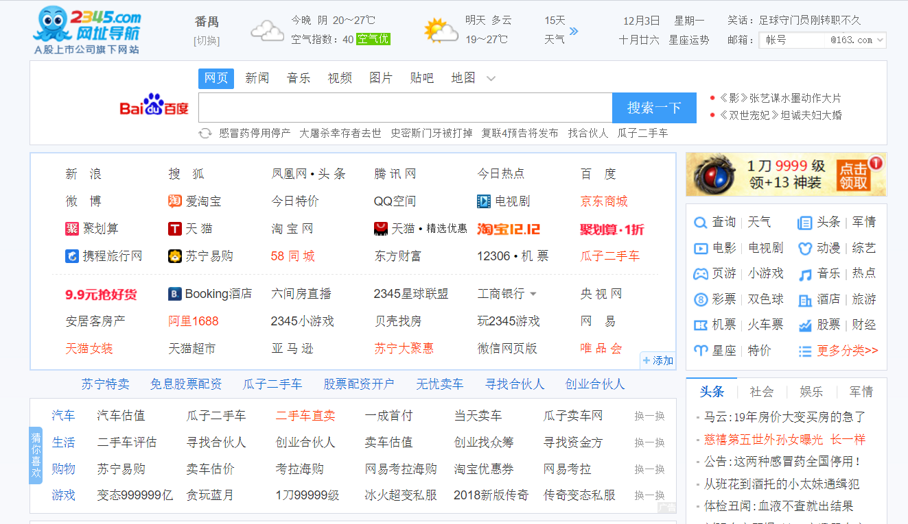

# 互联网时代的盈利模式

#### 一、 何谓流量

流量（flow rate），在网络指在一定时间内打开网站地址的人气访问量，或者是手机移动数据的通俗意思。

流量是一个数字记录，记录一个网页等所耗的字节数，单位有B，KB，MB，GB。

关于流量，我们在日常生活中很容易理解其价值。比如，如果你想开一家卖鞋的店铺，在租金合理的前提下，你一般会选择热闹的商业街;你 想摆摊卖鸡蛋灌饼，在交得起保护费的前提下，你一般会选择居民区的大门口、地铁站出口，或者写字楼密集的地区。理由很简单，因为这些地方有很多人经过，而 这些人，很多是带着需求的，很可能会产生购买行为。

另一方面，你有没有注意到类似这样的细节：很多超市，如果它有2层楼的话，入口一般在2 层;如果是3层楼，入口则十有八九在3层;而它们的出口，不出意外，一定会在1层。这种设置的目的显而易见，是为了让你多在超市中停留。换句话讲，超市的 经营者认为，你在超市中停留的时间越久，就越有可能多买东西。

著名的家居卖场宜家，据说也曾使用过这样的策略来提高销量。

互联网公司的估值模式，很重要的指标就是流量，包括注册用户数量、活跃用户数、用户访问频率等，一个注册用户1000万的互联网产品，没有任何的盈利，就可以估值数亿美元，在互联网领域是常有的事。在用户数量、活跃度这些指标的背后，是对用户注意力的一种占有。

#### 与流量有关的盈利模式

**一、 广告不能少**

广告是所有互联网产品最常见的盈利模式，当然有时也是消费者们最讨厌的一种模式。但毋庸置疑的，广告作为盈利界的大佬，确实带动了流量的腾飞，给盈利者带来了巨大的收益。利用互联网浏览量大的特点，广告无处不在，特别是以 AdWords 为代表的推广方式出现后。对于餐饮、旅游、汽车等垂直社区，广告在推广商家的同时，也可以起到个性化推荐、装点站点的作用。在这点上，从早期的坚决不上到如今每个条目、活动的页面都会出现广告的豆瓣，应该是一个很好的范例。

结合文艺、小众的的定位，豆瓣认真挑选合适的广告品牌，并配以风格一致的广告图片，可谓完美融入。在这个时候，甚至用 Adblock Plus 都会觉得可惜，也许这就是广告艺术的最高境界。

1. banner广告(典型案例：门户网站)

在新浪、腾讯网等门户网站上，我们经常能够看到各种banner广告;在类似新浪乐居、搜房网等无节操的房地产门户上面，则是广告满天飞，(当然这是以前，现在貌似已经没怎么看到了)有时候会占据你大半屏的空间。这种广告的原理即盈利方式跟地铁站、街边的广告牌本质上没有区别。

2. 匹配广告(典型案例：Google搜索、淘宝直通车、百度)

与电视广告、户外广告等方式相比，互联网的优势是可以同用户交互。于是，互联网特有的匹配广告诞生了。Google的关键词广告是匹配广告的一种形式，它构成了Google的主要收入来源。

传统媒体上的广告对于受众的区分能力是比较差的，例如，如果你在电视上做广告，你一般不太清楚什么人看到了你的广告，以及这些人是否需要购买你所宣传的商品 (如果他们对你的商品没兴趣，那么广告对于他们来说就是一种骚扰)，至于广告的实际效果，也不太容易衡量。但是当我们使用搜索引擎搜索信息的时候，我 们所输入的关键词所对应的一定是我感兴趣的，想要寻找的内容，这时，如果根据关键词匹配相应的推广内容，则会大幅度提高转化率。

比如下面这个例子：

我只是想找点素材啊！要不要这么坑我！！！

匹配广告的另外一种重要应用，是在电商平台网站上。

比如，如果我在百度上输入“美国签证”这个关键词，我的·目的可能是想查看关于申请美国签证的攻略、注意事项等，看完了之后自己跑大使馆办理。这时如果百度给我推出一堆旅行社的签证服务报价，对于我来说，也是无意义的。

但在淘宝，大家使用搜索的目的就要明确得多。如果我在淘宝上搜索“美国签证”这个关键词，我不可能是去找攻略的，一定是想花钱办签证。这种场景下，提供匹配广告的转化率会高很多。

3. 社交广告(典型案例：Wechat、QQ、广点通)

在现实生活中，我们是否购买一样商品，会有很多影响因素，这其中一个重要的因素是“他人推荐”。如果把广告跟社交元素结合，有时会产生一些意想不到的效果。这类推广方式，我想最具代表性的，大概就是微商了。打开微信朋友圈，你总会看到不知名的广告出现：

除此之外，还有强大的亲戚朋友强力推荐与打广告，使其成为实打实的超强盈利模式。毕竟是熟人，再加上其他方式没有的互动，人与人之间的不信任是降了不少。

另外，用户在社交网站上往往会留有更加准确、详细的个人信息。网站可以利用这些信息，对用户进行细分，以至于可以实现更加精准的广告投放。

**二、 流量分发(典型案例：导航网站、各种“互联网入口”)**

除了广告之外，直接把流量导入某些网站，也是一个赚钱的好方法。国内的案例有很多，比如我在用的2345网址导航，还有360浏览器等。

像2345网址导航这样的盈利模式其实也很简单，首先利用其独特的定位和运营，获得大量的流量。然后，把这些流量分发到各种网站上，向网站收费。

所有的网址链接，都是要缴费的，有的网址显示颜色不一样，是因为交的费用不一样。收费可以按照点击次数（从本页面点击链接进入网站的有效IP）或年度。

流量分发的前提是获取到流量。所以，争夺用户的上网入口就成为了这类盈利模式的大前提。搜索引擎是一个很重要的入口，浏览器起始页也是，如果还嫌不够，那就要把入口再前置，把自己的软件直接安装在用户的电脑上。

**三、 线上到线上的佣金**

比如豆瓣，用户看到一本书后，就可以点击右侧的链接，或者将它们添加到购书单，到网上书城里进行购买，豆瓣收取佣金。以及其他所有意义上的点击跳转，根据链接收取佣金。

**四、 虚拟货币或者虚拟物品等增值服务**

这种盈利方式可以说是腾讯对整个互联网的贡献，依靠这样的方式，腾讯构建了属于自己的、巨大的金融体系。但一般产品想这么做，至少要有几个条件。
1. 足够大的用户数量，只有依靠足够大的使用人数，体系才可以被稳定建立。
2. 有长久价值，并可以被交易的物品。虚拟世界商品的属性必须和现实世界大体一致，否则很难具有购买的吸引力。
3. 不断演进完善的金融体系。用户具有大量的虚拟货币和虚拟物品后，要生产合理数量的新物品。因为对于运营商来讲，生产这样的物品完全是没有成本的，需要考虑到已经购买它们的用户的价值。另外，如何生产出新的商品，去不断消费掉用户手中的货币，让整个金融体系得以延续，也是一门学问。

**五、 数据、信息等营销服务**

这种类型的商业模式主要面对下游的商家用户。在不影响用户隐私的前提下，利用产品本身具有的庞大数据库和用户信息，向下游的商家或者第三方提供数据信息，以便其展开营销。

