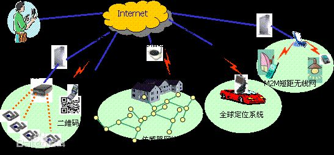
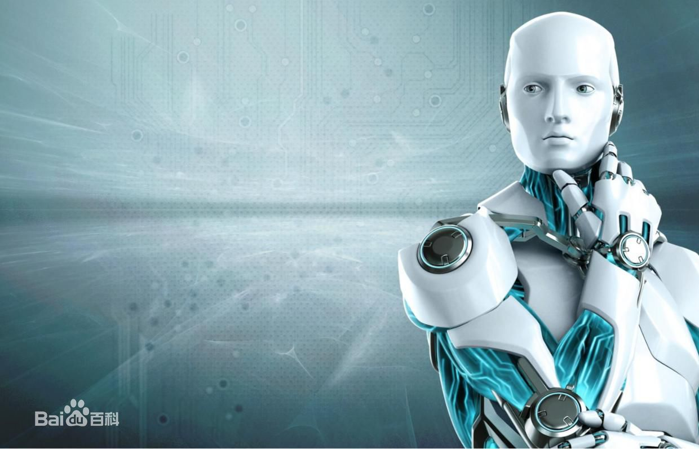

# 互联网时代的热点领域选择与营销方法

#### 热点领域

**一、分享经济**

分享经济（Sharing Economy）是指将社会海量、分散、闲置资源，平台化、协同化地集聚、复用与供需匹配，从而实现经济与社会价值创新的新形态。
分享经济强调的两个核心理念是“使用而不占有”（Access over Ownership）和“不使用即浪费”（Value Unused is Waste）。
“互联网+”时代，分享经济成为新潮流，消费者基于众享理念的应用和参与，让很多的行业发展带来新的挑战。有些行业在独享经济时代能够活的很好，但在分享经济时代里却很难再招徕到消费者，因为消费者完全可以自己通过相互众享来达成自己的梦想，而不需要过多的产品生产来满足其基本的生活需求。随着分享经济的深入发展，未来会有越来越多的行业以分享经济为契机在市场当中掀起众享潮流，分享经济时代对行业的变革已经来临。
**二、物联网**

物联网是新一代信息技术的重要组成部分，也是“信息化”时代的重要发展阶段。其英文名称是：“Internet of things（IoT）”。顾名思义，物联网就是物物相连的互联网。这有两层意思：其一，物联网的核心和基础仍然是互联网，是在互联网基础上的延伸和扩展的网络；其二，其用户端延伸和扩展到了任何物品与物品之间，进行信息交换和通信，也就是物物相息。物联网通过智能感知、识别技术与普适计算等通信感知技术，广泛应用于网络的融合中，也因此被称为继计算机、互联网之后世界信息产业发展的第三次浪潮。物联网是互联网的应用拓展，与其说物联网是网络，不如说物联网是业务和应用。因此，应用创新是物联网发展的核心，以用户体验为核心的创新2.0是物联网发展的灵魂。
物联网将是下一个推动世界高速发展的“重要生产力”，是继通信网之后的另一个万亿级市场。
**三、自媒体**
 

自媒体(外文名：We Media)又称“公民媒体”或“个人媒体”，是指私人化、平民化、普泛化、自主化的传播者，以现代化、电子化的手段，向不特定的大多数或者特定的单个人传递规范性及非规范性信息的新媒体的总称。自媒体平台包括：博客、微博、微信、百度官方贴吧、论坛/BBS等网络社区。
自媒体向传统媒体发出挑战。以播客为新兴形式的自媒体使得原来处于新闻制造边缘的受众成为新闻信息传播的中坚力量，传统媒体受到自媒体的挑战。
**对于自媒体运营：**
关于平台：公众平台和自媒体人是共生关系，平台需要自媒体的好内容，自媒体需要平台将内容散播出去。
当然，所有的传播都是基于平台的规则内的，很多人都奇怪为什么会被无缘无故封号，在平台的规则内，进行有效的传播，是比较好的方式。
关于读者：有人叫读者、粉丝和用户，其实他们是你公众号所能影响到的读者，并逐渐转化为深度读者。
关于互动：和读者互动是一个技术活儿，也是一个脑力活，非常人所能胜任也，互动的好，一片欢声笑语，互动的不好，骂、喷、屌、踩样样都来。
**四、大数据**

大数据（big data），指无法在一定时间范围内用常规软件工具进行捕捉、管理和处理的数据集合，是需要新处理模式才能具有更强的决策力、洞察发现力和流程优化能力的海量、高增长率和多样化的信息资产。

**八大趋势：**
趋势一：数据的资源化
趋势二：与云计算的深度结合
趋势三：科学理论的突破
趋势四：数据科学和数据联盟的成立
趋势五：数据泄露泛滥
趋势六：数据管理成为核心竞争力
趋势七：数据质量是BI(商业智能)成功的关键
趋势八：数据生态系统复合化程度加强
**五、人工智能**

人工智能（Artificial Intelligence），英文缩写为AI。它是研究、开发用于模拟、延伸和扩展人的智能的理论、方法、技术及应用系统的一门新的技术科学。
人工智能是计算机科学的一个分支，它企图了解智能的实质，并生产出一种新的能以人类智能相似的方式做出反应的智能机器，该领域的研究包括机器人、语言识别、图像识别、自然语言处理和专家系统等。人工智能从诞生以来，理论和技术日益成熟，应用领域也不断扩大，可以设想，未来人工智能带来的科技产品，将会是人类智慧的“容器”。人工智能可以对人的意识、思维的信息过程的模拟。人工智能不是人的智能，但能像人那样思考、也可能超过人的智能。
人工智能是一门极富挑战性的科学，从事这项工作的人必须懂得计算机知识，心理学和哲学。人工智能是包括十分广泛的科学，它由不同的领域组成，如机器学习，计算机视觉等等，总的说来，人工智能研究的一个主要目标是使机器能够胜任一些通常需要人类智能才能完成的复杂工作。但不同的时代、不同的人对这种“复杂工作”的理解是不同的。 2017年12月，人工智能入选“2017年度中国媒体十大流行语”。
**六、内容付费**
内容付费说白了是教育（培训）、内容（出版）、媒体行业的整合。它主要包含：
1. 专业资讯
专业资讯给到的是相对比较轻快的专业资讯、行业报告。
很多人出于工作生活学习中遇到困难，需要在短时间内，迅速对一个领域进行系统性、结构化的学习理解，最终把这些内容内化成自己知识。以此来解决自己工作生活中遇到的问题。
于是“知识生产者”，对一手的行业信息进行整理，提炼，生产出真实、可靠的行业信息。
2. 在线教育

在线教育则是将专业的理论/知识搬到线上，让受众在接受教育的同时可以内化为自己的知识。
“知识获取者”出于工作或学习需要，但又迫于时间的限制，希望通过在线教育平台补充自身职业、学术层面缺失的知识结构，为下一个阶段的工作、学习打好理论基础。但这其中非不乏一些人通过买课来抚慰自己的“知识焦虑”，被收割“智商税”。
3. 知识付费等

知识付费给到的是细分垂直领域的知识、经验。
知识经济是目前最热的概念，它和专业资讯、在线教育只有一墙之隔，其本质上是专业资讯和在线教育的“空隙”。知识付费涵盖领域较广，一切可以进行“贩卖”的知识点都存活于知识付费麾下。
**七、互联网+医疗**

互联网医疗（interenet+medical care），是互联网在医疗行业的新应用，其包括了以互联网为载体和技术手段的健康教育、医疗信息查询、电子健康档案、疾病风险评估、在线疾病咨询、电子处方、远程会诊、及远程治疗和康复等多种形式的健康医疗服务。
互联网医疗，代表了医疗行业新的发展方向，有利于解决中国医疗资源不平衡和人们日益增加的健康医疗需求之间的矛盾，是卫生部积极引导和支持的医疗发展模式。
**八、网红经济”**

网红经济是以年轻貌美的时尚达人为形象代表，以红人的品味和眼光为主导，进行选款和视觉推广，在社交媒体上聚集人气，依托庞大的粉丝群体进行定向营销，从而将粉丝转化为购买力的一个过程。
**九、区块链**

区块链是分布式数据存储、点对点传输、共识机制、加密算法等计算机技术的新型应用模式。
区块链（Blockchain）是比特币的一个重要概念，它本质上是一个去中介化的数据库，同时作为比特币的底层技术，是一串使用密码学方法相关联产生的数据块，每一个数据块中包含了一次比特币网络交易的信息，用于验证其信息的有效性（防伪）和生成下一个区块。
区块链主要应用于：艺术行业、法律行业、开发行业、房地产行业、物联网、保险行业等。
#### 营销方法

**一、抓住超前消费**
==超前消费==是指当下的收入水平不足以购买现在所需的产品或服务,以分期付款,预支等形式进行消费。超前消费又称消费超前、消费早熟，是指居民的消费水平超过本国同期社会经济发展水平的一种消费行为。在超过暂时的收入能力的情况下将今后的收入提前到现在支出。**超前消费可以让用户提前享受到未来所支付的服务。**
传统的超前消费主要以信用卡、赊账等形式实现，其手续复杂，不宜使用。而在互联网时代，我们的超前消费也变得更加方便、简单。目前，很多平台都推出了超前消费的形式。例如：支付宝推出的花呗，京东推出的京东白条，天猫的天猫分期，唯品会的唯品花等等。
这些平台都是看清了在互联网时代人们的消费行为，尤其是年轻人的消费行为。所以说在互联网时代，企业应该抓住超前消费这一热点。
**二、抓住儿童经济**

儿童经济是以3-14岁的孩子为需求主体，形成的包括儿童用品，儿童玩具、亲子娱乐、教育、医疗等消费需求。孩子是家庭的未来，每个家长都希望自己的孩子用最好的，所以儿童的消费所产生的经济效益是巨大的。
而目前针对儿童所形成的互联网模式还没有一个完整的的体系。所以对于企业来说，这是一个好的发展机会。
**三、抓住女性消费热点**

女性消费者撑起了网购市场份额的半边天，对于商家来说，这无疑是一个好的现象，女生的购物狂潮，不再是传统的春节购物，已经体现在三八节，五一，十一，双十一，双十二，圣诞节等节日，都成为女人疯狂购物的理由。
不止是女性产品，所附带的日常用品，也成为女人购物的对象，各类商品成直线上升趋势。**如果企业抓住了女性这一消费群体，那么也就抓住了成功的关键。**
**四、打造以健康养生的经营模式**
现代人的生活压力越来越大，面对快速的生活节奏和高强度的工作，大多数上班族都出现了“亚健康”的问题。
随着人们收入的增加，健康意识的不断提高，也越来越注意养生，而养生不再是老年人的专属，而越来越向年轻化发展。人们对健康养生的需求也向多样性，全面性发展。而随着互联网的发展，年轻人也越来越多地倾向于互联网方式的消费。
如何全面地将移动互联网与养生相结合，整合行业的资源，让客户更全面地了解与消费，是企业值得思考的问题。
**五、搜素引擎营销**

这种方法一般是通过自建官网然后针对官网进行优化与更新，使得网站在搜索引擎中有一个好的排名。也可通过做付费推广，使得网站的某个关键词在搜索引擎中有个好的排名。
**六、事件营销**

这个方法需要结合时事热点，与要宣传推广的产品、企业等联系起来，实现无缝对接，并需要扎实和创意的文字功底，抓住人们的眼球，并且内容也是有质量的。此外，也可以创造一些事件，策划活动，进行宣传推广，如周年庆、世界杯等。
**七、即时通讯营销**
现在社交软件、即时通讯软件的频繁使用，在如今的手机中，通讯等社交软件使用的频率是非常之高的，并且在即时通讯软件中，添加了很多朋友。可以利用这一工具，将需要推广的内容有选择发给他们，也可以在同一个空间、朋友圈发布出来。
**八、电子邮件**
电子邮件，是一个操作起来简单方便的方法，只要邮件的接收者的质量高，就会收到很好地效果。所以，在群发邮件之前，需要整理好邮箱并进行筛选，而且还要对发布的内容进行策划斟酌，使得内容更加能展示核心竞争力，以吸引接受者的关注，并进行深入地了解。虽然我认为这样真的挺烦人啊！！！

----
材料来源：

百度百科